# Iosevka 
**Iosevka** is an *open-source*, *sans-serif* + *slab-serif*, *monospace* + *quasi‑proportional* typeface family, designed for *writing code*, using in *terminals*, and preparing *technical documents*.


## Installation

Quit your editor/program. Unzip and open the folder.

* **Windows**: Download the fonts from the [Releases](https://github.com/be5invis/Iosevka/releases), select the font files and right click, then hit “Install”.  
  
  * On Windows 10 1809 or newer the default font installation is per-user, and it may cause compatibility issues for some applications, mostly written in Java. To cope with this, right click and select “Install for all users” instead. [Ref.](https://youtrack.jetbrains.com/issue/JRE-1166?p=IDEA-200145)
* **[macOS](http://support.apple.com/kb/HT2509)**
  * Standard distribution in Homebrew: 
    ```bash
    brew tap homebrew/cask-fonts
    brew install --cask font-iosevka
    ```
  *  Search for other variants using `brew search font-iosevka` and install what you want.
  * Customizable install using Homebrew: see [robertgzr/homebrew-tap](https://github.com/robertgzr/homebrew-tap).
* **Linux** : Copy the TTF files to your fonts directory → Run `sudo fc-cache`. 
  - Arch Linux users can install one of the [ttc-iosevka packages](https://archlinux.org/packages/?q=ttc-iosevka).
  - Void Linux users can install the font with `xbps-install font-iosevka`.
  - Fedora Linux users can install the font(s) from the copr [here](https://copr.fedorainfracloud.org/coprs/peterwu/iosevka/). Run `dnf search iosevka` to discover available fonts and `dnf install` to install the chosen one(s).
* **FreeBSD**: The font can be installed with `pkg install iosevka`.
* **OpenBSD**: Run `pkg_info -Q iosevka` to see which Iosevka packages are available. Use `pkg_add` to install the chosen package(s).

## Features

In the official package, Iosevka provides 6 monospace subfamilies (sans-serif and slab-serif, each in the 3 spacings Default, Term and Fixed) and 2 quasi-proportional subfamilies (Aile (sans-serif) and Etoile (slab-serif)). In all the monospace subfamilies, 9 weights (Thin to Heavy), 2 widths (Normal and Extended), and 3 slopes (Upright, Italic and Oblique) are included. In the quasi-proportional subfamilies, the quantity of widths is reduced to 1.


All versions include the same ranges of characters: Latin letters, Greek letters (including Polytonic), some Cyrillic letters, IPA symbols and common punctuations and some symbols. You can check out the full list [here](http://be5invis.github.io/Iosevka/specimen).


<!-- BEGIN Section-Language-List -->
<!-- THIS SECTION IS AUTOMATICALLY GENERATED. DO NOT EDIT. -->

161 Supported Languages: 

Afrikaans, Aghem, Akan, Albanian, Asturian, Asu, Azerbaijani, Bafia, Bambara, Basaa, Basque, Belarusian, Bemba, Bena, Bosnian, Breton, Bulgarian, Catalan, Cebuano, Central Atlas Tamazight, Chechen, Chiga, Colognian, Cornish, Croatian, Czech, Danish, Duala, Dutch, Embu, English, Esperanto, Estonian, Ewe, Ewondo, Faroese, Filipino, Finnish, French, Friulian, Fulah, Galician, Ganda, German, Greek, Gusii, Hausa, Hawaiian, Hungarian, Icelandic, Igbo, Inari Sami, Indonesian, Interlingua, Irish, Italian, Javanese, Jola-Fonyi, Kabuverdianu, Kabyle, Kako, Kalaallisut, Kalenjin, Kamba, Kazakh, Kikuyu, Kinyarwanda, Koyra Chiini, Koyraboro Senni, Kurdish, Kwasio, Kyrgyz, Lakota, Langi, Latvian, Lingala, Lithuanian, Low German, Lower Sorbian, Luba-Katanga, Luo, Luxembourgish, Luyia, Macedonian, Machame, Makhuwa-Meetto, Makonde, Malagasy, Malay, Maltese, Manx, Maori, Masai, Meru, Metaʼ, Mongolian, Morisyen, Mundang, Nama, Ngiemboon, Nigerian Pidgin, North Ndebele, Northern Sami, Norwegian, Norwegian Bokmål, Norwegian Nynorsk, Nuer, Nyankole, Oromo, Ossetic, Polish, Portuguese, Quechua, Romanian, Romansh, Rombo, Rundi, Russian, Rwa, Sakha, Samburu, Sango, Sangu, Scottish Gaelic, Sena, Serbian, Shambala, Shona, Slovak, Slovenian, Soga, Somali, Spanish, Sundanese, Swahili, Swedish, Swiss German, Tachelhit (shi_latn), Taita, Tajik, Tasawaq, Tatar, Teso, Tongan, Turkish, Turkmen, Ukrainian, Upper Sorbian, Uzbek, Vai (vai_latn), Vietnamese, Vunjo, Walser, Welsh, Western Frisian, Wolof, Xhosa, Yangben, Yoruba, Zarma, Zulu

<!-- END Section-Language-List -->

### Stylistic Sets

Monospace Iosevka contains various stylistic sets to change the shape of certain characters. Enabling corresponded OpenType feature to enable.

<!-- BEGIN Section-OT-Stylistic-Sets -->
<!-- THIS SECTION IS AUTOMATICALLY GENERATED. DO NOT EDIT. -->

<table>
<tr>
<td colspan="2"><code>ss01</code> — Andale Mono Style</td>
</tr>
<tr>
<td></td>
<td></td>
</tr>
<tr>
<td colspan="2"><code>ss02</code> — Anonymous Pro Style</td>
</tr>
<tr>
<td></td>
<td></td>
</tr>
<tr>
<td colspan="2"><code>ss03</code> — Consolas Style</td>
</tr>
<tr>
<td></td>
<td></td>
</tr>
<tr>
<td colspan="2"><code>ss04</code> — Menlo Style</td>
</tr>
<tr>
<td></td>
<td></td>
</tr>
<tr>
<td colspan="2"><code>ss05</code> — Fira Mono Style</td>
</tr>
<tr>
<td></td>
<td></td>
</tr>
<tr>
<td colspan="2"><code>ss06</code> — Liberation Mono Style</td>
</tr>
<tr>
<td></td>
<td></td>
</tr>
<tr>
<td colspan="2"><code>ss07</code> — Monaco Style</td>
</tr>
<tr>
<td></td>
<td></td>
</tr>
<tr>
<td colspan="2"><code>ss08</code> — Pragmata Pro Style</td>
</tr>
<tr>
<td></td>
<td></td>
</tr>
<tr>
<td colspan="2"><code>ss09</code> — Source Code Pro Style</td>
</tr>
<tr>
<td></td>
<td></td>
</tr>
<tr>
<td colspan="2"><code>ss10</code> — Envy Code R Style</td>
</tr>
<tr>
<td></td>
<td></td>
</tr>
<tr>
<td colspan="2"><code>ss11</code> — X Window Style</td>
</tr>
<tr>
<td></td>
<td></td>
</tr>
<tr>
<td colspan="2"><code>ss12</code> — Ubuntu Mono Style</td>
</tr>
<tr>
<td></td>
<td></td>
</tr>
<tr>
<td colspan="2"><code>ss13</code> — Lucida Style</td>
</tr>
<tr>
<td></td>
<td></td>
</tr>
<tr>
<td colspan="2"><code>ss14</code> — JetBrains Mono Style</td>
</tr>
<tr>
<td></td>
<td></td>
</tr>
<tr>
<td colspan="2"><code>ss15</code> — IBM Plex Mono Style</td>
</tr>
<tr>
<td></td>
<td></td>
</tr>
<tr>
<td colspan="2"><code>ss16</code> — PT Mono Style</td>
</tr>
<tr>
<td></td>
<td></td>
</tr>
<tr>
<td colspan="2"><code>ss17</code> — Recursive Mono Style</td>
</tr>
<tr>
<td></td>
<td></td>
</tr>
<tr>
<td colspan="2"><code>ss18</code> — Input Mono Style</td>
</tr>
<tr>
<td>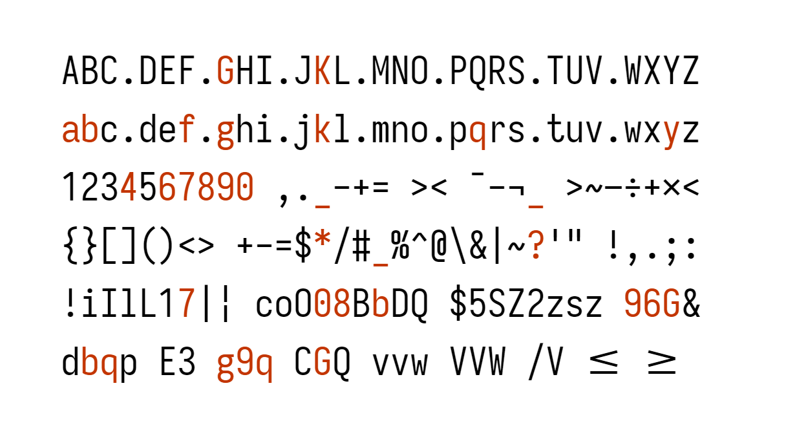</td>
<td>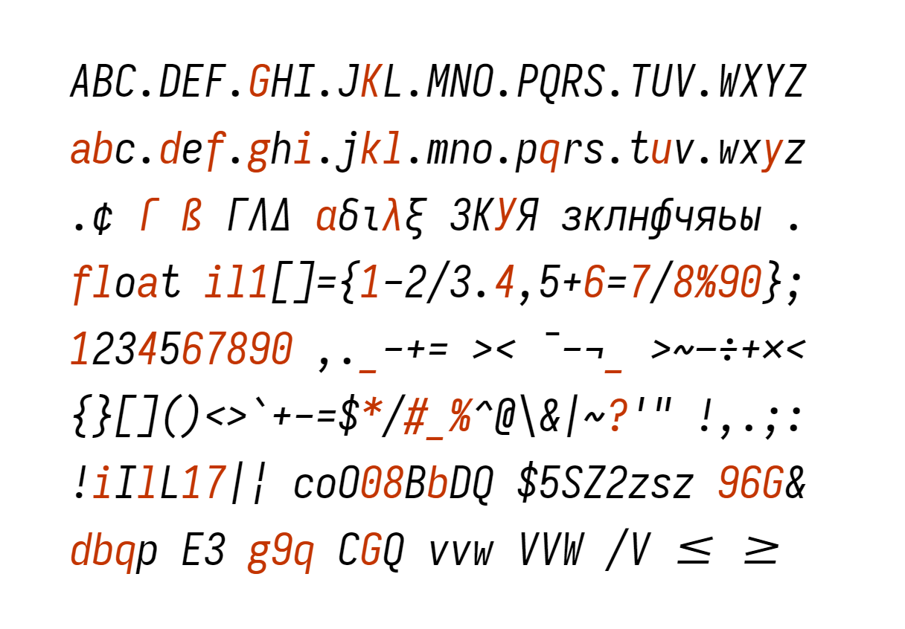</td>
</tr>
<tr>
<td colspan="2"><code>ss20</code> — Curly Style</td>
</tr>
<tr>
<td></td>
<td></td>
</tr>
</table>

<!-- END Section-OT-Stylistic-Sets -->

### Character Variants

Alongside stylistic sets, Monospace Iosevka can also be configured to cherry-pick variants for each character using OpenType. The variants are shown below. To enable, assign the feature tag to the variant index. For example, setting `cv26` to `6` will enable single-storey `a`.

**Caution :**  Certain software may limit the quantity of OpenType features and drop some of them if the feature list is too long. Please validate your feature configuration to ensure that it worked in your software.

<!-- BEGIN Section-OT-Character-Variants -->
<!-- THIS SECTION IS AUTOMATICALLY GENERATED. DO NOT EDIT. -->

<table>
<tr>
<td rowspan="2"><code>cv01</code></td>
<td>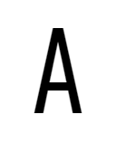</td>
<td>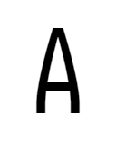</td>
<td>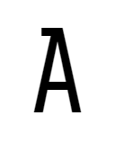</td>
<td>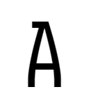</td>
<td>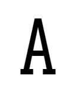</td>
<td>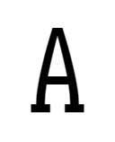</td>
<td>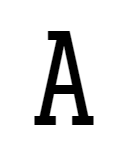</td>
<td>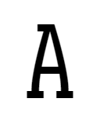</td>
<td colspan="4"> </td>
</tr>
<tr>
<td>1</td>
<td>2</td>
<td>3</td>
<td>4</td>
<td>5</td>
<td>6</td>
<td>7</td>
<td>8</td>
<td colspan="4"> </td>
</tr>
<tr>
<td rowspan="2"><code>cv02</code></td>
<td>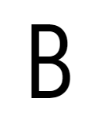</td>
<td>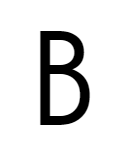</td>
<td>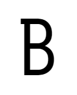</td>
<td>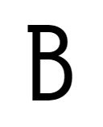</td>
<td>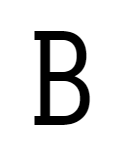</td>
<td></td>
<td>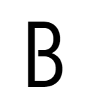</td>
<td>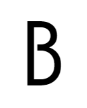</td>
<td>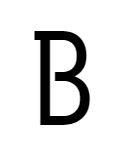</td>
<td>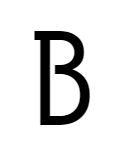</td>
<td>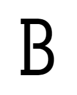</td>
<td>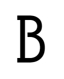</td>
</tr>
<tr>
<td>1</td>
<td>2</td>
<td>3</td>
<td>4</td>
<td>5</td>
<td>6</td>
<td>7</td>
<td>8</td>
<td>9</td>
<td>10</td>
<td>11</td>
<td>12</td>
</tr>
<tr>
<td rowspan="2"><code>cv03</code></td>
<td></td>
<td>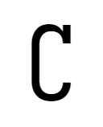</td>
<td></td>
<td>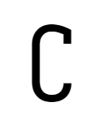</td>
<td>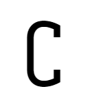</td>
<td colspan="7"> </td>
</tr>
<tr>
<td>1</td>
<td>2</td>
<td>3</td>
<td>4</td>
<td>5</td>
<td colspan="7"> </td>
</tr>
<tr>
<td rowspan="2"><code>cv04</code></td>
<td>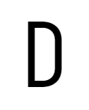</td>
<td>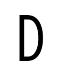</td>
<td>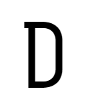</td>
<td>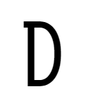</td>
<td>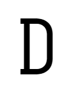</td>
<td>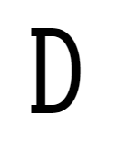</td>
<td colspan="6"> </td>
</tr>
<tr>
<td>1</td>
<td>2</td>
<td>3</td>
<td>4</td>
<td>5</td>
<td>6</td>
<td colspan="6"> </td>
</tr>
<tr>
<td rowspan="2"><code>cv05</code></td>
<td>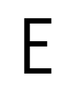</td>
<td>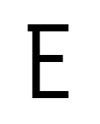</td>
<td>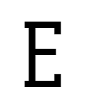</td>
<td colspan="9"> </td>
</tr>
<tr>
<td>1</td>
<td>2</td>
<td>3</td>
<td colspan="9"> </td>
</tr>
<tr>
<td rowspan="2"><code>cv06</code></td>
<td>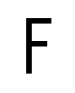</td>
<td>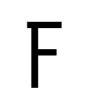</td>
<td>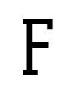</td>
<td colspan="9"> </td>
</tr>
<tr>
<td>1</td>
<td>2</td>
<td>3</td>
<td colspan="9"> </td>
</tr>
<tr>
<td rowspan="6"><code>cv07</code></td>
<td>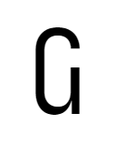</td>
<td></td>
<td>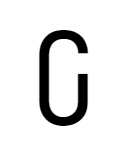</td>
<td>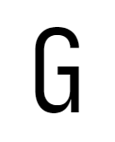</td>
<td>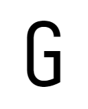</td>
<td>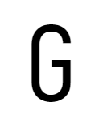</td>
<td>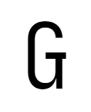</td>
<td>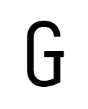</td>
<td>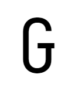</td>
<td>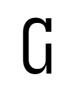</td>
<td>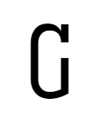</td>
<td>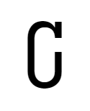</td>
</tr>
<tr>
<td>1</td>
<td>2</td>
<td>3</td>
<td>4</td>
<td>5</td>
<td>6</td>
<td>7</td>
<td>8</td>
<td>9</td>
<td>10</td>
<td>11</td>
<td>12</td>
</tr>
<tr>
<td>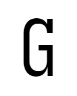</td>
<td>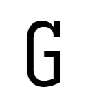</td>
<td>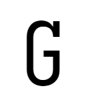</td>
<td></td>
<td></td>
<td></td>
<td></td>
<td></td>
<td></td>
<td></td>
<td></td>
<td></td>
</tr>
<tr>
<td>13</td>
<td>14</td>
<td>15</td>
<td>16</td>
<td>17</td>
<td>18</td>
<td>19</td>
<td>20</td>
<td>21</td>
<td>22</td>
<td>23</td>
<td>24</td>
</tr>
<tr>
<td></td>
<td></td>
<td></td>
<td colspan="9"> </td>
</tr>
<tr>
<td>25</td>
<td>26</td>
<td>27</td>
<td colspan="9"> </td>
</tr>
<tr>
<td rowspan="2"><code>cv08</code></td>
<td></td>
<td></td>
<td></td>
<td></td>
<td colspan="8"> </td>
</tr>
<tr>
<td>1</td>
<td>2</td>
<td>3</td>
<td>4</td>
<td colspan="8"> </td>
</tr>
<tr>
<td rowspan="2"><code>cv09</code></td>
<td></td>
<td></td>
<td></td>
<td colspan="9"> </td>
</tr>
<tr>
<td>1</td>
<td>2</td>
<td>3</td>
<td colspan="9"> </td>
</tr>
<tr>
<td rowspan="4"><code>cv10</code></td>
<td></td>
<td></td>
<td></td>
<td></td>
<td></td>
<td></td>
<td></td>
<td></td>
<td></td>
<td></td>
<td></td>
<td></td>
</tr>
<tr>
<td>1</td>
<td>2</td>
<td>3</td>
<td>4</td>
<td>5</td>
<td>6</td>
<td>7</td>
<td>8</td>
<td>9</td>
<td>10</td>
<td>11</td>
<td>12</td>
</tr>
<tr>
<td></td>
<td></td>
<td colspan="10"> </td>
</tr>
<tr>
<td>13</td>
<td>14</td>
<td colspan="10"> </td>
</tr>
<tr>
<td rowspan="4"><code>cv11</code></td>
<td></td>
<td></td>
<td></td>
<td></td>
<td></td>
<td></td>
<td></td>
<td></td>
<td></td>
<td></td>
<td></td>
<td></td>
</tr>
<tr>
<td>1</td>
<td>2</td>
<td>3</td>
<td>4</td>
<td>5</td>
<td>6</td>
<td>7</td>
<td>8</td>
<td>9</td>
<td>10</td>
<td>11</td>
<td>12</td>
</tr>
<tr>
<td></td>
<td></td>
<td></td>
<td></td>
<td colspan="8"> </td>
</tr>
<tr>
<td>13</td>
<td>14</td>
<td>15</td>
<td>16</td>
<td colspan="8"> </td>
</tr>
<tr>
<td rowspan="2"><code>cv12</code></td>
<td></td>
<td></td>
<td></td>
<td colspan="9"> </td>
</tr>
<tr>
<td>1</td>
<td>2</td>
<td>3</td>
<td colspan="9"> </td>
</tr>
<tr>
<td rowspan="2"><code>cv13</code></td>
<td></td>
<td></td>
<td></td>
<td></td>
<td></td>
<td></td>
<td></td>
<td></td>
<td colspan="4"> </td>
</tr>
<tr>
<td>1</td>
<td>2</td>
<td>3</td>
<td>4</td>
<td>5</td>
<td>6</td>
<td>7</td>
<td>8</td>
<td colspan="4"> </td>
</tr>
<tr>
<td rowspan="2"><code>cv14</code></td>
<td></td>
<td></td>
<td></td>
<td></td>
<td colspan="8"> </td>
</tr>
<tr>
<td>1</td>
<td>2</td>
<td>3</td>
<td>4</td>
<td colspan="8"> </td>
</tr>
<tr>
<td rowspan="2"><code>cv15</code></td>
<td></td>
<td></td>
<td></td>
<td></td>
<td colspan="8"> </td>
</tr>
<tr>
<td>1</td>
<td>2</td>
<td>3</td>
<td>4</td>
<td colspan="8"> </td>
</tr>
<tr>
<td rowspan="2"><code>cv16</code></td>
<td></td>
<td></td>
<td></td>
<td></td>
<td></td>
<td></td>
<td></td>
<td></td>
<td colspan="4"> </td>
</tr>
<tr>
<td>1</td>
<td>2</td>
<td>3</td>
<td>4</td>
<td>5</td>
<td>6</td>
<td>7</td>
<td>8</td>
<td colspan="4"> </td>
</tr>
<tr>
<td rowspan="2"><code>cv17</code></td>
<td></td>
<td></td>
<td></td>
<td></td>
<td></td>
<td></td>
<td></td>
<td></td>
<td></td>
<td></td>
<td></td>
<td></td>
</tr>
<tr>
<td>1</td>
<td>2</td>
<td>3</td>
<td>4</td>
<td>5</td>
<td>6</td>
<td>7</td>
<td>8</td>
<td>9</td>
<td>10</td>
<td>11</td>
<td>12</td>
</tr>
<tr>
<td rowspan="2"><code>cv18</code></td>
<td></td>
<td></td>
<td></td>
<td></td>
<td></td>
<td colspan="7"> </td>
</tr>
<tr>
<td>1</td>
<td>2</td>
<td>3</td>
<td>4</td>
<td>5</td>
<td colspan="7"> </td>
</tr>
<tr>
<td rowspan="2"><code>cv19</code></td>
<td></td>
<td></td>
<td></td>
<td colspan="9"> </td>
</tr>
<tr>
<td>1</td>
<td>2</td>
<td>3</td>
<td colspan="9"> </td>
</tr>
<tr>
<td rowspan="2"><code>cv20</code></td>
<td></td>
<td></td>
<td></td>
<td></td>
<td></td>
<td></td>
<td></td>
<td></td>
<td></td>
<td></td>
<td colspan="2"> </td>
</tr>
<tr>
<td>1</td>
<td>2</td>
<td>3</td>
<td>4</td>
<td>5</td>
<td>6</td>
<td>7</td>
<td>8</td>
<td>9</td>
<td>10</td>
<td colspan="2"> </td>
</tr>
<tr>
<td rowspan="2"><code>cv21</code></td>
<td></td>
<td></td>
<td></td>
<td></td>
<td colspan="8"> </td>
</tr>
<tr>
<td>1</td>
<td>2</td>
<td>3</td>
<td>4</td>
<td colspan="8"> </td>
</tr>
<tr>
<td rowspan="2"><code>cv22</code></td>
<td></td>
<td></td>
<td></td>
<td></td>
<td></td>
<td></td>
<td></td>
<td></td>
<td></td>
<td></td>
<td></td>
<td></td>
</tr>
<tr>
<td>1</td>
<td>2</td>
<td>3</td>
<td>4</td>
<td>5</td>
<td>6</td>
<td>7</td>
<td>8</td>
<td>9</td>
<td>10</td>
<td>11</td>
<td>12</td>
</tr>
<tr>
<td rowspan="2"><code>cv23</code></td>
<td></td>
<td></td>
<td></td>
<td></td>
<td></td>
<td></td>
<td colspan="6"> </td>
</tr>
<tr>
<td>1</td>
<td>2</td>
<td>3</td>
<td>4</td>
<td>5</td>
<td>6</td>
<td colspan="6"> </td>
</tr>
<tr>
<td rowspan="2"><code>cv24</code></td>
<td></td>
<td></td>
<td></td>
<td></td>
<td></td>
<td></td>
<td></td>
<td></td>
<td colspan="4"> </td>
</tr>
<tr>
<td>1</td>
<td>2</td>
<td>3</td>
<td>4</td>
<td>5</td>
<td>6</td>
<td>7</td>
<td>8</td>
<td colspan="4"> </td>
</tr>
<tr>
<td rowspan="6"><code>cv25</code></td>
<td></td>
<td></td>
<td></td>
<td></td>
<td></td>
<td></td>
<td></td>
<td></td>
<td></td>
<td></td>
<td></td>
<td></td>
</tr>
<tr>
<td>1</td>
<td>2</td>
<td>3</td>
<td>4</td>
<td>5</td>
<td>6</td>
<td>7</td>
<td>8</td>
<td>9</td>
<td>10</td>
<td>11</td>
<td>12</td>
</tr>
<tr>
<td></td>
<td></td>
<td></td>
<td></td>
<td></td>
<td></td>
<td></td>
<td></td>
<td></td>
<td></td>
<td></td>
<td></td>
</tr>
<tr>
<td>13</td>
<td>14</td>
<td>15</td>
<td>16</td>
<td>17</td>
<td>18</td>
<td>19</td>
<td>20</td>
<td>21</td>
<td>22</td>
<td>23</td>
<td>24</td>
</tr>
<tr>
<td></td>
<td></td>
<td></td>
<td colspan="9"> </td>
</tr>
<tr>
<td>25</td>
<td>26</td>
<td>27</td>
<td colspan="9"> </td>
</tr>
<tr>
<td rowspan="4"><code>cv26</code></td>
<td></td>
<td></td>
<td></td>
<td></td>
<td></td>
<td></td>
<td></td>
<td></td>
<td></td>
<td></td>
<td></td>
<td></td>
</tr>
<tr>
<td>1</td>
<td>2</td>
<td>3</td>
<td>4</td>
<td>5</td>
<td>6</td>
<td>7</td>
<td>8</td>
<td>9</td>
<td>10</td>
<td>11</td>
<td>12</td>
</tr>
<tr>
<td></td>
<td></td>
<td colspan="10"> </td>
</tr>
<tr>
<td>13</td>
<td>14</td>
<td colspan="10"> </td>
</tr>
<tr>
<td rowspan="2"><code>cv27</code></td>
<td></td>
<td></td>
<td></td>
<td></td>
<td></td>
<td></td>
<td colspan="6"> </td>
</tr>
<tr>
<td>1</td>
<td>2</td>
<td>3</td>
<td>4</td>
<td>5</td>
<td>6</td>
<td colspan="6"> </td>
</tr>
<tr>
<td rowspan="2"><code>cv28</code></td>
<td></td>
<td></td>
<td></td>
<td></td>
<td></td>
<td colspan="7"> </td>
</tr>
<tr>
<td>1</td>
<td>2</td>
<td>3</td>
<td>4</td>
<td>5</td>
<td colspan="7"> </td>
</tr>
<tr>
<td rowspan="2"><code>cv29</code></td>
<td></td>
<td></td>
<td></td>
<td></td>
<td></td>
<td></td>
<td></td>
<td></td>
<td></td>
<td colspan="3"> </td>
</tr>
<tr>
<td>1</td>
<td>2</td>
<td>3</td>
<td>4</td>
<td>5</td>
<td>6</td>
<td>7</td>
<td>8</td>
<td>9</td>
<td colspan="3"> </td>
</tr>
<tr>
<td rowspan="2"><code>cv30</code></td>
<td></td>
<td></td>
<td colspan="10"> </td>
</tr>
<tr>
<td>1</td>
<td>2</td>
<td colspan="10"> </td>
</tr>
<tr>
<td rowspan="4"><code>cv31</code></td>
<td></td>
<td></td>
<td></td>
<td></td>
<td></td>
<td></td>
<td></td>
<td></td>
<td></td>
<td></td>
<td></td>
<td></td>
</tr>
<tr>
<td>1</td>
<td>2</td>
<td>3</td>
<td>4</td>
<td>5</td>
<td>6</td>
<td>7</td>
<td>8</td>
<td>9</td>
<td>10</td>
<td>11</td>
<td>12</td>
</tr>
<tr>
<td></td>
<td></td>
<td></td>
<td></td>
<td></td>
<td></td>
<td></td>
<td></td>
<td colspan="4"> </td>
</tr>
<tr>
<td>13</td>
<td>14</td>
<td>15</td>
<td>16</td>
<td>17</td>
<td>18</td>
<td>19</td>
<td>20</td>
<td colspan="4"> </td>
</tr>
<tr>
<td rowspan="2"><code>cv32</code></td>
<td></td>
<td></td>
<td></td>
<td></td>
<td></td>
<td></td>
<td></td>
<td></td>
<td></td>
<td></td>
<td colspan="2"> </td>
</tr>
<tr>
<td>1</td>
<td>2</td>
<td>3</td>
<td>4</td>
<td>5</td>
<td>6</td>
<td>7</td>
<td>8</td>
<td>9</td>
<td>10</td>
<td colspan="2"> </td>
</tr>
<tr>
<td rowspan="2"><code>cv33</code></td>
<td></td>
<td></td>
<td></td>
<td></td>
<td></td>
<td colspan="7"> </td>
</tr>
<tr>
<td>1</td>
<td>2</td>
<td>3</td>
<td>4</td>
<td>5</td>
<td colspan="7"> </td>
</tr>
<tr>
<td rowspan="2"><code>cv34</code></td>
<td></td>
<td></td>
<td></td>
<td></td>
<td></td>
<td></td>
<td></td>
<td></td>
<td></td>
<td></td>
<td></td>
<td></td>
</tr>
<tr>
<td>1</td>
<td>2</td>
<td>3</td>
<td>4</td>
<td>5</td>
<td>6</td>
<td>7</td>
<td>8</td>
<td>9</td>
<td>10</td>
<td>11</td>
<td>12</td>
</tr>
<tr>
<td rowspan="2"><code>cv35</code></td>
<td></td>
<td></td>
<td></td>
<td></td>
<td></td>
<td></td>
<td></td>
<td></td>
<td colspan="4"> </td>
</tr>
<tr>
<td>1</td>
<td>2</td>
<td>3</td>
<td>4</td>
<td>5</td>
<td>6</td>
<td>7</td>
<td>8</td>
<td colspan="4"> </td>
</tr>
<tr>
<td rowspan="6"><code>cv36</code></td>
<td></td>
<td></td>
<td></td>
<td></td>
<td></td>
<td></td>
<td></td>
<td></td>
<td></td>
<td></td>
<td></td>
<td></td>
</tr>
<tr>
<td>1</td>
<td>2</td>
<td>3</td>
<td>4</td>
<td>5</td>
<td>6</td>
<td>7</td>
<td>8</td>
<td>9</td>
<td>10</td>
<td>11</td>
<td>12</td>
</tr>
<tr>
<td></td>
<td></td>
<td></td>
<td></td>
<td></td>
<td></td>
<td></td>
<td></td>
<td></td>
<td></td>
<td></td>
<td></td>
</tr>
<tr>
<td>13</td>
<td>14</td>
<td>15</td>
<td>16</td>
<td>17</td>
<td>18</td>
<td>19</td>
<td>20</td>
<td>21</td>
<td>22</td>
<td>23</td>
<td>24</td>
</tr>
<tr>
<td></td>
<td></td>
<td></td>
<td colspan="9"> </td>
</tr>
<tr>
<td>25</td>
<td>26</td>
<td>27</td>
<td colspan="9"> </td>
</tr>
<tr>
<td rowspan="2"><code>cv37</code></td>
<td></td>
<td></td>
<td></td>
<td></td>
<td></td>
<td></td>
<td></td>
<td></td>
<td></td>
<td></td>
<td></td>
<td></td>
</tr>
<tr>
<td>1</td>
<td>2</td>
<td>3</td>
<td>4</td>
<td>5</td>
<td>6</td>
<td>7</td>
<td>8</td>
<td>9</td>
<td>10</td>
<td>11</td>
<td>12</td>
</tr>
<tr>
<td rowspan="4"><code>cv38</code></td>
<td></td>
<td></td>
<td></td>
<td></td>
<td></td>
<td></td>
<td></td>
<td></td>
<td></td>
<td></td>
<td></td>
<td></td>
</tr>
<tr>
<td>1</td>
<td>2</td>
<td>3</td>
<td>4</td>
<td>5</td>
<td>6</td>
<td>7</td>
<td>8</td>
<td>9</td>
<td>10</td>
<td>11</td>
<td>12</td>
</tr>
<tr>
<td></td>
<td></td>
<td></td>
<td></td>
<td></td>
<td></td>
<td></td>
<td></td>
<td></td>
<td></td>
<td colspan="2"> </td>
</tr>
<tr>
<td>13</td>
<td>14</td>
<td>15</td>
<td>16</td>
<td>17</td>
<td>18</td>
<td>19</td>
<td>20</td>
<td>21</td>
<td>22</td>
<td colspan="2"> </td>
</tr>
<tr>
<td rowspan="2"><code>cv39</code></td>
<td></td>
<td></td>
<td></td>
<td></td>
<td></td>
<td></td>
<td></td>
<td></td>
<td></td>
<td colspan="3"> </td>
</tr>
<tr>
<td>1</td>
<td>2</td>
<td>3</td>
<td>4</td>
<td>5</td>
<td>6</td>
<td>7</td>
<td>8</td>
<td>9</td>
<td colspan="3"> </td>
</tr>
<tr>
<td rowspan="2"><code>cv40</code></td>
<td></td>
<td></td>
<td></td>
<td></td>
<td colspan="8"> </td>
</tr>
<tr>
<td>1</td>
<td>2</td>
<td>3</td>
<td>4</td>
<td colspan="8"> </td>
</tr>
<tr>
<td rowspan="2"><code>cv41</code></td>
<td></td>
<td></td>
<td></td>
<td></td>
<td></td>
<td></td>
<td></td>
<td></td>
<td></td>
<td></td>
<td></td>
<td></td>
</tr>
<tr>
<td>1</td>
<td>2</td>
<td>3</td>
<td>4</td>
<td>5</td>
<td>6</td>
<td>7</td>
<td>8</td>
<td>9</td>
<td>10</td>
<td>11</td>
<td>12</td>
</tr>
<tr>
<td rowspan="4"><code>cv42</code></td>
<td></td>
<td></td>
<td></td>
<td></td>
<td></td>
<td></td>
<td></td>
<td></td>
<td></td>
<td></td>
<td></td>
<td></td>
</tr>
<tr>
<td>1</td>
<td>2</td>
<td>3</td>
<td>4</td>
<td>5</td>
<td>6</td>
<td>7</td>
<td>8</td>
<td>9</td>
<td>10</td>
<td>11</td>
<td>12</td>
</tr>
<tr>
<td></td>
<td></td>
<td></td>
<td></td>
<td colspan="8"> </td>
</tr>
<tr>
<td>13</td>
<td>14</td>
<td>15</td>
<td>16</td>
<td colspan="8"> </td>
</tr>
<tr>
<td rowspan="2"><code>cv43</code></td>
<td></td>
<td></td>
<td></td>
<td></td>
<td></td>
<td colspan="7"> </td>
</tr>
<tr>
<td>1</td>
<td>2</td>
<td>3</td>
<td>4</td>
<td>5</td>
<td colspan="7"> </td>
</tr>
<tr>
<td rowspan="4"><code>cv44</code></td>
<td></td>
<td></td>
<td></td>
<td></td>
<td></td>
<td></td>
<td></td>
<td></td>
<td></td>
<td></td>
<td></td>
<td></td>
</tr>
<tr>
<td>1</td>
<td>2</td>
<td>3</td>
<td>4</td>
<td>5</td>
<td>6</td>
<td>7</td>
<td>8</td>
<td>9</td>
<td>10</td>
<td>11</td>
<td>12</td>
</tr>
<tr>
<td></td>
<td></td>
<td></td>
<td colspan="9"> </td>
</tr>
<tr>
<td>13</td>
<td>14</td>
<td>15</td>
<td colspan="9"> </td>
</tr>
<tr>
<td rowspan="2"><code>cv45</code></td>
<td></td>
<td></td>
<td></td>
<td></td>
<td></td>
<td></td>
<td></td>
<td></td>
<td></td>
<td colspan="3"> </td>
</tr>
<tr>
<td>1</td>
<td>2</td>
<td>3</td>
<td>4</td>
<td>5</td>
<td>6</td>
<td>7</td>
<td>8</td>
<td>9</td>
<td colspan="3"> </td>
</tr>
<tr>
<td rowspan="2"><code>cv46</code></td>
<td></td>
<td></td>
<td></td>
<td></td>
<td></td>
<td></td>
<td colspan="6"> </td>
</tr>
<tr>
<td>1</td>
<td>2</td>
<td>3</td>
<td>4</td>
<td>5</td>
<td>6</td>
<td colspan="6"> </td>
</tr>
<tr>
<td rowspan="4"><code>cv47</code></td>
<td></td>
<td></td>
<td></td>
<td></td>
<td></td>
<td></td>
<td></td>
<td></td>
<td></td>
<td></td>
<td></td>
<td></td>
</tr>
<tr>
<td>1</td>
<td>2</td>
<td>3</td>
<td>4</td>
<td>5</td>
<td>6</td>
<td>7</td>
<td>8</td>
<td>9</td>
<td>10</td>
<td>11</td>
<td>12</td>
</tr>
<tr>
<td></td>
<td></td>
<td colspan="10"> </td>
</tr>
<tr>
<td>13</td>
<td>14</td>
<td colspan="10"> </td>
</tr>
<tr>
<td rowspan="2"><code>cv48</code></td>
<td></td>
<td></td>
<td></td>
<td></td>
<td></td>
<td></td>
<td></td>
<td colspan="5"> </td>
</tr>
<tr>
<td>1</td>
<td>2</td>
<td>3</td>
<td>4</td>
<td>5</td>
<td>6</td>
<td>7</td>
<td colspan="5"> </td>
</tr>
<tr>
<td rowspan="2"><code>cv49</code></td>
<td></td>
<td></td>
<td></td>
<td></td>
<td></td>
<td></td>
<td></td>
<td></td>
<td></td>
<td></td>
<td></td>
<td></td>
</tr>
<tr>
<td>1</td>
<td>2</td>
<td>3</td>
<td>4</td>
<td>5</td>
<td>6</td>
<td>7</td>
<td>8</td>
<td>9</td>
<td>10</td>
<td>11</td>
<td>12</td>
</tr>
<tr>
<td rowspan="6"><code>cv50</code></td>
<td></td>
<td></td>
<td></td>
<td></td>
<td></td>
<td></td>
<td></td>
<td></td>
<td></td>
<td></td>
<td></td>
<td></td>
</tr>
<tr>
<td>1</td>
<td>2</td>
<td>3</td>
<td>4</td>
<td>5</td>
<td>6</td>
<td>7</td>
<td>8</td>
<td>9</td>
<td>10</td>
<td>11</td>
<td>12</td>
</tr>
<tr>
<td></td>
<td></td>
<td></td>
<td></td>
<td></td>
<td></td>
<td></td>
<td></td>
<td></td>
<td></td>
<td></td>
<td></td>
</tr>
<tr>
<td>13</td>
<td>14</td>
<td>15</td>
<td>16</td>
<td>17</td>
<td>18</td>
<td>19</td>
<td>20</td>
<td>21</td>
<td>22</td>
<td>23</td>
<td>24</td>
</tr>
<tr>
<td></td>
<td></td>
<td></td>
<td colspan="9"> </td>
</tr>
<tr>
<td>25</td>
<td>26</td>
<td>27</td>
<td colspan="9"> </td>
</tr>
<tr>
<td rowspan="2"><code>cv51</code></td>
<td></td>
<td></td>
<td></td>
<td></td>
<td></td>
<td></td>
<td colspan="6"> </td>
</tr>
<tr>
<td>1</td>
<td>2</td>
<td>3</td>
<td>4</td>
<td>5</td>
<td>6</td>
<td colspan="6"> </td>
</tr>
<tr>
<td rowspan="2"><code>cv52</code></td>
<td></td>
<td></td>
<td></td>
<td></td>
<td></td>
<td></td>
<td></td>
<td></td>
<td></td>
<td></td>
<td></td>
<td></td>
</tr>
<tr>
<td>1</td>
<td>2</td>
<td>3</td>
<td>4</td>
<td>5</td>
<td>6</td>
<td>7</td>
<td>8</td>
<td>9</td>
<td>10</td>
<td>11</td>
<td>12</td>
</tr>
<tr>
<td rowspan="2"><code>cv53</code></td>
<td colspan="2"></td>
<td colspan="2"></td>
<td colspan="8"> </td>
</tr>
<tr>
<td colspan="2">1</td>
<td colspan="2">2</td>
<td colspan="8"> </td>
</tr>
<tr>
<td rowspan="2"><code>cv54</code></td>
<td></td>
<td></td>
<td colspan="10"> </td>
</tr>
<tr>
<td>1</td>
<td>2</td>
<td colspan="10"> </td>
</tr>
<tr>
<td rowspan="2"><code>VXAA</code></td>
<td></td>
<td></td>
<td colspan="10"> </td>
</tr>
<tr>
<td>1</td>
<td>2</td>
<td colspan="10"> </td>
</tr>
<tr>
<td rowspan="2"><code>cv55</code></td>
<td></td>
<td></td>
<td></td>
<td colspan="9"> </td>
</tr>
<tr>
<td>1</td>
<td>2</td>
<td>3</td>
<td colspan="9"> </td>
</tr>
<tr>
<td rowspan="2"><code>cv56</code></td>
<td></td>
<td></td>
<td></td>
<td></td>
<td></td>
<td></td>
<td colspan="6"> </td>
</tr>
<tr>
<td>1</td>
<td>2</td>
<td>3</td>
<td>4</td>
<td>5</td>
<td>6</td>
<td colspan="6"> </td>
</tr>
<tr>
<td rowspan="2"><code>cv57</code></td>
<td></td>
<td></td>
<td></td>
<td></td>
<td colspan="8"> </td>
</tr>
<tr>
<td>1</td>
<td>2</td>
<td>3</td>
<td>4</td>
<td colspan="8"> </td>
</tr>
<tr>
<td rowspan="2"><code>VXAB</code></td>
<td></td>
<td></td>
<td colspan="10"> </td>
</tr>
<tr>
<td>1</td>
<td>2</td>
<td colspan="10"> </td>
</tr>
<tr>
<td rowspan="2"><code>cv58</code></td>
<td></td>
<td></td>
<td></td>
<td></td>
<td></td>
<td colspan="7"> </td>
</tr>
<tr>
<td>1</td>
<td>2</td>
<td>3</td>
<td>4</td>
<td>5</td>
<td colspan="7"> </td>
</tr>
<tr>
<td rowspan="2"><code>cv59</code></td>
<td></td>
<td></td>
<td></td>
<td></td>
<td></td>
<td colspan="7"> </td>
</tr>
<tr>
<td>1</td>
<td>2</td>
<td>3</td>
<td>4</td>
<td>5</td>
<td colspan="7"> </td>
</tr>
<tr>
<td rowspan="4"><code>cv60</code></td>
<td></td>
<td></td>
<td></td>
<td></td>
<td></td>
<td></td>
<td></td>
<td></td>
<td></td>
<td></td>
<td></td>
<td></td>
</tr>
<tr>
<td>1</td>
<td>2</td>
<td>3</td>
<td>4</td>
<td>5</td>
<td>6</td>
<td>7</td>
<td>8</td>
<td>9</td>
<td>10</td>
<td>11</td>
<td>12</td>
</tr>
<tr>
<td></td>
<td></td>
<td></td>
<td></td>
<td colspan="8"> </td>
</tr>
<tr>
<td>13</td>
<td>14</td>
<td>15</td>
<td>16</td>
<td colspan="8"> </td>
</tr>
<tr>
<td rowspan="4"><code>cv61</code></td>
<td></td>
<td></td>
<td></td>
<td></td>
<td></td>
<td></td>
<td></td>
<td></td>
<td></td>
<td></td>
<td></td>
<td></td>
</tr>
<tr>
<td>1</td>
<td>2</td>
<td>3</td>
<td>4</td>
<td>5</td>
<td>6</td>
<td>7</td>
<td>8</td>
<td>9</td>
<td>10</td>
<td>11</td>
<td>12</td>
</tr>
<tr>
<td></td>
<td></td>
<td></td>
<td></td>
<td colspan="8"> </td>
</tr>
<tr>
<td>13</td>
<td>14</td>
<td>15</td>
<td>16</td>
<td colspan="8"> </td>
</tr>
<tr>
<td rowspan="2"><code>cv62</code></td>
<td></td>
<td></td>
<td colspan="10"> </td>
</tr>
<tr>
<td>1</td>
<td>2</td>
<td colspan="10"> </td>
</tr>
<tr>
<td rowspan="2"><code>cv63</code></td>
<td></td>
<td></td>
<td></td>
<td></td>
<td></td>
<td></td>
<td></td>
<td colspan="5"> </td>
</tr>
<tr>
<td>1</td>
<td>2</td>
<td>3</td>
<td>4</td>
<td>5</td>
<td>6</td>
<td>7</td>
<td colspan="5"> </td>
</tr>
<tr>
<td rowspan="2"><code>cv64</code></td>
<td></td>
<td></td>
<td></td>
<td></td>
<td colspan="8"> </td>
</tr>
<tr>
<td>1</td>
<td>2</td>
<td>3</td>
<td>4</td>
<td colspan="8"> </td>
</tr>
<tr>
<td rowspan="2"><code>cv65</code></td>
<td></td>
<td></td>
<td colspan="10"> </td>
</tr>
<tr>
<td>1</td>
<td>2</td>
<td colspan="10"> </td>
</tr>
<tr>
<td rowspan="2"><code>cv66</code></td>
<td></td>
<td></td>
<td></td>
<td></td>
<td></td>
<td></td>
<td colspan="6"> </td>
</tr>
<tr>
<td>1</td>
<td>2</td>
<td>3</td>
<td>4</td>
<td>5</td>
<td>6</td>
<td colspan="6"> </td>
</tr>
<tr>
<td rowspan="2"><code>cv67</code></td>
<td></td>
<td></td>
<td></td>
<td></td>
<td></td>
<td></td>
<td colspan="6"> </td>
</tr>
<tr>
<td>1</td>
<td>2</td>
<td>3</td>
<td>4</td>
<td>5</td>
<td>6</td>
<td colspan="6"> </td>
</tr>
<tr>
<td rowspan="2"><code>cv68</code></td>
<td></td>
<td></td>
<td></td>
<td></td>
<td></td>
<td></td>
<td></td>
<td></td>
<td></td>
<td></td>
<td></td>
<td></td>
</tr>
<tr>
<td>1</td>
<td>2</td>
<td>3</td>
<td>4</td>
<td>5</td>
<td>6</td>
<td>7</td>
<td>8</td>
<td>9</td>
<td>10</td>
<td>11</td>
<td>12</td>
</tr>
<tr>
<td rowspan="2"><code>cv69</code></td>
<td></td>
<td></td>
<td></td>
<td colspan="9"> </td>
</tr>
<tr>
<td>1</td>
<td>2</td>
<td>3</td>
<td colspan="9"> </td>
</tr>
<tr>
<td rowspan="2"><code>cv70</code></td>
<td></td>
<td></td>
<td></td>
<td></td>
<td></td>
<td></td>
<td colspan="6"> </td>
</tr>
<tr>
<td>1</td>
<td>2</td>
<td>3</td>
<td>4</td>
<td>5</td>
<td>6</td>
<td colspan="6"> </td>
</tr>
<tr>
<td rowspan="2"><code>cv71</code></td>
<td></td>
<td></td>
<td></td>
<td></td>
<td></td>
<td></td>
<td></td>
<td></td>
<td></td>
<td></td>
<td colspan="2"> </td>
</tr>
<tr>
<td>1</td>
<td>2</td>
<td>3</td>
<td>4</td>
<td>5</td>
<td>6</td>
<td>7</td>
<td>8</td>
<td>9</td>
<td>10</td>
<td colspan="2"> </td>
</tr>
<tr>
<td rowspan="2"><code>cv72</code></td>
<td></td>
<td></td>
<td></td>
<td></td>
<td></td>
<td></td>
<td></td>
<td colspan="5"> </td>
</tr>
<tr>
<td>1</td>
<td>2</td>
<td>3</td>
<td>4</td>
<td>5</td>
<td>6</td>
<td>7</td>
<td colspan="5"> </td>
</tr>
<tr>
<td rowspan="2"><code>cv73</code></td>
<td></td>
<td></td>
<td colspan="10"> </td>
</tr>
<tr>
<td>1</td>
<td>2</td>
<td colspan="10"> </td>
</tr>
<tr>
<td rowspan="2"><code>cv74</code></td>
<td></td>
<td></td>
<td colspan="10"> </td>
</tr>
<tr>
<td>1</td>
<td>2</td>
<td colspan="10"> </td>
</tr>
<tr>
<td rowspan="2"><code>cv75</code></td>
<td></td>
<td></td>
<td></td>
<td></td>
<td></td>
<td></td>
<td colspan="6"> </td>
</tr>
<tr>
<td>1</td>
<td>2</td>
<td>3</td>
<td>4</td>
<td>5</td>
<td>6</td>
<td colspan="6"> </td>
</tr>
<tr>
<td rowspan="2"><code>cv76</code></td>
<td></td>
<td></td>
<td colspan="10"> </td>
</tr>
<tr>
<td>1</td>
<td>2</td>
<td colspan="10"> </td>
</tr>
<tr>
<td rowspan="2"><code>cv77</code></td>
<td></td>
<td></td>
<td></td>
<td colspan="9"> </td>
</tr>
<tr>
<td>1</td>
<td>2</td>
<td>3</td>
<td colspan="9"> </td>
</tr>
<tr>
<td rowspan="2"><code>cv78</code></td>
<td></td>
<td></td>
<td></td>
<td></td>
<td></td>
<td></td>
<td></td>
<td></td>
<td></td>
<td></td>
<td></td>
<td></td>
</tr>
<tr>
<td>1</td>
<td>2</td>
<td>3</td>
<td>4</td>
<td>5</td>
<td>6</td>
<td>7</td>
<td>8</td>
<td>9</td>
<td>10</td>
<td>11</td>
<td>12</td>
</tr>
<tr>
<td rowspan="2"><code>cv79</code></td>
<td></td>
<td></td>
<td></td>
<td colspan="9"> </td>
</tr>
<tr>
<td>1</td>
<td>2</td>
<td>3</td>
<td colspan="9"> </td>
</tr>
<tr>
<td rowspan="2"><code>cv80</code></td>
<td></td>
<td></td>
<td></td>
<td colspan="9"> </td>
</tr>
<tr>
<td>1</td>
<td>2</td>
<td>3</td>
<td colspan="9"> </td>
</tr>
<tr>
<td rowspan="2"><code>cv81</code></td>
<td></td>
<td></td>
<td colspan="10"> </td>
</tr>
<tr>
<td>1</td>
<td>2</td>
<td colspan="10"> </td>
</tr>
<tr>
<td rowspan="2"><code>cv82</code></td>
<td></td>
<td></td>
<td></td>
<td></td>
<td></td>
<td></td>
<td></td>
<td></td>
<td colspan="4"> </td>
</tr>
<tr>
<td>1</td>
<td>2</td>
<td>3</td>
<td>4</td>
<td>5</td>
<td>6</td>
<td>7</td>
<td>8</td>
<td colspan="4"> </td>
</tr>
<tr>
<td rowspan="2"><code>cv83</code></td>
<td></td>
<td></td>
<td></td>
<td colspan="9"> </td>
</tr>
<tr>
<td>1</td>
<td>2</td>
<td>3</td>
<td colspan="9"> </td>
</tr>
<tr>
<td rowspan="2"><code>cv84</code></td>
<td></td>
<td></td>
<td colspan="10"> </td>
</tr>
<tr>
<td>1</td>
<td>2</td>
<td colspan="10"> </td>
</tr>
<tr>
<td rowspan="2"><code>cv85</code></td>
<td></td>
<td></td>
<td></td>
<td colspan="9"> </td>
</tr>
<tr>
<td>1</td>
<td>2</td>
<td>3</td>
<td colspan="9"> </td>
</tr>
<tr>
<td rowspan="2"><code>cv86</code></td>
<td colspan="2"></td>
<td colspan="2"></td>
<td colspan="2"></td>
<td colspan="6"> </td>
</tr>
<tr>
<td colspan="2">1</td>
<td colspan="2">2</td>
<td colspan="2">3</td>
<td colspan="6"> </td>
</tr>
<tr>
<td rowspan="2"><code>cv87</code></td>
<td colspan="2"></td>
<td colspan="2"></td>
<td colspan="8"> </td>
</tr>
<tr>
<td colspan="2">1</td>
<td colspan="2">2</td>
<td colspan="8"> </td>
</tr>
<tr>
<td rowspan="2"><code>cv88</code></td>
<td></td>
<td></td>
<td></td>
<td></td>
<td colspan="8"> </td>
</tr>
<tr>
<td>1</td>
<td>2</td>
<td>3</td>
<td>4</td>
<td colspan="8"> </td>
</tr>
<tr>
<td rowspan="2"><code>cv89</code></td>
<td></td>
<td></td>
<td></td>
<td></td>
<td></td>
<td></td>
<td></td>
<td colspan="5"> </td>
</tr>
<tr>
<td>1</td>
<td>2</td>
<td>3</td>
<td>4</td>
<td>5</td>
<td>6</td>
<td>7</td>
<td colspan="5"> </td>
</tr>
<tr>
<td rowspan="2"><code>cv90</code></td>
<td></td>
<td></td>
<td></td>
<td colspan="9"> </td>
</tr>
<tr>
<td>1</td>
<td>2</td>
<td>3</td>
<td colspan="9"> </td>
</tr>
<tr>
<td rowspan="2"><code>cv91</code></td>
<td></td>
<td></td>
<td></td>
<td></td>
<td></td>
<td></td>
<td colspan="6"> </td>
</tr>
<tr>
<td>1</td>
<td>2</td>
<td>3</td>
<td>4</td>
<td>5</td>
<td>6</td>
<td colspan="6"> </td>
</tr>
<tr>
<td rowspan="2"><code>cv92</code></td>
<td></td>
<td></td>
<td></td>
<td colspan="9"> </td>
</tr>
<tr>
<td>1</td>
<td>2</td>
<td>3</td>
<td colspan="9"> </td>
</tr>
<tr>
<td rowspan="2"><code>cv93</code></td>
<td></td>
<td></td>
<td></td>
<td></td>
<td colspan="8"> </td>
</tr>
<tr>
<td>1</td>
<td>2</td>
<td>3</td>
<td>4</td>
<td colspan="8"> </td>
</tr>
<tr>
<td rowspan="2"><code>cv94</code></td>
<td colspan="2"></td>
<td colspan="2"></td>
<td colspan="8"> </td>
</tr>
<tr>
<td colspan="2">1</td>
<td colspan="2">2</td>
<td colspan="8"> </td>
</tr>
<tr>
<td rowspan="2"><code>cv95</code></td>
<td colspan="2"></td>
<td colspan="2"></td>
<td colspan="8"> </td>
</tr>
<tr>
<td colspan="2">1</td>
<td colspan="2">2</td>
<td colspan="8"> </td>
</tr>
<tr>
<td rowspan="2"><code>cv96</code></td>
<td></td>
<td></td>
<td colspan="10"> </td>
</tr>
<tr>
<td>1</td>
<td>2</td>
<td colspan="10"> </td>
</tr>
<tr>
<td rowspan="2"><code>cv97</code></td>
<td></td>
<td></td>
<td></td>
<td colspan="9"> </td>
</tr>
<tr>
<td>1</td>
<td>2</td>
<td>3</td>
<td colspan="9"> </td>
</tr>
<tr>
<td rowspan="2"><code>cv98</code></td>
<td></td>
<td></td>
<td></td>
<td colspan="9"> </td>
</tr>
<tr>
<td>1</td>
<td>2</td>
<td>3</td>
<td colspan="9"> </td>
</tr>
<tr>
<td rowspan="2"><code>cv99</code></td>
<td colspan="6"></td>
<td colspan="6"></td>
</tr>
<tr>
<td colspan="6">1</td>
<td colspan="6">2</td>
</tr>
</table>

<!-- END Section-OT-Character-Variants -->

### Ligations

Monospace subfamilies support ligations. Iosevka’s default ligation set is assigned to `calt` feature, though not all of them are enabled by default.

<!-- BEGIN Section-OT-Ligation-Tags-1 -->
<!-- THIS SECTION IS AUTOMATICALLY GENERATED. DO NOT EDIT. -->

<table>
<tr>
<td><code>calt off</td>
<td>Ligation Off</td>
</tr>
<tr>
<td colspan="2"></td>
</tr>
<tr>
<td><code>calt</code></td>
<td>Default setting in text editors</td>
</tr>
<tr>
<td colspan="2"></td>
</tr>
</table>

<!-- END Section-OT-Ligation-Tags-1 -->

Iosevka supports Language-Specific Ligations, which is the ligation set enabled only under certain languages. These ligation sets are assigned to custom feature tags. To use them, you need to turn **off** `calt` and enable the corresponded feature. The feature list is:

<!-- BEGIN Section-OT-Ligation-Tags-2 -->
<!-- THIS SECTION IS AUTOMATICALLY GENERATED. DO NOT EDIT. -->

<table>
<tr>
<td><code>dlig</code></td>
<td>Discretionary ligatures</td>
</tr>
<tr>
<td colspan="2"></td>
</tr>
<tr>
<td><code>CLIK</code>; <code>JSPT</code>; <code>PHPX</code></td>
<td>C-Like, JavaScript, PHP</td>
</tr>
<tr>
<td colspan="2"></td>
</tr>
<tr>
<td><code>MLXX</code>; <code>FSHP</code></td>
<td>ML, F#</td>
</tr>
<tr>
<td colspan="2"></td>
</tr>
<tr>
<td><code>FSTA</code></td>
<td>F*</td>
</tr>
<tr>
<td colspan="2"></td>
</tr>
<tr>
<td><code>HSKL</code>; <code>IDRS</code>; <code>ELMX</code>; <code>PURS</code></td>
<td>Haskell, Idris, Elm, PureScript</td>
</tr>
<tr>
<td colspan="2"></td>
</tr>
<tr>
<td><code>SWFT</code></td>
<td>Swift</td>
</tr>
<tr>
<td colspan="2"></td>
</tr>
<tr>
<td><code>COQX</code></td>
<td>Coq</td>
</tr>
<tr>
<td colspan="2"></td>
</tr>
<tr>
<td><code>MTLB</code></td>
<td>Matlab</td>
</tr>
<tr>
<td colspan="2"></td>
</tr>
<tr>
<td><code>VRLG</code></td>
<td>Verilog</td>
</tr>
<tr>
<td colspan="2"></td>
</tr>
<tr>
<td><code>WFLM</code></td>
<td>Wolfram Language (Mathematica)</td>
</tr>
<tr>
<td colspan="2"></td>
</tr>
</table>

<!-- END Section-OT-Ligation-Tags-2 -->

Please note that, due to the complex interactions when forming ligations, cherry-picking ligation groups will require a custom Iosevka build. The instructions could be seen below.

## Building from Source

To build Iosevka you should:

1. Ensure that [`nodejs`](http://nodejs.org) (≥ 12.16.0) and [`ttfautohint`](http://www.freetype.org/ttfautohint/) are present, and accessible from `PATH`.
2. Run `npm install`. This command will install **all** the NPM dependencies, and will also validate whether external dependencies are present.
3. `npm run build -- contents::iosevka`.

You will find TTFs, as well as WOFF(2) web fonts and one Webfont CSS in the `dist/` directory.

### Using a Docker container

A Docker container handling the build environment for you can be found [here](https://github.com/avivace/fonts-iosevka).

To pull it from Docker Hub and start a standard build of the latest released version, run

```
docker run -it -v $(pwd):/build avivace/iosevka-build
```

Fonts files will be placed in the `dist` folder.

You can provide `private-build.plans.toml` for a customized build and/or specify the desired release appending `-e FONT_VERSION=X.X.X`. to the Docker command.

## Customized Build

To create a custom build, you need:

1. Create `private-build-plans.toml` file if absent.

2. Add a build plan into `private-build-plans.toml`. The configurable properties are described in the following sections.
   
3. Run `npm run build -- contents::<your plan name>` and the built fonts would be available in `dist/`. Aside from `contents::<plan>`, other options are:

   1. `contents::<plan>` : TTF (Hinted and Unhinted), WOFF(2) and Web font CSS;
   2. `ttf::<plan>` : TTF;
   3. `ttf-unhinted::<plan>` : Unhinted TTF only;
   4. `webfont::<plan>` : Web fonts only (CSS + WOFF2);
   5. `woff2::<plan>` : WOFF2 only.

### Configuring Custom Build

Configuration of build plans are organized under `[buildPlans.<plan name>]` sections in the `private-build-plans.toml`. You can use [the Customizer](https://be5invis.github.io/Iosevka/customizer) to create the build plan, and/or manually edit them, following the instructions below.

Inside the plan, top-level properties include:

* `family`: String, defines the family name of your custom variant.
* `spacing`: Optional, String, denotes the spacing of the custom variant. Valid values include:
  - `quasi-proportional`: The font will become quasi-proportional.
  - `term`: Make the symbols' width suitable for terminal emulators. Arrows and geometric symbols will become narrower.
  - `fontconfig-mono`: Apply `term` spacing changes and further apply changes to be compatible with FontConfig's Mono spacing, which recognizes a font as monospace if and only if its every non-combining characters having the same width. The changes include:
    - Completely remove wide glyphs. All non-combining glyphs will be exactly the same width.
      - As a consequence, the following characters will be **removed**:
        - `U+27F5` LONG LEFTWARDS ARROW
        - `U+27F6` LONG RIGHTWARDS ARROW
    - Remove `NWID` and `WWID` OpenType feature.
  - `fixed`: Apply `fontconfig-mono` changes and further remove ligations.
* `serifs`: Optional, String, configures style of serifs.
  - When set to `slab`, the font will be converted into slab-serif.
  - Otherwise the font will be sans-serif.
* `no-cv-ss`: Optional, Boolean, disables `cv##` and `ss##` OpenType features.
* `no-ligation`: Optional, Boolean, disables ligations.
* `export-glyph-names`: Optional, Boolean, whether to export glyph names into the fonts. Setting this to `true` will increase file footprint, however this is necessary for ligature support in [Kitty](https://sw.kovidgoyal.net/kitty/).

Build plan could have 5 optional subsections: `ligations`, `variants`, `weights`, `widths` and `slopes`.

#### Configuring Ligations

Subsection `ligations` is used to customize the ligation set assigned to `calt` OpenType feature. Properties include:

<!-- BEGIN Section-Predefined-Ligation-Sets -->
<!-- THIS SECTION IS AUTOMATICALLY GENERATED. DO NOT EDIT. -->

* `inherits`: Optional, String, defines the inherited ligation set. When absent, the ligation set will not inherit any other sets. Valid values are:

  - `default-calt`: Inherit default ligation set.
  - `dlig`: Default ligation set would be assigned to Discretionary ligatures.
  - `clike`: Default ligation set would be assigned to C-Like.
  - `javascript`: Default ligation set would be assigned to JavaScript.
  - `php`: Default ligation set would be assigned to PHP.
  - `ml`: Default ligation set would be assigned to ML.
  - `fsharp`: Default ligation set would be assigned to F#.
  - `fstar`: Default ligation set would be assigned to F*.
  - `haskell`: Default ligation set would be assigned to Haskell.
  - `idris`: Default ligation set would be assigned to Idris.
  - `elm`: Default ligation set would be assigned to Elm.
  - `purescript`: Default ligation set would be assigned to PureScript.
  - `swift`: Default ligation set would be assigned to Swift.
  - `coq`: Default ligation set would be assigned to Coq.
  - `matlab`: Default ligation set would be assigned to Matlab.
  - `verilog`: Default ligation set would be assigned to Verilog.
  - `wolfram`: Default ligation set would be assigned to Wolfram Language (Mathematica).

<!-- END Section-Predefined-Ligation-Sets -->

<!-- BEGIN Section-Cherry-Picking-Ligation-Sets -->
<!-- THIS SECTION IS AUTOMATICALLY GENERATED. DO NOT EDIT. -->

* `disables` and `enables`: Optional, String Array, Cherry-picking ligation groups to be disabled or enabled. Valid values include:

  - `center-ops`: Vertically align some of the operators (like `*`) to the center position it is before or after a "center" operator (like `+`).
  - `arrow`: Enable ligation set that forms arrows.
  - `arrow2`: Enable ligation for more arrows, like `>>=`.
  - `trig`: Enable ligation for `<|`, `|>` , `<||`, and other bar-and-angle-bracket symbols.
  - `eqeqeq`: Enable special ligation for `===` with triple lines.
  - `eqeq`: Enable ligation for `==` and `===`.
  - `ineq`: Enable ligation for `<=` and `>=`.
  - `exeqeq`: Enable special ligation for `!==` with triple lines.
  - `exeqeq-dotted`: Enable special ligation for `!==` with triple lines, and a dot at below for distinction.
  - `eqexeq`: Enable special ligation for `=!=` with triple lines.
  - `eqexeq-dotted`: Enable special ligation for `=!=` with triple lines and a dot at below for distinction.
  - `eqexeq-dl`: Enable special ligation for `=!=` with double lines.
  - `eqexeq-dl-dotted`: Enable special ligation for `=!=` with double lines, and a dot at below for distinction.
  - `exeq`: Enable ligation for `!=` and `!==`.
  - `exeq-dotted`: Enable ligation for `!=` and `!==` with a dot at below for distinction.
  - `tildeeq`: Enable ligation for `~=` as inequality.
  - `eqslasheq`: Enable special triple-line ligation for `=/=` as inequality.
  - `slasheq`: Enable ligation for `/=` and `=/=` as inequality.
  - `ltgt-ne`: Enable ligation for `<>` as inequality.
  - `ltgt-diamond`: Enable ligation for `<>` as diamond.
  - `brst`: Center asterisk in `(*` and `*)`.
  - `plusplus`: Enable ligation for `++` and further plus-chaining.
  - `kern-dotty`: Move connecting dotty punctuations closer, like for `::`, `:::` and `...`.
  - `logic`: Enable ligation for `/\` and `\/`.
  - `llgg`: Enable ligation for `<<`, `>>` and other angle-bracket chaining.
  - `llggeq`: Enable ligation for `<<=`, `>>=` as shift operator.
  - `dot-as-operator`: Treat dot (`.`) as operator and perform chained centering.
  - `lteq-as-arrow`: Treat `<=` as arrow.
  - `gteq-as-co-arrow`: Treat `>=` as co-arrow.
  - `html-comment`: Enable ligation for `<!--` and `<!---`.
  - `colon-greater-as-colon-arrow`: Transform `:>` into `:` and a narrow arrow.
  - `brace-bar`: Enable ligation for `{|` and `|}`.
  - `brack-bar`: Enable ligation for `[|` and `|]`.
  - `connected-underscore`: Make contiguous underscores (like `__`) connected.
  - `connected-number-sign`: Make contiguous number signs (like `##`) connected.
  - `connected-tilde-as-wave`: Make contiguous ASCII tildes (like `~~`) connected as a wave line.
  - `connected-hyphen-as-solid-line`: Make contiguous hyphen-minuses (like `--`) connected as a straight solid line.
  - `connected-hyphen-as-semi-dashed-line`: Make contiguous hyphen-minuses (like `--`) connected as a straight semi-dashed line, identifying each hyphen component.

<!-- END Section-Cherry-Picking-Ligation-Sets -->

#### Configuring Character Variants

Subsection `variants` is used to configure character variants in the font. Properties include:

<!-- BEGIN Section-Stylistic-Sets -->
<!-- THIS SECTION IS AUTOMATICALLY GENERATED. DO NOT EDIT. -->

* `inherits`: Optional, String, defines the inherited stylistic set. Valid options include:

  - `ss01`: Set character variant to “Andale Mono Style”.
  - `ss02`: Set character variant to “Anonymous Pro Style”.
  - `ss03`: Set character variant to “Consolas Style”.
  - `ss04`: Set character variant to “Menlo Style”.
  - `ss05`: Set character variant to “Fira Mono Style”.
  - `ss06`: Set character variant to “Liberation Mono Style”.
  - `ss07`: Set character variant to “Monaco Style”.
  - `ss08`: Set character variant to “Pragmata Pro Style”.
  - `ss09`: Set character variant to “Source Code Pro Style”.
  - `ss10`: Set character variant to “Envy Code R Style”.
  - `ss11`: Set character variant to “X Window Style”.
  - `ss12`: Set character variant to “Ubuntu Mono Style”.
  - `ss13`: Set character variant to “Lucida Style”.
  - `ss14`: Set character variant to “JetBrains Mono Style”.
  - `ss15`: Set character variant to “IBM Plex Mono Style”.
  - `ss16`: Set character variant to “PT Mono Style”.
  - `ss17`: Set character variant to “Recursive Mono Style”.
  - `ss18`: Set character variant to “Input Mono Style”.
  - `ss20`: Set character variant to “Curly Style”.

<!-- END Section-Stylistic-Sets -->

<!-- BEGIN Section-Cherry-Picking-Styles -->
<!-- THIS SECTION IS AUTOMATICALLY GENERATED. DO NOT EDIT. -->

* `design`, `upright`, `italic`, and `oblique`: Optional, Dictionary, defines styles for individual characters. The choices are organized in key-value pairs, assigning a variant to a character group. Alternatively, you could assign numbers to `cv##` tags, like what you did when using OpenType in CSS. Assignments under `design` will be applied to all the slopes, and `upright`, `italic`, and `oblique` will apply to corresponded slopes. 

  In addition, style selector for default digit form also uses these dictionaries.
  
  The valid combinations include:

  - Default digit form:
     <table><tr><td rowspan="2" width="348"></td><td><code>digit-form = 'lining'</code></td></tr><tr><td>Lining (default)</td></tr><tr><td rowspan="2" width="348"></td><td><code>digit-form = 'old-style'</code></td></tr><tr><td>Old-style</td></tr></table>
  - Styles for `A`:
     <table><tr><td rowspan="2" width="60"></td><td><code>capital-a = 'straight-serifless'</code>, <code>cv01 = 1</code></td></tr><tr><td>Standard, straight <code>A</code>, without serifs</td></tr><tr><td rowspan="2" width="60"></td><td><code>capital-a = 'curly-serifless'</code>, <code>cv01 = 2</code></td></tr><tr><td>Slightly curly <code>A</code>, like Iosevka 2.x, without serifs</td></tr><tr><td rowspan="2" width="60"></td><td><code>capital-a = 'straight-top-serifed'</code>, <code>cv01 = 3</code></td></tr><tr><td>Straight <code>A</code> with serif at top</td></tr><tr><td rowspan="2" width="60"></td><td><code>capital-a = 'curly-top-serifed'</code>, <code>cv01 = 4</code></td></tr><tr><td>Slightly curly <code>A</code>, like Iosevka 2.x, with serif at top</td></tr><tr><td rowspan="2" width="60"></td><td><code>capital-a = 'straight-base-serifed'</code>, <code>cv01 = 5</code></td></tr><tr><td>Straight <code>A</code> with serif at both top and bottom</td></tr><tr><td rowspan="2" width="60"></td><td><code>capital-a = 'curly-base-serifed'</code>, <code>cv01 = 6</code></td></tr><tr><td>Slightly curly <code>A</code>, like Iosevka 2.x, with serif at both top and bottom</td></tr><tr><td rowspan="2" width="60"></td><td><code>capital-a = 'straight-tri-serifed'</code>, <code>cv01 = 7</code></td></tr><tr><td>Straight <code>A</code> with serif at both top and bottom</td></tr><tr><td rowspan="2" width="60"></td><td><code>capital-a = 'curly-tri-serifed'</code>, <code>cv01 = 8</code></td></tr><tr><td>Slightly curly <code>A</code>, like Iosevka 2.x, with serif at both top and bottom</td></tr></table>
  - Styles for `B`:
     <table><tr><td rowspan="2" width="60"></td><td><code>capital-b = 'standard-serifless'</code>, <code>cv02 = 1</code></td></tr><tr><td><code>B</code> in near-symmetric proportion, without serifs</td></tr><tr><td rowspan="2" width="60"></td><td><code>capital-b = 'more-asymmetric-serifless'</code>, <code>cv02 = 2</code></td></tr><tr><td><code>B</code> in more asymmetric proportion to differentiate with <code>8</code>, without serifs</td></tr><tr><td rowspan="2" width="60"></td><td><code>capital-b = 'standard-unilateral-serifed'</code>, <code>cv02 = 3</code></td></tr><tr><td><code>B</code> in near-symmetric proportion with motion serifs at top</td></tr><tr><td rowspan="2" width="60"></td><td><code>capital-b = 'more-asymmetric-unilateral-serifed'</code>, <code>cv02 = 4</code></td></tr><tr><td><code>B</code> in more asymmetric proportion with motion serifs at top</td></tr><tr><td rowspan="2" width="60"></td><td><code>capital-b = 'standard-bilateral-serifed'</code>, <code>cv02 = 5</code></td></tr><tr><td><code>B</code> in near-symmetric proportion with motion serifs at both top and bottom</td></tr><tr><td rowspan="2" width="60"></td><td><code>capital-b = 'more-asymmetric-bilateral-serifed'</code>, <code>cv02 = 6</code></td></tr><tr><td><code>B</code> in more asymmetric proportion with motion serifs at both top and bottom</td></tr><tr><td rowspan="2" width="60"></td><td><code>capital-b = 'standard-interrupted-serifless'</code>, <code>cv02 = 7</code></td></tr><tr><td><code>B</code> in near-symmetric proportion with interupted middle bar, without serifs</td></tr><tr><td rowspan="2" width="60"></td><td><code>capital-b = 'more-asymmetric-interrupted-serifless'</code>, <code>cv02 = 8</code></td></tr><tr><td><code>B</code> in more asymmetric proportion to differentiate with <code>8</code>, with interupted middle bar, without serifs</td></tr><tr><td rowspan="2" width="60"></td><td><code>capital-b = 'standard-interrupted-unilateral-serifed'</code>, <code>cv02 = 9</code></td></tr><tr><td><code>B</code> in near-symmetric proportion with interupted middle bar and motion serifs at top</td></tr><tr><td rowspan="2" width="60"></td><td><code>capital-b = 'more-asymmetric-interrupted-unilateral-serifed'</code>, <code>cv02 = 10</code></td></tr><tr><td><code>B</code> in more asymmetric proportion with interupted middle bar and <code>8</code> with motion serifs at top</td></tr><tr><td rowspan="2" width="60"></td><td><code>capital-b = 'standard-interrupted-bilateral-serifed'</code>, <code>cv02 = 11</code></td></tr><tr><td><code>B</code> in near-symmetric proportion with interupted middle bar and motion serifs at both top and bottom</td></tr><tr><td rowspan="2" width="60"></td><td><code>capital-b = 'more-asymmetric-interrupted-bilateral-serifed'</code>, <code>cv02 = 12</code></td></tr><tr><td><code>B</code> in more asymmetric proportion with interupted middle bar and <code>8</code> with motion serifs at both top and bottom</td></tr></table>
  - Styles for `C`:
     <table><tr><td rowspan="2" width="60"></td><td><code>capital-c = 'serifless'</code>, <code>cv03 = 1</code></td></tr><tr><td>Serifless <code>C</code></td></tr><tr><td rowspan="2" width="60"></td><td><code>capital-c = 'unilateral-serifed'</code>, <code>cv03 = 2</code></td></tr><tr><td><code>C</code> with serif at top</td></tr><tr><td rowspan="2" width="60"></td><td><code>capital-c = 'bilateral-serifed'</code>, <code>cv03 = 3</code></td></tr><tr><td><code>C</code> with serifs at both top and bottom</td></tr><tr><td rowspan="2" width="60"></td><td><code>capital-c = 'unilateral-inward-serifed'</code>, <code>cv03 = 4</code></td></tr><tr><td><code>C</code> with inward serif at top</td></tr><tr><td rowspan="2" width="60"></td><td><code>capital-c = 'bilateral-inward-serifed'</code>, <code>cv03 = 5</code></td></tr><tr><td><code>C</code> with inward serif at both top and bottom</td></tr></table>
  - Styles for `D`:
     <table><tr><td rowspan="2" width="60"></td><td><code>capital-d = 'standard-serifless'</code>, <code>cv04 = 1</code></td></tr><tr><td>Standard <code>D</code> without serifs</td></tr><tr><td rowspan="2" width="60"></td><td><code>capital-d = 'more-rounded-serifless'</code>, <code>cv04 = 2</code></td></tr><tr><td>More rounded <code>D</code> to differentiate with <code>O</code>, without serifs</td></tr><tr><td rowspan="2" width="60"></td><td><code>capital-d = 'standard-unilateral-serifed'</code>, <code>cv04 = 3</code></td></tr><tr><td>Standard <code>B</code> with serifs at top</td></tr><tr><td rowspan="2" width="60"></td><td><code>capital-d = 'more-rounded-unilateral-serifed'</code>, <code>cv04 = 4</code></td></tr><tr><td>More rounded <code>B</code> to differentiate with <code>O</code> with motion serifs at top</td></tr><tr><td rowspan="2" width="60"></td><td><code>capital-d = 'standard-bilateral-serifed'</code>, <code>cv04 = 5</code></td></tr><tr><td>Standard <code>B</code> with serifs at both top and bottom</td></tr><tr><td rowspan="2" width="60"></td><td><code>capital-d = 'more-rounded-bilateral-serifed'</code>, <code>cv04 = 6</code></td></tr><tr><td>More rounded <code>B</code> to differentiate with <code>O</code> with serifs at both top and bottom</td></tr></table>
  - Styles for `E`:
     <table><tr><td rowspan="2" width="60"></td><td><code>capital-e = 'serifless'</code>, <code>cv05 = 1</code></td></tr><tr><td>E without serifs</td></tr><tr><td rowspan="2" width="60"></td><td><code>capital-e = 'top-left-serifed'</code>, <code>cv05 = 2</code></td></tr><tr><td>E with serif only at top left</td></tr><tr><td rowspan="2" width="60"></td><td><code>capital-e = 'serifed'</code>, <code>cv05 = 3</code></td></tr><tr><td>E with serifs</td></tr></table>
  - Styles for `F`:
     <table><tr><td rowspan="2" width="60"></td><td><code>capital-f = 'serifless'</code>, <code>cv06 = 1</code></td></tr><tr><td>F without serifs</td></tr><tr><td rowspan="2" width="60"></td><td><code>capital-f = 'top-left-serifed'</code>, <code>cv06 = 2</code></td></tr><tr><td>F with serif only at top left</td></tr><tr><td rowspan="2" width="60"></td><td><code>capital-f = 'serifed'</code>, <code>cv06 = 3</code></td></tr><tr><td>F with serifs</td></tr></table>
  - Styles for `G`:
     <table><tr><td rowspan="2" width="60"></td><td><code>capital-g = 'toothed-serifless-hookless'</code>, <code>cv07 = 1</code></td></tr><tr><td>Toothed G</td></tr><tr><td rowspan="2" width="60"></td><td><code>capital-g = 'toothless-corner-serifless-hookless'</code>, <code>cv07 = 2</code></td></tr><tr><td>Corner toothless G</td></tr><tr><td rowspan="2" width="60"></td><td><code>capital-g = 'toothless-rounded-serifless-hookless'</code>, <code>cv07 = 3</code></td></tr><tr><td>Round toothless G</td></tr><tr><td rowspan="2" width="60"></td><td><code>capital-g = 'toothed-serifless-hooked'</code>, <code>cv07 = 4</code></td></tr><tr><td>Toothed G with inward hook at terminal</td></tr><tr><td rowspan="2" width="60"></td><td><code>capital-g = 'toothless-corner-serifless-hooked'</code>, <code>cv07 = 5</code></td></tr><tr><td>Corner toothless G with inward hook at terminal</td></tr><tr><td rowspan="2" width="60"></td><td><code>capital-g = 'toothless-rounded-serifless-hooked'</code>, <code>cv07 = 6</code></td></tr><tr><td>Round toothless G with inward hook at terminal</td></tr><tr><td rowspan="2" width="60"></td><td><code>capital-g = 'toothed-serifless-capped'</code>, <code>cv07 = 7</code></td></tr><tr><td>Toothed G with a cap terminal</td></tr><tr><td rowspan="2" width="60"></td><td><code>capital-g = 'toothless-corner-serifless-capped'</code>, <code>cv07 = 8</code></td></tr><tr><td>Corner toothless G with a cap terminal</td></tr><tr><td rowspan="2" width="60"></td><td><code>capital-g = 'toothless-rounded-serifless-capped'</code>, <code>cv07 = 9</code></td></tr><tr><td>Round toothless G with a cap terminal</td></tr><tr><td rowspan="2" width="60"></td><td><code>capital-g = 'toothed-serifed-hookless'</code>, <code>cv07 = 10</code></td></tr><tr><td>Toothed G with top serif</td></tr><tr><td rowspan="2" width="60"></td><td><code>capital-g = 'toothless-corner-serifed-hookless'</code>, <code>cv07 = 11</code></td></tr><tr><td>Corner toothless G with top serif</td></tr><tr><td rowspan="2" width="60"></td><td><code>capital-g = 'toothless-rounded-serifed-hookless'</code>, <code>cv07 = 12</code></td></tr><tr><td>Round toothless G with top serif</td></tr><tr><td rowspan="2" width="60"></td><td><code>capital-g = 'toothed-serifed-hooked'</code>, <code>cv07 = 13</code></td></tr><tr><td>Toothed G with inward hook at terminal and top serif</td></tr><tr><td rowspan="2" width="60"></td><td><code>capital-g = 'toothless-corner-serifed-hooked'</code>, <code>cv07 = 14</code></td></tr><tr><td>Corner toothless G with inward hook at terminal and top serif</td></tr><tr><td rowspan="2" width="60"></td><td><code>capital-g = 'toothless-rounded-serifed-hooked'</code>, <code>cv07 = 15</code></td></tr><tr><td>Round toothless G with inward hook at terminal and top serif</td></tr><tr><td rowspan="2" width="60"></td><td><code>capital-g = 'toothed-serifed-capped'</code>, <code>cv07 = 16</code></td></tr><tr><td>Toothed G with a cap terminal and top serif</td></tr><tr><td rowspan="2" width="60"></td><td><code>capital-g = 'toothless-corner-serifed-capped'</code>, <code>cv07 = 17</code></td></tr><tr><td>Corner toothless G with a cap terminal and top serif</td></tr><tr><td rowspan="2" width="60"></td><td><code>capital-g = 'toothless-rounded-serifed-capped'</code>, <code>cv07 = 18</code></td></tr><tr><td>Round toothless G with a cap terminal and top serif</td></tr><tr><td rowspan="2" width="60"></td><td><code>capital-g = 'toothed-inward-serifed-hookless'</code>, <code>cv07 = 19</code></td></tr><tr><td>Toothed G with inward top serif</td></tr><tr><td rowspan="2" width="60"></td><td><code>capital-g = 'toothless-corner-inward-serifed-hookless'</code>, <code>cv07 = 20</code></td></tr><tr><td>Corner toothless G with inward top serif</td></tr><tr><td rowspan="2" width="60"></td><td><code>capital-g = 'toothless-rounded-inward-serifed-hookless'</code>, <code>cv07 = 21</code></td></tr><tr><td>Round toothless G with inward top serif</td></tr><tr><td rowspan="2" width="60"></td><td><code>capital-g = 'toothed-inward-serifed-hooked'</code>, <code>cv07 = 22</code></td></tr><tr><td>Toothed G with inward hook at terminal and inward top serif</td></tr><tr><td rowspan="2" width="60"></td><td><code>capital-g = 'toothless-corner-inward-serifed-hooked'</code>, <code>cv07 = 23</code></td></tr><tr><td>Corner toothless G with inward hook at terminal and inward top serif</td></tr><tr><td rowspan="2" width="60"></td><td><code>capital-g = 'toothless-rounded-inward-serifed-hooked'</code>, <code>cv07 = 24</code></td></tr><tr><td>Round toothless G with inward hook at terminal and inward top serif</td></tr><tr><td rowspan="2" width="60"></td><td><code>capital-g = 'toothed-inward-serifed-capped'</code>, <code>cv07 = 25</code></td></tr><tr><td>Toothed G with a cap terminal and inward top serif</td></tr><tr><td rowspan="2" width="60"></td><td><code>capital-g = 'toothless-corner-inward-serifed-capped'</code>, <code>cv07 = 26</code></td></tr><tr><td>Corner toothless G with a cap terminal and inward top serif</td></tr><tr><td rowspan="2" width="60"></td><td><code>capital-g = 'toothless-rounded-inward-serifed-capped'</code>, <code>cv07 = 27</code></td></tr><tr><td>Round toothless G with a cap terminal and inward top serif</td></tr></table>
  - Styles for `H`:
     <table><tr><td rowspan="2" width="60"></td><td><code>capital-h = 'serifless'</code>, <code>cv08 = 1</code></td></tr><tr><td>H without serifs</td></tr><tr><td rowspan="2" width="60"></td><td><code>capital-h = 'top-left-serifed'</code>, <code>cv08 = 2</code></td></tr><tr><td>H with serif only at top left</td></tr><tr><td rowspan="2" width="60"></td><td><code>capital-h = 'top-left-bottom-right-serifed'</code>, <code>cv08 = 3</code></td></tr><tr><td>H with serif only at top left and bottom right</td></tr><tr><td rowspan="2" width="60"></td><td><code>capital-h = 'serifed'</code>, <code>cv08 = 4</code></td></tr><tr><td>H with serifs</td></tr></table>
  - Styles for `I`:
     <table><tr><td rowspan="2" width="60"></td><td><code>capital-i = 'serifed'</code>, <code>cv09 = 1</code></td></tr><tr><td>I with standard (long) serifs</td></tr><tr><td rowspan="2" width="60"></td><td><code>capital-i = 'serifless'</code>, <code>cv09 = 2</code></td></tr><tr><td>I without serifs, like a straight bar</td></tr><tr><td rowspan="2" width="60"></td><td><code>capital-i = 'short-serifed'</code>, <code>cv09 = 3</code></td></tr><tr><td>I with short serifs</td></tr></table>
  - Styles for `J`:
     <table><tr><td rowspan="2" width="60"></td><td><code>capital-j = 'serifless'</code>, <code>cv10 = 1</code></td></tr><tr><td>J without top serif</td></tr><tr><td rowspan="2" width="60"></td><td><code>capital-j = 'serifed'</code>, <code>cv10 = 2</code></td></tr><tr><td>J with top serif at left side</td></tr><tr><td rowspan="2" width="60"></td><td><code>capital-j = 'serifed-both-sides'</code>, <code>cv10 = 3</code></td></tr><tr><td>J with top serif at both sides (asymmetric)</td></tr><tr><td rowspan="2" width="60"></td><td><code>capital-j = 'serifed-symmetric'</code>, <code>cv10 = 4</code></td></tr><tr><td>J with top serif at both sides (symmetric)</td></tr><tr><td rowspan="2" width="60"></td><td><code>capital-j = 'flat-hook-serifless'</code>, <code>cv10 = 5</code></td></tr><tr><td>J with flat hook and without top serif</td></tr><tr><td rowspan="2" width="60"></td><td><code>capital-j = 'flat-hook-serifed'</code>, <code>cv10 = 6</code></td></tr><tr><td>J with flat hook and top serif at left side</td></tr><tr><td rowspan="2" width="60"></td><td><code>capital-j = 'flat-hook-serifed-both-sides'</code>, <code>cv10 = 7</code></td></tr><tr><td>J with flat hook and top serif at both sides (asymmetric)</td></tr><tr><td rowspan="2" width="60"></td><td><code>capital-j = 'flat-hook-serifed-symmetric'</code>, <code>cv10 = 8</code></td></tr><tr><td>J with flat hook and top serif at both sides (symmetric)</td></tr><tr><td rowspan="2" width="60"></td><td><code>capital-j = 'descending-serifless'</code>, <code>cv10 = 9</code></td></tr><tr><td>J with hook goes below descender and without serif</td></tr><tr><td rowspan="2" width="60"></td><td><code>capital-j = 'descending-serifed'</code>, <code>cv10 = 10</code></td></tr><tr><td>J with hook goes below descender and top serif at left side</td></tr><tr><td rowspan="2" width="60"></td><td><code>capital-j = 'descending-serifed-both-sides'</code>, <code>cv10 = 11</code></td></tr><tr><td>J with hook goes below descender and top serif at both sides (asymmetric)</td></tr><tr><td rowspan="2" width="60"></td><td><code>capital-j = 'descending-serifed-symmetric'</code>, <code>cv10 = 12</code></td></tr><tr><td>J with hook goes below descender and top serif at both sides (symmetric)</td></tr><tr><td rowspan="2" width="60"></td><td><code>capital-j = 'descending-flat-hook-serifless'</code>, <code>cv10 = 13</code></td></tr><tr><td>J with flat hook goes below descender and without serif</td></tr><tr><td rowspan="2" width="60"></td><td><code>capital-j = 'descending-flat-hook-serifed'</code>, <code>cv10 = 14</code></td></tr><tr><td>J with flat hook goes below descender and top serif at left side</td></tr></table>
  - Styles for `K`:
     <table><tr><td rowspan="2" width="60"></td><td><code>capital-k = 'straight-serifless'</code>, <code>cv11 = 1</code></td></tr><tr><td><code>K</code> with standard shape, without serifs</td></tr><tr><td rowspan="2" width="60"></td><td><code>capital-k = 'curly-serifless'</code>, <code>cv11 = 2</code></td></tr><tr><td>Slightly curly <code>K</code>, like Iosevka 2.x, without serifs</td></tr><tr><td rowspan="2" width="60"></td><td><code>capital-k = 'symmetric-touching-serifless'</code>, <code>cv11 = 3</code></td></tr><tr><td><code>K</code> with symmetric legs disconnected to the vertical bar, without serifs</td></tr><tr><td rowspan="2" width="60"></td><td><code>capital-k = 'symmetric-connected-serifless'</code>, <code>cv11 = 4</code></td></tr><tr><td><code>K</code> with symmetric legs connected to the vertical bar, without serifs</td></tr><tr><td rowspan="2" width="60"></td><td><code>capital-k = 'straight-top-left-serifed'</code>, <code>cv11 = 5</code></td></tr><tr><td><code>K</code> with standard shape and serifs at top left</td></tr><tr><td rowspan="2" width="60"></td><td><code>capital-k = 'curly-top-left-serifed'</code>, <code>cv11 = 6</code></td></tr><tr><td>Slightly curly <code>K</code>, like Iosevka 2.x, with serifs at top left</td></tr><tr><td rowspan="2" width="60"></td><td><code>capital-k = 'symmetric-touching-top-left-serifed'</code>, <code>cv11 = 7</code></td></tr><tr><td><code>K</code> with symmetric legs disconnected to the vertical bar, and serifs at top left</td></tr><tr><td rowspan="2" width="60"></td><td><code>capital-k = 'symmetric-connected-top-left-serifed'</code>, <code>cv11 = 8</code></td></tr><tr><td><code>K</code> with symmetric legs connected to the vertical bar, and serifs at top left</td></tr><tr><td rowspan="2" width="60"></td><td><code>capital-k = 'straight-bottom-right-serifed'</code>, <code>cv11 = 9</code></td></tr><tr><td><code>K</code> with standard shape and serifs at bottom right</td></tr><tr><td rowspan="2" width="60"></td><td><code>capital-k = 'curly-bottom-right-serifed'</code>, <code>cv11 = 10</code></td></tr><tr><td>Slightly curly <code>K</code>, like Iosevka 2.x, with serifs at bottom right</td></tr><tr><td rowspan="2" width="60"></td><td><code>capital-k = 'symmetric-touching-bottom-right-serifed'</code>, <code>cv11 = 11</code></td></tr><tr><td><code>K</code> with symmetric legs disconnected to the vertical bar, and serifs at bottom right</td></tr><tr><td rowspan="2" width="60"></td><td><code>capital-k = 'symmetric-connected-bottom-right-serifed'</code>, <code>cv11 = 12</code></td></tr><tr><td><code>K</code> with symmetric legs connected to the vertical bar, and serifs at bottom right</td></tr><tr><td rowspan="2" width="60"></td><td><code>capital-k = 'straight-serifed'</code>, <code>cv11 = 13</code></td></tr><tr><td><code>K</code> with standard shape, and serifs</td></tr><tr><td rowspan="2" width="60"></td><td><code>capital-k = 'curly-serifed'</code>, <code>cv11 = 14</code></td></tr><tr><td>Slightly curly <code>K</code>, like Iosevka 2.x, and with serifs</td></tr><tr><td rowspan="2" width="60"></td><td><code>capital-k = 'symmetric-touching-serifed'</code>, <code>cv11 = 15</code></td></tr><tr><td><code>K</code> with symmetric legs disconnected to the vertical bar, and serifs</td></tr><tr><td rowspan="2" width="60"></td><td><code>capital-k = 'symmetric-connected-serifed'</code>, <code>cv11 = 16</code></td></tr><tr><td><code>K</code> with symmetric legs connected to the vertical bar, and serifs</td></tr></table>
  - Styles for `L`:
     <table><tr><td rowspan="2" width="60"></td><td><code>capital-l = 'serifless'</code>, <code>cv12 = 1</code></td></tr><tr><td>Serifless <code>L</code></td></tr><tr><td rowspan="2" width="60"></td><td><code>capital-l = 'motion-serifed'</code>, <code>cv12 = 2</code></td></tr><tr><td>Standard <code>L</code> with motion serif at bottom right</td></tr><tr><td rowspan="2" width="60"></td><td><code>capital-l = 'serifed'</code>, <code>cv12 = 3</code></td></tr><tr><td><code>L</code> with serifs</td></tr></table>
  - Styles for `M`:
     <table><tr><td rowspan="2" width="60"></td><td><code>capital-m = 'hanging'</code>, <code>cv13 = 1</code></td></tr><tr><td><code>M</code> with middle being hanging off baseline</td></tr><tr><td rowspan="2" width="60"></td><td><code>capital-m = 'flat-bottom'</code>, <code>cv13 = 2</code></td></tr><tr><td><code>M</code> with middle aligned to baseline</td></tr><tr><td rowspan="2" width="60"></td><td><code>capital-m = 'slanted-sides-hanging'</code>, <code>cv13 = 3</code></td></tr><tr><td><code>M</code> with slanted sides and middle being hanging off baseline</td></tr><tr><td rowspan="2" width="60"></td><td><code>capital-m = 'slanted-sides-flat-bottom'</code>, <code>cv13 = 4</code></td></tr><tr><td><code>M</code> with slanted sides and middle aligned to baseline</td></tr><tr><td rowspan="2" width="60"></td><td><code>capital-m = 'hanging-motion-serifed'</code>, <code>cv13 = 5</code></td></tr><tr><td><code>M</code> with middle being hanging off baseline and motion serifs</td></tr><tr><td rowspan="2" width="60"></td><td><code>capital-m = 'flat-bottom-motion-serifed'</code>, <code>cv13 = 6</code></td></tr><tr><td><code>M</code> with middle aligned to baseline and motion serifs</td></tr><tr><td rowspan="2" width="60"></td><td><code>capital-m = 'slanted-sides-hanging-motion-serifed'</code>, <code>cv13 = 7</code></td></tr><tr><td><code>M</code> with slanted sides, middle being hanging off baseline, and motion serifs</td></tr><tr><td rowspan="2" width="60"></td><td><code>capital-m = 'slanted-sides-flat-bottom-motion-serifed'</code>, <code>cv13 = 8</code></td></tr><tr><td><code>M</code> with slanted sides, middle aligned to baseline, and motion serifs</td></tr></table>
  - Styles for `N`:
     <table><tr><td rowspan="2" width="60"></td><td><code>capital-n = 'standard'</code>, <code>cv14 = 1</code></td></tr><tr><td>Standard N</td></tr><tr><td rowspan="2" width="60"></td><td><code>capital-n = 'asymmetric'</code>, <code>cv14 = 2</code></td></tr><tr><td>More asymmetric N, with the diagonal bar stops at middle of right stem</td></tr><tr><td rowspan="2" width="60"></td><td><code>capital-n = 'motion-serifed'</code>, <code>cv14 = 3</code></td></tr><tr><td>Standard N with motion serifs</td></tr><tr><td rowspan="2" width="60"></td><td><code>capital-n = 'asymmetric-motion-serifed'</code>, <code>cv14 = 4</code></td></tr><tr><td>More asymmetric N, with the diagonal bar stops at middle of right stem and motion serifs</td></tr></table>
  - Styles for `P`:
     <table><tr><td rowspan="2" width="60"></td><td><code>capital-p = 'closed'</code>, <code>cv15 = 1</code></td></tr><tr><td>Closed <code>P</code></td></tr><tr><td rowspan="2" width="60"></td><td><code>capital-p = 'open'</code>, <code>cv15 = 2</code></td></tr><tr><td>P with open contour at bottom</td></tr><tr><td rowspan="2" width="60"></td><td><code>capital-p = 'closed-motion-serifed'</code>, <code>cv15 = 3</code></td></tr><tr><td>Closed <code>P</code> with motion serifs</td></tr><tr><td rowspan="2" width="60"></td><td><code>capital-p = 'open-motion-serifed'</code>, <code>cv15 = 4</code></td></tr><tr><td>P with open contour at bottom and motion serifs</td></tr></table>
  - Styles for `Q`:
     <table><tr><td rowspan="2" width="60"></td><td><code>capital-q = 'curly-tailed'</code>, <code>cv16 = 1</code></td></tr><tr><td><code>Q</code> with a curly tail</td></tr><tr><td rowspan="2" width="60"></td><td><code>capital-q = 'crossing-curly-tailed'</code>, <code>cv16 = 2</code></td></tr><tr><td><code>Q</code> with a curly tail</td></tr><tr><td rowspan="2" width="60"></td><td><code>capital-q = 'straight'</code>, <code>cv16 = 3</code></td></tr><tr><td><code>Q</code> with a straight tail like in the old versions</td></tr><tr><td rowspan="2" width="60"></td><td><code>capital-q = 'crossing'</code>, <code>cv16 = 4</code></td></tr><tr><td><code>Q</code> with a tail crossing the ring</td></tr><tr><td rowspan="2" width="60"></td><td><code>capital-q = 'vertical-crossing'</code>, <code>cv16 = 5</code></td></tr><tr><td><code>Q</code> with a vertical tail crossing the ring</td></tr><tr><td rowspan="2" width="60"></td><td><code>capital-q = 'horizontal-tailed'</code>, <code>cv16 = 6</code></td></tr><tr><td><code>Q</code> with a horizontal tail, like Univers</td></tr><tr><td rowspan="2" width="60"></td><td><code>capital-q = 'detached-tailed'</code>, <code>cv16 = 7</code></td></tr><tr><td><code>Q</code> with a oblique tail detached</td></tr><tr><td rowspan="2" width="60"></td><td><code>capital-q = 'detached-bend-tailed'</code>, <code>cv16 = 8</code></td></tr><tr><td><code>Q</code> with a bend tail detached</td></tr></table>
  - Styles for `R`:
     <table><tr><td rowspan="2" width="60"></td><td><code>capital-r = 'straight'</code>, <code>cv17 = 1</code></td></tr><tr><td>Standard, straight-leg <code>R</code></td></tr><tr><td rowspan="2" width="60"></td><td><code>capital-r = 'curly'</code>, <code>cv17 = 2</code></td></tr><tr><td> Slightly curly-legged <code>R</code>, like Iosevka 2.x</td></tr><tr><td rowspan="2" width="60"></td><td><code>capital-r = 'standing'</code>, <code>cv17 = 3</code></td></tr><tr><td><code>R</code> with near-vertical standing leg</td></tr><tr><td rowspan="2" width="60"></td><td><code>capital-r = 'straight-open'</code>, <code>cv17 = 4</code></td></tr><tr><td>Standard, straight-leg <code>R</code>, with open contour at bottom</td></tr><tr><td rowspan="2" width="60"></td><td><code>capital-r = 'curly-open'</code>, <code>cv17 = 5</code></td></tr><tr><td> Slightly curly-legged <code>R</code>, like Iosevka 2.x, with open contour at bottom</td></tr><tr><td rowspan="2" width="60"></td><td><code>capital-r = 'standing-open'</code>, <code>cv17 = 6</code></td></tr><tr><td><code>R</code> with near-vertical standing leg, with open contour at bottom</td></tr><tr><td rowspan="2" width="60"></td><td><code>capital-r = 'straight-motion-serifed'</code>, <code>cv17 = 7</code></td></tr><tr><td>Standard, straight-leg <code>R</code>, with motion serifs</td></tr><tr><td rowspan="2" width="60"></td><td><code>capital-r = 'curly-motion-serifed'</code>, <code>cv17 = 8</code></td></tr><tr><td> Slightly curly-legged <code>R</code>, like Iosevka 2.x, with motion serifs</td></tr><tr><td rowspan="2" width="60"></td><td><code>capital-r = 'standing-motino-serifed'</code>, <code>cv17 = 9</code></td></tr><tr><td><code>R</code> with near-vertical standing leg</td></tr><tr><td rowspan="2" width="60"></td><td><code>capital-r = 'straight-open-motion-serifed'</code>, <code>cv17 = 10</code></td></tr><tr><td>Standard, straight-leg <code>R</code>, with open contour at bottom and motion serifs</td></tr><tr><td rowspan="2" width="60"></td><td><code>capital-r = 'curly-open-motion-serifed'</code>, <code>cv17 = 11</code></td></tr><tr><td> Slightly curly-legged <code>R</code>, like Iosevka 2.x, with open contour at bottom and motion serifs</td></tr><tr><td rowspan="2" width="60"></td><td><code>capital-r = 'standing-open-motion-serifed'</code>, <code>cv17 = 12</code></td></tr><tr><td><code>R</code> with near-vertical standing leg, with open contour at bottom and motion serifs</td></tr></table>
  - Styles for `S`:
     <table><tr><td rowspan="2" width="60"></td><td><code>capital-s = 'serifless'</code>, <code>cv18 = 1</code></td></tr><tr><td>Serifless <code>S</code></td></tr><tr><td rowspan="2" width="60"></td><td><code>capital-s = 'unilateral-serifed'</code>, <code>cv18 = 2</code></td></tr><tr><td><code>S</code> with single serif at top</td></tr><tr><td rowspan="2" width="60"></td><td><code>capital-s = 'bilateral-serifed'</code>, <code>cv18 = 3</code></td></tr><tr><td><code>S</code> with serifs at both end</td></tr><tr><td rowspan="2" width="60"></td><td><code>capital-s = 'unilateral-inward-serifed'</code>, <code>cv18 = 4</code></td></tr><tr><td><code>S</code> with single inward serif at top</td></tr><tr><td rowspan="2" width="60"></td><td><code>capital-s = 'bilateral-inward-serifed'</code>, <code>cv18 = 5</code></td></tr><tr><td><code>S</code> with inward serifs at both end</td></tr></table>
  - Styles for `T`:
     <table><tr><td rowspan="2" width="60"></td><td><code>capital-t = 'serifless'</code>, <code>cv19 = 1</code></td></tr><tr><td>Serifless T</td></tr><tr><td rowspan="2" width="60"></td><td><code>capital-t = 'motion-serifed'</code>, <code>cv19 = 2</code></td></tr><tr><td>Motion-Serifed T</td></tr><tr><td rowspan="2" width="60"></td><td><code>capital-t = 'serifed'</code>, <code>cv19 = 3</code></td></tr><tr><td>Serifed T</td></tr></table>
  - Styles for `U`:
     <table><tr><td rowspan="2" width="60"></td><td><code>capital-u = 'toothed'</code>, <code>cv20 = 1</code></td></tr><tr><td><code>U</code> with bottom-right tooth</td></tr><tr><td rowspan="2" width="60"></td><td><code>capital-u = 'toothless-corner'</code>, <code>cv20 = 2</code></td></tr><tr><td>Toothless (corner bottom-right) <code>U</code></td></tr><tr><td rowspan="2" width="60"></td><td><code>capital-u = 'toothless-rounded'</code>, <code>cv20 = 3</code></td></tr><tr><td>Toothless (rounded) <code>U</code></td></tr><tr><td rowspan="2" width="60"></td><td><code>capital-u = 'tailed'</code>, <code>cv20 = 4</code></td></tr><tr><td><code>U</code> with right bar and a slightly curly tail</td></tr><tr><td rowspan="2" width="60"></td><td><code>capital-u = 'motion-serifed'</code>, <code>cv20 = 5</code></td></tr><tr><td>Normal <code>U</code> with right bar and motion serifs</td></tr><tr><td rowspan="2" width="60"></td><td><code>capital-u = 'tailed-motion-serifed'</code>, <code>cv20 = 6</code></td></tr><tr><td><code>U</code> with right bar, motion serifs and a slightly curly tail</td></tr><tr><td rowspan="2" width="60"></td><td><code>capital-u = 'toothless-corner-unilateral-motion-serifed'</code>, <code>cv20 = 7</code></td></tr><tr><td>Toothless (corner bottom-right) <code>U</code> with motion serifs, like Museo</td></tr><tr><td rowspan="2" width="60"></td><td><code>capital-u = 'toothless-rounded-unilateral-motion-serifed'</code>, <code>cv20 = 8</code></td></tr><tr><td>Toothless (rounded) <code>U</code> with motion serifs, like Museo</td></tr><tr><td rowspan="2" width="60"></td><td><code>capital-u = 'toothless-corner-bilateral-motion-serifed'</code>, <code>cv20 = 9</code></td></tr><tr><td>Toothless (corner bottom-right) <code>U</code> with motion serifs, like Museo</td></tr><tr><td rowspan="2" width="60"></td><td><code>capital-u = 'toothless-rounded-bilateral-motion-serifed'</code>, <code>cv20 = 10</code></td></tr><tr><td>Toothless (rounded) <code>U</code> with motion serifs, like Museo</td></tr></table>
  - Styles for `V`:
     <table><tr><td rowspan="2" width="60"></td><td><code>capital-v = 'straight'</code>, <code>cv21 = 1</code></td></tr><tr><td>Standard, straight <code>V</code></td></tr><tr><td rowspan="2" width="60"></td><td><code>capital-v = 'curly'</code>, <code>cv21 = 2</code></td></tr><tr><td> Slightly curly <code>V</code>, like Iosevka 2.x</td></tr><tr><td rowspan="2" width="60"></td><td><code>capital-v = 'straight-motion-serifed'</code>, <code>cv21 = 3</code></td></tr><tr><td>Standard, straight <code>V</code>, and motion serifs</td></tr><tr><td rowspan="2" width="60"></td><td><code>capital-v = 'curly-motion-serifed'</code>, <code>cv21 = 4</code></td></tr><tr><td> Slightly curly <code>V</code>, like Iosevka 2.x, and motion serifs</td></tr></table>
  - Styles for `W`:
     <table><tr><td rowspan="2" width="60"></td><td><code>capital-w = 'straight'</code>, <code>cv22 = 1</code></td></tr><tr><td>Standard, straight <code>W</code></td></tr><tr><td rowspan="2" width="60"></td><td><code>capital-w = 'curly'</code>, <code>cv22 = 2</code></td></tr><tr><td>Slightly curly <code>W</code>, like Iosevka 2.x</td></tr><tr><td rowspan="2" width="60"></td><td><code>capital-w = 'straight-flat-top'</code>, <code>cv22 = 3</code></td></tr><tr><td>Standard, straight <code>W</code>, and the middle is forced to be aligned the top</td></tr><tr><td rowspan="2" width="60"></td><td><code>capital-w = 'straight-double-v'</code>, <code>cv22 = 4</code></td></tr><tr><td>Straight <code>W</code> looks like double V</td></tr><tr><td rowspan="2" width="60"></td><td><code>capital-w = 'straight-asymmetric'</code>, <code>cv22 = 5</code></td></tr><tr><td>Straight <code>W</code> looks asymmetric</td></tr><tr><td rowspan="2" width="60"></td><td><code>capital-w = 'straight-vertical-sides'</code>, <code>cv22 = 6</code></td></tr><tr><td>Straight <code>W</code> with vertical sides</td></tr><tr><td rowspan="2" width="60"></td><td><code>capital-w = 'straight-motion-serifed'</code>, <code>cv22 = 7</code></td></tr><tr><td>Standard, straight <code>W</code>, with motion serifs</td></tr><tr><td rowspan="2" width="60"></td><td><code>capital-w = 'curly-motion-serifed'</code>, <code>cv22 = 8</code></td></tr><tr><td>Slightly curly <code>W</code>, like Iosevka 2.x, with motion serifs</td></tr><tr><td rowspan="2" width="60"></td><td><code>capital-w = 'straight-flat-top-motion-serifed'</code>, <code>cv22 = 9</code></td></tr><tr><td>Standard, straight <code>W</code>, and the middle is forced to be aligned the top, with motion serifs</td></tr><tr><td rowspan="2" width="60"></td><td><code>capital-w = 'straight-double-v-motion-serifed'</code>, <code>cv22 = 10</code></td></tr><tr><td>Straight <code>W</code> looks like double V, with motion serifs</td></tr><tr><td rowspan="2" width="60"></td><td><code>capital-w = 'straight-asymmetric-motion-serifed'</code>, <code>cv22 = 11</code></td></tr><tr><td>Straight <code>W</code> looks asymmetric, with motion serifs</td></tr><tr><td rowspan="2" width="60"></td><td><code>capital-w = 'straight-vertical-sides-motion-serifed'</code>, <code>cv22 = 12</code></td></tr><tr><td>Straight <code>W</code> with vertical sides and motion serifs</td></tr></table>
  - Styles for `X`:
     <table><tr><td rowspan="2" width="60"></td><td><code>capital-x = 'straight-serifless'</code>, <code>cv23 = 1</code></td></tr><tr><td>Serifless, straight <code>X</code></td></tr><tr><td rowspan="2" width="60"></td><td><code>capital-x = 'curly-serifless'</code>, <code>cv23 = 2</code></td></tr><tr><td>Serifless, slightly curly <code>X</code>, like Iosevka 2.x</td></tr><tr><td rowspan="2" width="60"></td><td><code>capital-x = 'straight-motion-serifed'</code>, <code>cv23 = 3</code></td></tr><tr><td>Straight <code>X</code> with motion serifs</td></tr><tr><td rowspan="2" width="60"></td><td><code>capital-x = 'curly-motion-serifed'</code>, <code>cv23 = 4</code></td></tr><tr><td>Slightly curly <code>X</code>, like Iosevka 2.x, with motion serifs</td></tr><tr><td rowspan="2" width="60"></td><td><code>capital-x = 'straight-serifed'</code>, <code>cv23 = 5</code></td></tr><tr><td>Straight <code>X</code> with full serifs</td></tr><tr><td rowspan="2" width="60"></td><td><code>capital-x = 'curly-serifed'</code>, <code>cv23 = 6</code></td></tr><tr><td>Slightly curly <code>X</code>, like Iosevka 2.x, with full serifs</td></tr></table>
  - Styles for `Y`:
     <table><tr><td rowspan="2" width="60"></td><td><code>capital-y = 'straight-serifless'</code>, <code>cv24 = 1</code></td></tr><tr><td>Straight <code>Y</code> without serifs</td></tr><tr><td rowspan="2" width="60"></td><td><code>capital-y = 'curly-serifless'</code>, <code>cv24 = 2</code></td></tr><tr><td>Slightly curly <code>Y</code>, like Iosevka 2.x, without serifs</td></tr><tr><td rowspan="2" width="60"></td><td><code>capital-y = 'straight-base-serifed'</code>, <code>cv24 = 3</code></td></tr><tr><td>Standard, straight <code>Y</code>, with serif at bottom</td></tr><tr><td rowspan="2" width="60"></td><td><code>capital-y = 'curly-base-serifed'</code>, <code>cv24 = 4</code></td></tr><tr><td>Slightly curly <code>Y</code>, like Iosevka 2.x, with serif at bottom</td></tr><tr><td rowspan="2" width="60"></td><td><code>capital-y = 'straight-motion-serifed'</code>, <code>cv24 = 5</code></td></tr><tr><td>Standard, straight <code>Y</code>, with motion serifs</td></tr><tr><td rowspan="2" width="60"></td><td><code>capital-y = 'curly-motion-serifed'</code>, <code>cv24 = 6</code></td></tr><tr><td>Slightly curly <code>Y</code>, like Iosevka 2.x, with motion serifs</td></tr><tr><td rowspan="2" width="60"></td><td><code>capital-y = 'straight-serifed'</code>, <code>cv24 = 7</code></td></tr><tr><td>Standard, straight <code>Y</code>, with serifs</td></tr><tr><td rowspan="2" width="60"></td><td><code>capital-y = 'curly-serifed'</code>, <code>cv24 = 8</code></td></tr><tr><td>Slightly curly <code>Y</code>, like Iosevka 2.x, with serifs</td></tr></table>
  - Styles for `Z`:
     <table><tr><td rowspan="2" width="60"></td><td><code>capital-z = 'straight-serifless'</code>, <code>cv25 = 1</code></td></tr><tr><td>Straight <code>Z</code> without serifs</td></tr><tr><td rowspan="2" width="60"></td><td><code>capital-z = 'straight-serifless-with-crossbar'</code>, <code>cv25 = 2</code></td></tr><tr><td>Straight <code>Z</code> with a diagonal crossbar, and without serifs</td></tr><tr><td rowspan="2" width="60"></td><td><code>capital-z = 'straight-serifless-with-horizontal-crossbar'</code>, <code>cv25 = 3</code></td></tr><tr><td>Straight <code>Z</code> with a horizontal crossbar, and without serifs</td></tr><tr><td rowspan="2" width="60"></td><td><code>capital-z = 'curly-serifless'</code>, <code>cv25 = 4</code></td></tr><tr><td>Curly <code>Z</code> without serifs</td></tr><tr><td rowspan="2" width="60"></td><td><code>capital-z = 'curly-serifless-with-crossbar'</code>, <code>cv25 = 5</code></td></tr><tr><td>Curly <code>Z</code> with a diagonal crossbar, and without serifs</td></tr><tr><td rowspan="2" width="60"></td><td><code>capital-z = 'curly-serifless-with-horizontal-crossbar'</code>, <code>cv25 = 6</code></td></tr><tr><td>Curly <code>Z</code> with a horizontal crossbar, and without serifs</td></tr><tr><td rowspan="2" width="60"></td><td><code>capital-z = 'straight-serifed'</code>, <code>cv25 = 7</code></td></tr><tr><td>Straight <code>Z</code> with top and bottom serifs</td></tr><tr><td rowspan="2" width="60"></td><td><code>capital-z = 'straight-serifed-with-crossbar'</code>, <code>cv25 = 8</code></td></tr><tr><td>Straight <code>Z</code> with a diagonal crossbar and serifs</td></tr><tr><td rowspan="2" width="60"></td><td><code>capital-z = 'straight-serifed-with-horizontal-crossbar'</code>, <code>cv25 = 9</code></td></tr><tr><td>Straight <code>Z</code> with a horizontal crossbar and serifs</td></tr><tr><td rowspan="2" width="60"></td><td><code>capital-z = 'curly-serifed'</code>, <code>cv25 = 10</code></td></tr><tr><td>Curly <code>Z</code> woth top and bottom serifs</td></tr><tr><td rowspan="2" width="60"></td><td><code>capital-z = 'curly-serifed-with-crossbar'</code>, <code>cv25 = 11</code></td></tr><tr><td>Curly <code>Z</code> with a diagonal crossbar and serifs</td></tr><tr><td rowspan="2" width="60"></td><td><code>capital-z = 'curly-serifed-with-horizontal-crossbar'</code>, <code>cv25 = 12</code></td></tr><tr><td>Curly <code>Z</code> with a horizontal crossbar and serifs</td></tr><tr><td rowspan="2" width="60"></td><td><code>capital-z = 'straight-bottom-serifed'</code>, <code>cv25 = 13</code></td></tr><tr><td>Standard <code>Z</code> with serif at bottom</td></tr><tr><td rowspan="2" width="60"></td><td><code>capital-z = 'straight-bottom-serifed-with-crossbar'</code>, <code>cv25 = 14</code></td></tr><tr><td>Standard <code>Z</code> with a diagonal crossbar and serif at bottom</td></tr><tr><td rowspan="2" width="60"></td><td><code>capital-z = 'straight-bottom-serifed-with-horizontal-crossbar'</code>, <code>cv25 = 15</code></td></tr><tr><td>Standard <code>Z</code> with a horizontal crossbar and serif at bottom</td></tr><tr><td rowspan="2" width="60"></td><td><code>capital-z = 'curly-bottom-serifed-with-crossbar'</code>, <code>cv25 = 16</code></td></tr><tr><td>Curly <code>Z</code> with serif at bottom</td></tr><tr><td rowspan="2" width="60"></td><td><code>capital-z = 'curly-bottom-serifed-with-horizontal-crossbar'</code>, <code>cv25 = 17</code></td></tr><tr><td>Curly <code>Z</code> with a diagonal crossbar and serif at bottom</td></tr><tr><td rowspan="2" width="60"></td><td><code>capital-z = 'curly-bottom-serifed'</code>, <code>cv25 = 18</code></td></tr><tr><td>Curly <code>Z</code> with a horizontal crossbar and serif at bottom</td></tr><tr><td rowspan="2" width="60"></td><td><code>capital-z = 'straight-top-serifed'</code>, <code>cv25 = 19</code></td></tr><tr><td>Standard <code>Z</code> with serif at top</td></tr><tr><td rowspan="2" width="60"></td><td><code>capital-z = 'straight-top-serifed-with-crossbar'</code>, <code>cv25 = 20</code></td></tr><tr><td>Standard <code>Z</code> with a diagonal crossbar and serif at top</td></tr><tr><td rowspan="2" width="60"></td><td><code>capital-z = 'straight-top-serifed-with-horizontal-crossbar'</code>, <code>cv25 = 21</code></td></tr><tr><td>Standard <code>Z</code> with a horizontal crossbar and serif at top</td></tr><tr><td rowspan="2" width="60"></td><td><code>capital-z = 'curly-top-serifed'</code>, <code>cv25 = 22</code></td></tr><tr><td>Curly <code>Z</code> with serif at top</td></tr><tr><td rowspan="2" width="60"></td><td><code>capital-z = 'curly-top-serifed-with-crossbar'</code>, <code>cv25 = 23</code></td></tr><tr><td>Curly <code>Z</code> with a diagonal crossbar and serif at top</td></tr><tr><td rowspan="2" width="60"></td><td><code>capital-z = 'curly-top-serifed-with-horizontal-crossbar'</code>, <code>cv25 = 24</code></td></tr><tr><td>Curly <code>Z</code> with a horizontal crossbar and serif at top</td></tr><tr><td rowspan="2" width="60"></td><td><code>capital-z = 'cursive'</code>, <code>cv25 = 25</code></td></tr><tr><td>Cursive <code>Z</code></td></tr><tr><td rowspan="2" width="60"></td><td><code>capital-z = 'cursive-with-crossbar'</code>, <code>cv25 = 26</code></td></tr><tr><td>Cursive <code>Z</code> with a diagonal cross bar</td></tr><tr><td rowspan="2" width="60"></td><td><code>capital-z = 'cursive-with-horizontal-crossbar'</code>, <code>cv25 = 27</code></td></tr><tr><td>Cursive <code>Z</code> with a horizontal cross bar</td></tr></table>
  - Styles for `a`:
     <table><tr><td rowspan="2" width="60"></td><td><code>a = 'double-storey-serifless'</code>, <code>cv26 = 1</code></td></tr><tr><td>Double-storey <code>a</code> without serifs</td></tr><tr><td rowspan="2" width="60"></td><td><code>a = 'double-storey-tailed'</code>, <code>cv26 = 2</code></td></tr><tr><td>Double-storey <code>a</code> with curly tail</td></tr><tr><td rowspan="2" width="60"></td><td><code>a = 'double-storey-toothless-corner'</code>, <code>cv26 = 3</code></td></tr><tr><td>Toothless (cornered bottom-right) double-storey <code>a</code></td></tr><tr><td rowspan="2" width="60"></td><td><code>a = 'double-storey-toothless-rounded'</code>, <code>cv26 = 4</code></td></tr><tr><td>Toothless (rounded bottom-right) double-storey <code>a</code></td></tr><tr><td rowspan="2" width="60"></td><td><code>a = 'double-storey-serifed'</code>, <code>cv26 = 5</code></td></tr><tr><td>Double-storey <code>a</code> with serif at bottom right</td></tr><tr><td rowspan="2" width="60"></td><td><code>a = 'single-storey-serifless'</code>, <code>cv26 = 6</code></td></tr><tr><td>Single-storey <code>a</code> without serifs</td></tr><tr><td rowspan="2" width="60"></td><td><code>a = 'single-storey-earless-corner-serifless'</code>, <code>cv26 = 7</code></td></tr><tr><td>Earless (cornered top-right) single-storey <code>a</code> without serifs</td></tr><tr><td rowspan="2" width="60"></td><td><code>a = 'single-storey-earless-rounded-serifless'</code>, <code>cv26 = 8</code></td></tr><tr><td>Earless (rounded top-right) single-storey <code>a</code> without serifs</td></tr><tr><td rowspan="2" width="60"></td><td><code>a = 'single-storey-tailed'</code>, <code>cv26 = 9</code></td></tr><tr><td>Single-storey <code>a</code> with curly tail</td></tr><tr><td rowspan="2" width="60"></td><td><code>a = 'single-storey-earless-corner-tailed'</code>, <code>cv26 = 10</code></td></tr><tr><td>Earless (cornered top-right) single-storey <code>a</code> with curly tail</td></tr><tr><td rowspan="2" width="60"></td><td><code>a = 'single-storey-earless-rounded-tailed'</code>, <code>cv26 = 11</code></td></tr><tr><td>Earless (rounded top-right) single-storey <code>a</code> with curly tail</td></tr><tr><td rowspan="2" width="60"></td><td><code>a = 'single-storey-serifed'</code>, <code>cv26 = 12</code></td></tr><tr><td>Single-storey <code>a</code> with serif at bottom right</td></tr><tr><td rowspan="2" width="60"></td><td><code>a = 'single-storey-earless-corner-serifed'</code>, <code>cv26 = 13</code></td></tr><tr><td>Earless (cornered top-right) single-storey <code>a</code> with serif at bottom right</td></tr><tr><td rowspan="2" width="60"></td><td><code>a = 'single-storey-earless-rounded-serifed'</code>, <code>cv26 = 14</code></td></tr><tr><td>Earless (rounded top-right) single-storey <code>a</code> with serif at bottom right</td></tr></table>
  - Styles for `b`:
     <table><tr><td rowspan="2" width="60"></td><td><code>b = 'toothed'</code>, <code>cv27 = 1</code></td></tr><tr><td><code>b</code> with bottom-left tooth</td></tr><tr><td rowspan="2" width="60"></td><td><code>b = 'toothless-corner'</code>, <code>cv27 = 2</code></td></tr><tr><td><code>b</code> without bottom-left tooth, with a corner transition</td></tr><tr><td rowspan="2" width="60"></td><td><code>b = 'toothless-rounded'</code>, <code>cv27 = 3</code></td></tr><tr><td><code>b</code> without bottom-left tooth, with a rounded transition</td></tr><tr><td rowspan="2" width="60"></td><td><code>b = 'toothed-motion-serifed'</code>, <code>cv27 = 4</code></td></tr><tr><td><code>b</code> with motion serif, and with bottom-left tooth</td></tr><tr><td rowspan="2" width="60"></td><td><code>b = 'toothless-corner-motion-serifed'</code>, <code>cv27 = 5</code></td></tr><tr><td><code>b</code> with motion serif, and without bottom-left tooth, with a corner transition</td></tr><tr><td rowspan="2" width="60"></td><td><code>b = 'toothless-rounded-motion-serifed'</code>, <code>cv27 = 6</code></td></tr><tr><td><code>b</code> with motion serif, and without bottom-left tooth, with a rounded transition</td></tr></table>
  - Styles for `c`:
     <table><tr><td rowspan="2" width="60"></td><td><code>c = 'serifless'</code>, <code>cv28 = 1</code></td></tr><tr><td>Serifless <code>c</code></td></tr><tr><td rowspan="2" width="60"></td><td><code>c = 'unilateral-serifed'</code>, <code>cv28 = 2</code></td></tr><tr><td><code>c</code> with serif at top</td></tr><tr><td rowspan="2" width="60"></td><td><code>c = 'bilateral-serifed'</code>, <code>cv28 = 3</code></td></tr><tr><td><code>c</code> with serifs at both top and bottom</td></tr><tr><td rowspan="2" width="60"></td><td><code>c = 'unilateral-inward-serifed'</code>, <code>cv28 = 4</code></td></tr><tr><td><code>c</code> with inward serif at top</td></tr><tr><td rowspan="2" width="60"></td><td><code>c = 'bilateral-inward-serifed'</code>, <code>cv28 = 5</code></td></tr><tr><td><code>c</code> with inward serif at both top and bottom</td></tr></table>
  - Styles for `d`:
     <table><tr><td rowspan="2" width="60"></td><td><code>d = 'toothed-serifless'</code>, <code>cv29 = 1</code></td></tr><tr><td><code>d</code> with bottom-right tooth, and without serifs</td></tr><tr><td rowspan="2" width="60"></td><td><code>d = 'toothless-corner-serifless'</code>, <code>cv29 = 2</code></td></tr><tr><td><code>d</code> without bottom-right tooth, with a corner transition, and without serif</td></tr><tr><td rowspan="2" width="60"></td><td><code>d = 'toothless-rounded-serifless'</code>, <code>cv29 = 3</code></td></tr><tr><td><code>d</code> without bottom-right tooth, with a rounded transition, and without serif</td></tr><tr><td rowspan="2" width="60"></td><td><code>d = 'tailed-serifless'</code>, <code>cv29 = 4</code></td></tr><tr><td><code>d</code> with a bottom-right tail, and without serif</td></tr><tr><td rowspan="2" width="60"></td><td><code>d = 'toothed-top-serifed'</code>, <code>cv29 = 5</code></td></tr><tr><td><code>d</code> with bottom-right tooth and top serif</td></tr><tr><td rowspan="2" width="60"></td><td><code>d = 'toothed-serifed'</code>, <code>cv29 = 6</code></td></tr><tr><td><code>d</code> with serifs</td></tr><tr><td rowspan="2" width="60"></td><td><code>d = 'toothless-corner-serifed'</code>, <code>cv29 = 7</code></td></tr><tr><td><code>d</code> without bottom-right tooth, with a corner transition and top serif</td></tr><tr><td rowspan="2" width="60"></td><td><code>d = 'toothless-rounded-serifed'</code>, <code>cv29 = 8</code></td></tr><tr><td><code>d</code> without bottom-right tooth, with a rounded transition and top serif</td></tr><tr><td rowspan="2" width="60"></td><td><code>d = 'tailed-serifed'</code>, <code>cv29 = 9</code></td></tr><tr><td><code>d</code> with a bottom-right tail and top serif</td></tr></table>
  - Styles for `e`:
     <table><tr><td rowspan="2" width="60"></td><td><code>e = 'flat-crossbar'</code>, <code>cv30 = 1</code></td></tr><tr><td><code>e</code> with flat crossbar</td></tr><tr><td rowspan="2" width="60"></td><td><code>e = 'rounded'</code>, <code>cv30 = 2</code></td></tr><tr><td><code>e</code> with more rounded shape</td></tr></table>
  - Styles for `f`:
     <table><tr><td rowspan="2" width="60"></td><td><code>f = 'serifless'</code>, <code>cv31 = 1</code></td></tr><tr><td><code>f</code> without bottom serif, hook or exension</td></tr><tr><td rowspan="2" width="60"></td><td><code>f = 'serifed'</code>, <code>cv31 = 2</code></td></tr><tr><td><code>f</code> with bottom serif</td></tr><tr><td rowspan="2" width="60"></td><td><code>f = 'tailed'</code>, <code>cv31 = 3</code></td></tr><tr><td><code>f</code> with bottom hook</td></tr><tr><td rowspan="2" width="60"></td><td><code>f = 'extended'</code>, <code>cv31 = 4</code></td></tr><tr><td><code>f</code> with bar extended to descender</td></tr><tr><td rowspan="2" width="60"></td><td><code>f = 'diagonal-tailed'</code>, <code>cv31 = 5</code></td></tr><tr><td><code>f</code> with bottom diagonal tail</td></tr><tr><td rowspan="2" width="60"></td><td><code>f = 'serifless-crossbar-at-x-height'</code>, <code>cv31 = 6</code></td></tr><tr><td><code>f</code> without bottom serif, hook or exension; crossbar is placed right at X-height</td></tr><tr><td rowspan="2" width="60"></td><td><code>f = 'serifed-crossbar-at-x-height'</code>, <code>cv31 = 7</code></td></tr><tr><td><code>f</code> with bottom serif; crossbar is placed right at X-height</td></tr><tr><td rowspan="2" width="60"></td><td><code>f = 'tailed-crossbar-at-x-height'</code>, <code>cv31 = 8</code></td></tr><tr><td><code>f</code> with bottom hook; crossbar is placed right at X-height</td></tr><tr><td rowspan="2" width="60"></td><td><code>f = 'extended-crossbar-at-x-height'</code>, <code>cv31 = 9</code></td></tr><tr><td><code>f</code> with bar extended to descender; crossbar is placed right at X-height</td></tr><tr><td rowspan="2" width="60"></td><td><code>f = 'diagonal-tailed-crossbar-at-x-height'</code>, <code>cv31 = 10</code></td></tr><tr><td><code>f</code> with bottom diagonal tail; crossbar is placed right at X-height</td></tr><tr><td rowspan="2" width="60"></td><td><code>f = 'flat-hook'</code>, <code>cv31 = 11</code></td></tr><tr><td><code>f</code> with flat top hook, without bottom serif, hook or exension</td></tr><tr><td rowspan="2" width="60"></td><td><code>f = 'flat-hook-serifed'</code>, <code>cv31 = 12</code></td></tr><tr><td><code>f</code> with flat top hook and bottom serif</td></tr><tr><td rowspan="2" width="60"></td><td><code>f = 'flat-hook-tailed'</code>, <code>cv31 = 13</code></td></tr><tr><td><code>f</code> with flat top hook and bottom hook</td></tr><tr><td rowspan="2" width="60"></td><td><code>f = 'flat-hook-extended'</code>, <code>cv31 = 14</code></td></tr><tr><td><code>f</code> with flat top hook and bar extended to descender</td></tr><tr><td rowspan="2" width="60"></td><td><code>f = 'flat-hook-diagonal-tailed'</code>, <code>cv31 = 15</code></td></tr><tr><td><code>f</code> with falt hook and bottom diagonal tail</td></tr><tr><td rowspan="2" width="60"></td><td><code>f = 'flat-hook-crossbar-at-x-height'</code>, <code>cv31 = 16</code></td></tr><tr><td><code>f</code> with flat top hook, without bottom serif, hook or exension; crossbar is placed right at X-height</td></tr><tr><td rowspan="2" width="60"></td><td><code>f = 'flat-hook-serifed-crossbar-at-x-height'</code>, <code>cv31 = 17</code></td></tr><tr><td><code>f</code> with flat top hook, bottom serif; crossbar is placed right at X-height</td></tr><tr><td rowspan="2" width="60"></td><td><code>f = 'flat-hook-tailed-crossbar-at-x-height'</code>, <code>cv31 = 18</code></td></tr><tr><td><code>f</code> with flat top hook, bottom hook; crossbar is placed right at X-height</td></tr><tr><td rowspan="2" width="60"></td><td><code>f = 'flat-hook-extended-crossbar-at-x-height'</code>, <code>cv31 = 19</code></td></tr><tr><td><code>f</code> with flat top hook, bar extended to descender; crossbar is placed right at X-height</td></tr><tr><td rowspan="2" width="60"></td><td><code>f = 'flat-hook-diagonal-tailed-crossbar-at-x-height'</code>, <code>cv31 = 20</code></td></tr><tr><td><code>f</code> with falt hook and bottom diagonal tail; crossbar is placed right at X-height</td></tr></table>
  - Styles for `g`:
     <table><tr><td rowspan="2" width="60"></td><td><code>g = 'double-storey'</code>, <code>cv32 = 1</code></td></tr><tr><td>Double-storey <code>g</code></td></tr><tr><td rowspan="2" width="60"></td><td><code>g = 'double-storey-open'</code>, <code>cv32 = 2</code></td></tr><tr><td>Open Double-storey <code>g</code>, like Trebuchet MS or Fira Code</td></tr><tr><td rowspan="2" width="60"></td><td><code>g = 'single-storey-serifless'</code>, <code>cv32 = 3</code></td></tr><tr><td>Single-storey <code>g</code> without serifs</td></tr><tr><td rowspan="2" width="60"></td><td><code>g = 'single-storey-serifed'</code>, <code>cv32 = 4</code></td></tr><tr><td>Single-storey <code>g</code> with serif at top right</td></tr><tr><td rowspan="2" width="60"></td><td><code>g = 'earless-corner'</code>, <code>cv32 = 5</code></td></tr><tr><td>Earless (cornered top-right) single-storey <code>g</code></td></tr><tr><td rowspan="2" width="60"></td><td><code>g = 'earless-rounded'</code>, <code>cv32 = 6</code></td></tr><tr><td>Earless (rounded top-right) single-storey <code>g</code></td></tr><tr><td rowspan="2" width="60"></td><td><code>g = 'single-storey-flat-hook-serifless'</code>, <code>cv32 = 7</code></td></tr><tr><td>Single-storey <code>g</code> with flat terminal hook and without serifs</td></tr><tr><td rowspan="2" width="60"></td><td><code>g = 'single-storey-flat-hook-serifed'</code>, <code>cv32 = 8</code></td></tr><tr><td>Single-storey <code>g</code> with top-right serif and flat terminal hook</td></tr><tr><td rowspan="2" width="60"></td><td><code>g = 'single-storey-earless-corner-flat-hook'</code>, <code>cv32 = 9</code></td></tr><tr><td>Earless (cornered top-right) single-storey <code>g</code> with flat terminal hook</td></tr><tr><td rowspan="2" width="60"></td><td><code>g = 'single-storey-earless-rounded-flat-hook'</code>, <code>cv32 = 10</code></td></tr><tr><td>Earless (rounded top-right) single-storey <code>g</code> with flat terminal hook</td></tr></table>
  - Styles for `h`:
     <table><tr><td rowspan="2" width="60"></td><td><code>h = 'straight'</code>, <code>cv33 = 1</code></td></tr><tr><td><code>h</code> with straight ending</td></tr><tr><td rowspan="2" width="60"></td><td><code>h = 'tailed'</code>, <code>cv33 = 2</code></td></tr><tr><td><code>h</code> with curly tailed ending</td></tr><tr><td rowspan="2" width="60"></td><td><code>h = 'straight-motion-serifed'</code>, <code>cv33 = 3</code></td></tr><tr><td><code>h</code> with straight ending and motion serifs</td></tr><tr><td rowspan="2" width="60"></td><td><code>h = 'tailed-motion-serifed'</code>, <code>cv33 = 4</code></td></tr><tr><td><code>h</code> with curly tailed ending and motion serifs</td></tr><tr><td rowspan="2" width="60"></td><td><code>h = 'straight-top-left-serifed'</code>, <code>cv33 = 5</code></td></tr><tr><td><code>h</code> with straight ending and serif at top left</td></tr></table>
  - Styles for `i`:
     <table><tr><td rowspan="2" width="60"></td><td><code>i = 'serifed'</code>, <code>cv34 = 1</code></td></tr><tr><td>Serifed <code>i</code></td></tr><tr><td rowspan="2" width="60"></td><td><code>i = 'zshaped'</code>, <code>cv34 = 2</code></td></tr><tr><td>Z-shaped <code>i</code></td></tr><tr><td rowspan="2" width="60"></td><td><code>i = 'serifless'</code>, <code>cv34 = 3</code></td></tr><tr><td><code>i</code> like a straight line</td></tr><tr><td rowspan="2" width="60"></td><td><code>i = 'hooky'</code>, <code>cv34 = 4</code></td></tr><tr><td>Hooky <code>i</code></td></tr><tr><td rowspan="2" width="60"></td><td><code>i = 'hooky-bottom'</code>, <code>cv34 = 5</code></td></tr><tr><td><code>i</code> with a sharp-turning horizontal tail</td></tr><tr><td rowspan="2" width="60"></td><td><code>i = 'serifed-asymmetric'</code>, <code>cv34 = 6</code></td></tr><tr><td><code>i</code> with shorter top serif and full bottom serif</td></tr><tr><td rowspan="2" width="60"></td><td><code>i = 'tailed'</code>, <code>cv34 = 7</code></td></tr><tr><td><code>i</code> with curly tail</td></tr><tr><td rowspan="2" width="60"></td><td><code>i = 'tailed-serifed'</code>, <code>cv34 = 8</code></td></tr><tr><td><code>i</code> with top serif and curly tail</td></tr><tr><td rowspan="2" width="60"></td><td><code>i = 'flat-tailed'</code>, <code>cv34 = 9</code></td></tr><tr><td><code>i</code> with curly-then-flat tail</td></tr><tr><td rowspan="2" width="60"></td><td><code>i = 'serifed-flat-tailed'</code>, <code>cv34 = 10</code></td></tr><tr><td><code>i</code> with top serif and curly-then-flat tail</td></tr><tr><td rowspan="2" width="60"></td><td><code>i = 'diagonal-tailed'</code>, <code>cv34 = 11</code></td></tr><tr><td><code>i</code> with diagonal tail</td></tr><tr><td rowspan="2" width="60"></td><td><code>i = 'serifed-diagonal-tailed'</code>, <code>cv34 = 12</code></td></tr><tr><td><code>i</code> with top serif and diagonal tail</td></tr></table>
  - Styles for `j`:
     <table><tr><td rowspan="2" width="60"></td><td><code>j = 'serifless'</code>, <code>cv35 = 1</code></td></tr><tr><td><code>j</code> without serif</td></tr><tr><td rowspan="2" width="60"></td><td><code>j = 'serifed'</code>, <code>cv35 = 2</code></td></tr><tr><td><code>j</code> with top serif</td></tr><tr><td rowspan="2" width="60"></td><td><code>j = 'straight-line'</code>, <code>cv35 = 3</code></td></tr><tr><td><code>j</code> like a straight line</td></tr><tr><td rowspan="2" width="60"></td><td><code>j = 'hooky'</code>, <code>cv35 = 4</code></td></tr><tr><td><code>j</code> like a straight line with top serif</td></tr><tr><td rowspan="2" width="60"></td><td><code>j = 'flat-hook-serifless'</code>, <code>cv35 = 5</code></td></tr><tr><td><code>j</code> with flat terminal hook</td></tr><tr><td rowspan="2" width="60"></td><td><code>j = 'flat-hook-serifed'</code>, <code>cv35 = 6</code></td></tr><tr><td><code>j</code> with flat terminal hook and top serif</td></tr><tr><td rowspan="2" width="60"></td><td><code>j = 'diagonal-tailed-serifless'</code>, <code>cv35 = 7</code></td></tr><tr><td><code>j</code> with diagonal tail</td></tr><tr><td rowspan="2" width="60"></td><td><code>j = 'diagonal-tailed-serifed'</code>, <code>cv35 = 8</code></td></tr><tr><td><code>j</code> with top serif and diagonal tail</td></tr></table>
  - Styles for `k`:
     <table><tr><td rowspan="2" width="60"></td><td><code>k = 'straight-serifless'</code>, <code>cv36 = 1</code></td></tr><tr><td><code>k</code> with standard shape, and without serifs</td></tr><tr><td rowspan="2" width="60"></td><td><code>k = 'curly-serifless'</code>, <code>cv36 = 2</code></td></tr><tr><td>Slightly curly <code>k</code>, like Iosevka 2.x, and without serifs</td></tr><tr><td rowspan="2" width="60"></td><td><code>k = 'cursive-serifless'</code>, <code>cv36 = 3</code></td></tr><tr><td><code>k</code> with a cursive loop, and without serifs</td></tr><tr><td rowspan="2" width="60"></td><td><code>k = 'diagonal-tailed-cursive-serifless'</code>, <code>cv36 = 4</code></td></tr><tr><td><code>k</code> with a cursive loop and diagonal tail, and without serifs</td></tr><tr><td rowspan="2" width="60"></td><td><code>k = 'symmetric-touching-serifless'</code>, <code>cv36 = 5</code></td></tr><tr><td><code>k</code> with symmetric legs disconnected to the vertical bar, and without serifs</td></tr><tr><td rowspan="2" width="60"></td><td><code>k = 'symmetric-connected-serifless'</code>, <code>cv36 = 6</code></td></tr><tr><td><code>k</code> with symmetric legs connected to the vertical bar, and without serifs</td></tr><tr><td rowspan="2" width="60"></td><td><code>k = 'straight-top-left-serifed'</code>, <code>cv36 = 7</code></td></tr><tr><td><code>k</code> with serifs at top left</td></tr><tr><td rowspan="2" width="60"></td><td><code>k = 'curly-top-left-serifed'</code>, <code>cv36 = 8</code></td></tr><tr><td>Slightly curly <code>k</code>, like Iosevka 2.x, with serifs at top left</td></tr><tr><td rowspan="2" width="60"></td><td><code>k = 'cursive-top-left-serifed'</code>, <code>cv36 = 9</code></td></tr><tr><td><code>k</code> with a cursive loop and serifs at top left</td></tr><tr><td rowspan="2" width="60"></td><td><code>k = 'diagonal-tailed-cursive-top-left-serifed'</code>, <code>cv36 = 10</code></td></tr><tr><td><code>k</code> with a cursive loop, diagonal tail and serifs at top left</td></tr><tr><td rowspan="2" width="60"></td><td><code>k = 'symmetric-touching-top-left-serifed'</code>, <code>cv36 = 11</code></td></tr><tr><td><code>k</code> with symmetric legs disconnected to the vertical bar and serifs at top left</td></tr><tr><td rowspan="2" width="60"></td><td><code>k = 'symmetric-connected-top-left-serifed'</code>, <code>cv36 = 12</code></td></tr><tr><td><code>k</code> with symmetric legs connected to the vertical bar and serifs at top left</td></tr><tr><td rowspan="2" width="60"></td><td><code>k = 'straight-bottom-right-serifed'</code>, <code>cv36 = 13</code></td></tr><tr><td><code>k</code> with serifs at bottom right</td></tr><tr><td rowspan="2" width="60"></td><td><code>k = 'curly-bottom-right-serifed'</code>, <code>cv36 = 14</code></td></tr><tr><td>Slightly curly <code>k</code>, like Iosevka 2.x, with serifs at bottom right</td></tr><tr><td rowspan="2" width="60"></td><td><code>k = 'cursive-bottom-right-serifed'</code>, <code>cv36 = 15</code></td></tr><tr><td><code>k</code> with a cursive loop and serifs at bottom right</td></tr><tr><td rowspan="2" width="60"></td><td><code>k = 'symmetric-touching-bottom-right-serifed'</code>, <code>cv36 = 16</code></td></tr><tr><td><code>k</code> with symmetric legs disconnected to the vertical bar and serifs at bottom right</td></tr><tr><td rowspan="2" width="60"></td><td><code>k = 'symmetric-connected-bottom-right-serifed'</code>, <code>cv36 = 17</code></td></tr><tr><td><code>k</code> with symmetric legs connected to the vertical bar and serifs at bottom right</td></tr><tr><td rowspan="2" width="60"></td><td><code>k = 'straight-top-left-and-bottom-right-serifed'</code>, <code>cv36 = 18</code></td></tr><tr><td><code>k</code> with serifs at top left and bottom right</td></tr><tr><td rowspan="2" width="60"></td><td><code>k = 'curly-top-left-and-bottom-right-serifed'</code>, <code>cv36 = 19</code></td></tr><tr><td>Slightly curly <code>k</code>, like Iosevka 2.x, with serifs at top left and bottom right</td></tr><tr><td rowspan="2" width="60"></td><td><code>k = 'cursive-top-left-and-bottom-right-serifed'</code>, <code>cv36 = 20</code></td></tr><tr><td><code>k</code> with a cursive loop and serifs at top left and bottom right</td></tr><tr><td rowspan="2" width="60"></td><td><code>k = 'symmetric-touching-top-left-and-bottom-right-serifed'</code>, <code>cv36 = 21</code></td></tr><tr><td><code>k</code> with symmetric legs disconnected to the vertical bar and serifs at top left and bottom right</td></tr><tr><td rowspan="2" width="60"></td><td><code>k = 'symmetric-connected-top-left-and-bottom-right-serifed'</code>, <code>cv36 = 22</code></td></tr><tr><td><code>k</code> with symmetric legs connected to the vertical bar and serifs at top left and bottom right</td></tr><tr><td rowspan="2" width="60"></td><td><code>k = 'straight-serifed'</code>, <code>cv36 = 23</code></td></tr><tr><td><code>k</code> with serifs</td></tr><tr><td rowspan="2" width="60"></td><td><code>k = 'curly-serifed'</code>, <code>cv36 = 24</code></td></tr><tr><td>Slightly curly <code>k</code>, like Iosevka 2.x, with serifs</td></tr><tr><td rowspan="2" width="60"></td><td><code>k = 'cursive-serifed'</code>, <code>cv36 = 25</code></td></tr><tr><td><code>k</code> with a cursive loop and serifs</td></tr><tr><td rowspan="2" width="60"></td><td><code>k = 'symmetric-touching-serifed'</code>, <code>cv36 = 26</code></td></tr><tr><td><code>k</code> with symmetric legs disconnected to the vertical bar and serifs</td></tr><tr><td rowspan="2" width="60"></td><td><code>k = 'symmetric-connected-serifed'</code>, <code>cv36 = 27</code></td></tr><tr><td><code>k</code> with symmetric legs connected to the vertical bar and serifs</td></tr></table>
  - Styles for `l`:
     <table><tr><td rowspan="2" width="60"></td><td><code>l = 'serifed'</code>, <code>cv37 = 1</code></td></tr><tr><td>Serifed <code>l</code></td></tr><tr><td rowspan="2" width="60"></td><td><code>l = 'serifless'</code>, <code>cv37 = 2</code></td></tr><tr><td><code>l</code> like a straight line</td></tr><tr><td rowspan="2" width="60"></td><td><code>l = 'hooky'</code>, <code>cv37 = 3</code></td></tr><tr><td>Hooky <code>l</code></td></tr><tr><td rowspan="2" width="60"></td><td><code>l = 'zshaped'</code>, <code>cv37 = 4</code></td></tr><tr><td>Z-shaped <code>l</code></td></tr><tr><td rowspan="2" width="60"></td><td><code>l = 'hooky-bottom'</code>, <code>cv37 = 5</code></td></tr><tr><td><code>l</code> with a straight sharp-turning horizontal tail</td></tr><tr><td rowspan="2" width="60"></td><td><code>l = 'serifed-asymmetric'</code>, <code>cv37 = 6</code></td></tr><tr><td><code>l</code> with shorter top serif and full bottom serif</td></tr><tr><td rowspan="2" width="60"></td><td><code>l = 'tailed'</code>, <code>cv37 = 7</code></td></tr><tr><td><code>l</code> with curly tail</td></tr><tr><td rowspan="2" width="60"></td><td><code>l = 'tailed-serifed'</code>, <code>cv37 = 8</code></td></tr><tr><td><code>l</code> with top serif and curly tail</td></tr><tr><td rowspan="2" width="60"></td><td><code>l = 'flat-tailed'</code>, <code>cv37 = 9</code></td></tr><tr><td><code>l</code> with curly-then-flat tail</td></tr><tr><td rowspan="2" width="60"></td><td><code>l = 'serifed-flat-tailed'</code>, <code>cv37 = 10</code></td></tr><tr><td><code>l</code> with top serif and curly-then-flat tail</td></tr><tr><td rowspan="2" width="60"></td><td><code>l = 'diagonal-tailed'</code>, <code>cv37 = 11</code></td></tr><tr><td><code>l</code> with diagonal tail</td></tr><tr><td rowspan="2" width="60"></td><td><code>l = 'serifed-diagonal-tailed'</code>, <code>cv37 = 12</code></td></tr><tr><td><code>l</code> with top serif and diagonal tail</td></tr></table>
  - Styles for `m`:
     <table><tr><td rowspan="2" width="60"></td><td><code>m = 'normal'</code>, <code>cv38 = 1</code></td></tr><tr><td><code>m</code> with normal middle leg, touching the baseline</td></tr><tr><td rowspan="2" width="60"></td><td><code>m = 'short-leg'</code>, <code>cv38 = 2</code></td></tr><tr><td><code>m</code> with shorter middle leg, like Ubuntu Mono</td></tr><tr><td rowspan="2" width="60"></td><td><code>m = 'tailed'</code>, <code>cv38 = 3</code></td></tr><tr><td><code>m</code> with normal middle leg, touching the baseline, and a curly tail</td></tr><tr><td rowspan="2" width="60"></td><td><code>m = 'short-leg-tailed'</code>, <code>cv38 = 4</code></td></tr><tr><td><code>m</code> with shorter middle leg, like Ubuntu Mono, and a curly tail</td></tr><tr><td rowspan="2" width="60"></td><td><code>m = 'earless-corner-double-arch'</code>, <code>cv38 = 5</code></td></tr><tr><td>Earless (corner top-left) <code>m</code> with normal middle leg touching baseline</td></tr><tr><td rowspan="2" width="60"></td><td><code>m = 'earless-corner-double-arch-short-leg'</code>, <code>cv38 = 6</code></td></tr><tr><td>Earless (corner top-left) <code>m</code> with a shorter middle leg like Ubuntu Mono</td></tr><tr><td rowspan="2" width="60"></td><td><code>m = 'earless-corner-double-arch-tailed'</code>, <code>cv38 = 7</code></td></tr><tr><td>Earless (corner top-left) <code>m</code> with normal middle leg touching baseline, and a curly tail</td></tr><tr><td rowspan="2" width="60"></td><td><code>m = 'earless-corner-double-arch-short-leg-tailed'</code>, <code>cv38 = 8</code></td></tr><tr><td>Earless (corner top-left) <code>m</code> with a shorter middle leg like Ubuntu Mono, and a curly tail</td></tr><tr><td rowspan="2" width="60"></td><td><code>m = 'earless-rounded-double-arch'</code>, <code>cv38 = 9</code></td></tr><tr><td>Earless (rounded top-left) <code>m</code> with normal middle leg touching baseline</td></tr><tr><td rowspan="2" width="60"></td><td><code>m = 'earless-rounded-double-arch-short-leg'</code>, <code>cv38 = 10</code></td></tr><tr><td>Earless (rounded top-left) <code>m</code> with a shorter middle leg like Ubuntu Mono</td></tr><tr><td rowspan="2" width="60"></td><td><code>m = 'earless-rounded-double-arch-tailed'</code>, <code>cv38 = 11</code></td></tr><tr><td>Earless (rounded top-left) <code>m</code> with normal middle leg touching baseline, and a curly tail</td></tr><tr><td rowspan="2" width="60"></td><td><code>m = 'earless-rounded-double-arch-short-leg-tailed'</code>, <code>cv38 = 12</code></td></tr><tr><td>Earless (rounded top-left) <code>m</code> with a shorter middle leg like Ubuntu Mono, and a curly tail</td></tr><tr><td rowspan="2" width="60"></td><td><code>m = 'earless-single-arch'</code>, <code>cv38 = 13</code></td></tr><tr><td>Earless (single-arch) <code>m</code> with normal middle leg touching baseline</td></tr><tr><td rowspan="2" width="60"></td><td><code>m = 'earless-single-arch-short-leg'</code>, <code>cv38 = 14</code></td></tr><tr><td>Earless (single-arch) <code>m</code> with a shorter middle leg like Ubuntu Mono</td></tr><tr><td rowspan="2" width="60"></td><td><code>m = 'earless-single-arch-tailed'</code>, <code>cv38 = 15</code></td></tr><tr><td>Earless (single-arch) <code>m</code> with normal middle leg touching baseline, and a curly tail</td></tr><tr><td rowspan="2" width="60"></td><td><code>m = 'earless-single-arch-short-leg-tailed'</code>, <code>cv38 = 16</code></td></tr><tr><td>Earless (single-arch) <code>m</code> with a shorter middle leg like Ubuntu Mono, and a curly tail</td></tr><tr><td rowspan="2" width="60"></td><td><code>m = 'top-left-serifed'</code>, <code>cv38 = 17</code></td></tr><tr><td><code>m</code> with serif at top left, normal middle leg touching baseline</td></tr><tr><td rowspan="2" width="60"></td><td><code>m = 'short-leg-top-left-serifed'</code>, <code>cv38 = 18</code></td></tr><tr><td><code>m</code> with serif at top left, a shorter middle leg like Ubuntu Mono</td></tr><tr><td rowspan="2" width="60"></td><td><code>m = 'tailed-top-left-serifed'</code>, <code>cv38 = 19</code></td></tr><tr><td><code>m</code> with serif at top left, normal middle leg touching baseline, and a curly tail</td></tr><tr><td rowspan="2" width="60"></td><td><code>m = 'short-leg-tailed-top-left-serifed'</code>, <code>cv38 = 20</code></td></tr><tr><td><code>m</code> with serif at top left, a shorter middle leg like Ubuntu Mono, and a curly tail</td></tr><tr><td rowspan="2" width="60"></td><td><code>m = 'top-left-and-bottom-right-serifed'</code>, <code>cv38 = 21</code></td></tr><tr><td><code>m</code> with serifs at top left and bottom right, normal middle leg touching baseline</td></tr><tr><td rowspan="2" width="60"></td><td><code>m = 'short-leg-top-left-and-bottom-right-serifed'</code>, <code>cv38 = 22</code></td></tr><tr><td><code>m</code> with serifs at top left and bottom right, a shorter middle leg like Ubuntu Mono</td></tr></table>
  - Styles for `n`:
     <table><tr><td rowspan="2" width="60"></td><td><code>n = 'straight'</code>, <code>cv39 = 1</code></td></tr><tr><td><code>n</code> with straight ending</td></tr><tr><td rowspan="2" width="60"></td><td><code>n = 'tailed'</code>, <code>cv39 = 2</code></td></tr><tr><td><code>n</code> with a curly tail</td></tr><tr><td rowspan="2" width="60"></td><td><code>n = 'earless-corner-straight'</code>, <code>cv39 = 3</code></td></tr><tr><td>Earless (corner top-left) <code>n</code> with straight ending</td></tr><tr><td rowspan="2" width="60"></td><td><code>n = 'earless-corner-tailed'</code>, <code>cv39 = 4</code></td></tr><tr><td>Earless (corner top-left) <code>n</code> with a curly tail</td></tr><tr><td rowspan="2" width="60"></td><td><code>n = 'earless-rounded-straight'</code>, <code>cv39 = 5</code></td></tr><tr><td>Earless (rounded top-left) <code>n</code> with straight ending</td></tr><tr><td rowspan="2" width="60"></td><td><code>n = 'earless-rounded-tailed'</code>, <code>cv39 = 6</code></td></tr><tr><td>Earless (rounded top-left) <code>n</code> with a curly tail</td></tr><tr><td rowspan="2" width="60"></td><td><code>n = 'straight-motion-serifed'</code>, <code>cv39 = 7</code></td></tr><tr><td><code>n</code> with motion serifs and straight ending</td></tr><tr><td rowspan="2" width="60"></td><td><code>n = 'tailed-motion-serifed'</code>, <code>cv39 = 8</code></td></tr><tr><td><code>n</code> with motion serifs and a curly tail</td></tr><tr><td rowspan="2" width="60"></td><td><code>n = 'straight-top-left-serifed'</code>, <code>cv39 = 9</code></td></tr><tr><td><code>n</code> with motion serifs at top left and straight ending</td></tr></table>
  - Styles for `p`:
     <table><tr><td rowspan="2" width="60"></td><td><code>p = 'eared'</code>, <code>cv40 = 1</code></td></tr><tr><td><code>p</code> with top-left ear</td></tr><tr><td rowspan="2" width="60"></td><td><code>p = 'earless-corner'</code>, <code>cv40 = 2</code></td></tr><tr><td><code>p</code> without top-left ear (corner)</td></tr><tr><td rowspan="2" width="60"></td><td><code>p = 'earless-rounded'</code>, <code>cv40 = 3</code></td></tr><tr><td><code>p</code> without top-left ear (rounded)</td></tr><tr><td rowspan="2" width="60"></td><td><code>p = 'motion-serifed'</code>, <code>cv40 = 4</code></td></tr><tr><td><code>p</code> with motion serifs</td></tr></table>
  - Styles for `q`:
     <table><tr><td rowspan="2" width="60"></td><td><code>q = 'straight'</code>, <code>cv41 = 1</code></td></tr><tr><td><code>q</code> with straight bar</td></tr><tr><td rowspan="2" width="60"></td><td><code>q = 'earless-corner'</code>, <code>cv41 = 2</code></td></tr><tr><td>Earless (cornered top-left) single-storey <code>q</code></td></tr><tr><td rowspan="2" width="60"></td><td><code>q = 'earless-rounded'</code>, <code>cv41 = 3</code></td></tr><tr><td>Earless (rounded top-left) single-storey <code>q</code></td></tr><tr><td rowspan="2" width="60"></td><td><code>q = 'straight-motion-serifed'</code>, <code>cv41 = 4</code></td></tr><tr><td><code>q</code> with straight bar and motion serifs</td></tr><tr><td rowspan="2" width="60"></td><td><code>q = 'tailed'</code>, <code>cv41 = 5</code></td></tr><tr><td><code>q</code> with tail</td></tr><tr><td rowspan="2" width="60"></td><td><code>q = 'earless-corner-tailed'</code>, <code>cv41 = 6</code></td></tr><tr><td>Earless (cornered top-left) single-storey <code>q</code> with curly tail</td></tr><tr><td rowspan="2" width="60"></td><td><code>q = 'earless-rounded-tailed'</code>, <code>cv41 = 7</code></td></tr><tr><td>Earless (rounded top-left) single-storey <code>q</code> with curly tail</td></tr><tr><td rowspan="2" width="60"></td><td><code>q = 'tailed-motion-serifed'</code>, <code>cv41 = 8</code></td></tr><tr><td><code>q</code> with tail and motion serifs</td></tr><tr><td rowspan="2" width="60"></td><td><code>q = 'diagonal-tailed'</code>, <code>cv41 = 9</code></td></tr><tr><td><code>q</code> with diagonal tail</td></tr><tr><td rowspan="2" width="60"></td><td><code>q = 'earless-corner-diagonal-tailed'</code>, <code>cv41 = 10</code></td></tr><tr><td>Earless (cornered top-left) single-storey <code>q</code> with curly diagonal tail</td></tr><tr><td rowspan="2" width="60"></td><td><code>q = 'earless-rounded-diagonal-tailed'</code>, <code>cv41 = 11</code></td></tr><tr><td>Earless (rounded top-left) single-storey <code>q</code> with curly diagonal tail</td></tr><tr><td rowspan="2" width="60"></td><td><code>q = 'diagonal-tailed-motion-serifed'</code>, <code>cv41 = 12</code></td></tr><tr><td><code>q</code> with diagonal tail and motion serifs</td></tr></table>
  - Styles for `r`:
     <table><tr><td rowspan="2" width="60"></td><td><code>r = 'serifless'</code>, <code>cv42 = 1</code></td></tr><tr><td>Straight, serif-less <code>r</code></td></tr><tr><td rowspan="2" width="60"></td><td><code>r = 'serifed'</code>, <code>cv42 = 2</code></td></tr><tr><td><code>r</code> with serif at both top and bottom</td></tr><tr><td rowspan="2" width="60"></td><td><code>r = 'top-serifed'</code>, <code>cv42 = 3</code></td></tr><tr><td><code>r</code> with serifs at top-left only</td></tr><tr><td rowspan="2" width="60"></td><td><code>r = 'base-serifed'</code>, <code>cv42 = 4</code></td></tr><tr><td><code>r</code> with serifs at top-left only</td></tr><tr><td rowspan="2" width="60"></td><td><code>r = 'earless-corner'</code>, <code>cv42 = 5</code></td></tr><tr><td>Earless (corner top-left), serif-less <code>r</code></td></tr><tr><td rowspan="2" width="60"></td><td><code>r = 'earless-corner-serifed'</code>, <code>cv42 = 6</code></td></tr><tr><td>Earless (corner top-left), serifed <code>r</code></td></tr><tr><td rowspan="2" width="60"></td><td><code>r = 'earless-rounded'</code>, <code>cv42 = 7</code></td></tr><tr><td>Earless (rounded top-left), serif-less <code>r</code></td></tr><tr><td rowspan="2" width="60"></td><td><code>r = 'earless-rounded-serifed'</code>, <code>cv42 = 8</code></td></tr><tr><td>Earless (rounded top-left), serifed <code>r</code></td></tr><tr><td rowspan="2" width="60"></td><td><code>r = 'compact'</code>, <code>cv42 = 9</code></td></tr><tr><td>Compact, serifless <code>r</code></td></tr><tr><td rowspan="2" width="60"></td><td><code>r = 'compact-serifed'</code>, <code>cv42 = 10</code></td></tr><tr><td>Compact <code>r</code> with top and bottom serifs</td></tr><tr><td rowspan="2" width="60"></td><td><code>r = 'compact-top-serifed'</code>, <code>cv42 = 11</code></td></tr><tr><td>Compact <code>r</code> with top serif</td></tr><tr><td rowspan="2" width="60"></td><td><code>r = 'compact-base-serifed'</code>, <code>cv42 = 12</code></td></tr><tr><td>Compact <code>r</code> with bottom serif</td></tr><tr><td rowspan="2" width="60"></td><td><code>r = 'corner-hooked'</code>, <code>cv42 = 13</code></td></tr><tr><td><code>r</code> with vertical corner hook downwards</td></tr><tr><td rowspan="2" width="60"></td><td><code>r = 'corner-hooked-serifed'</code>, <code>cv42 = 14</code></td></tr><tr><td><code>r</code> with vertical corner hook downwards, top and bottom serifs</td></tr><tr><td rowspan="2" width="60"></td><td><code>r = 'corner-hooked-top-serifed'</code>, <code>cv42 = 15</code></td></tr><tr><td><code>r</code> with vertical corner hook downwards and top serif</td></tr><tr><td rowspan="2" width="60"></td><td><code>r = 'corner-hooked-base-serifed'</code>, <code>cv42 = 16</code></td></tr><tr><td><code>r</code> with vertical corner hook downwards and bottom serif</td></tr></table>
  - Styles for `s`:
     <table><tr><td rowspan="2" width="60"></td><td><code>s = 'serifless'</code>, <code>cv43 = 1</code></td></tr><tr><td>Serifless <code>s</code></td></tr><tr><td rowspan="2" width="60"></td><td><code>s = 'unilateral-serifed'</code>, <code>cv43 = 2</code></td></tr><tr><td><code>s</code> with single serif at top</td></tr><tr><td rowspan="2" width="60"></td><td><code>s = 'bilateral-serifed'</code>, <code>cv43 = 3</code></td></tr><tr><td><code>s</code> with serifs at both end</td></tr><tr><td rowspan="2" width="60"></td><td><code>s = 'unilateral-inward-serifed'</code>, <code>cv43 = 4</code></td></tr><tr><td><code>s</code> with single inward serif at top</td></tr><tr><td rowspan="2" width="60"></td><td><code>s = 'bilateral-inward-serifed'</code>, <code>cv43 = 5</code></td></tr><tr><td><code>s</code> with inward serifs at both end</td></tr></table>
  - Styles for `t`:
     <table><tr><td rowspan="2" width="60"></td><td><code>t = 'standard'</code>, <code>cv44 = 1</code></td></tr><tr><td>Standard <code>t</code> shape</td></tr><tr><td rowspan="2" width="60"></td><td><code>t = 'flat-hook'</code>, <code>cv44 = 2</code></td></tr><tr><td><code>t</code> with flat hook</td></tr><tr><td rowspan="2" width="60"></td><td><code>t = 'diagonal-tailed'</code>, <code>cv44 = 3</code></td></tr><tr><td><code>t</code> with diagonal tail</td></tr><tr><td rowspan="2" width="60"></td><td><code>t = 'cross'</code>, <code>cv44 = 4</code></td></tr><tr><td>Futura-like <code>t</code> shape</td></tr><tr><td rowspan="2" width="60"></td><td><code>t = 'hookless-asymmetric'</code>, <code>cv44 = 5</code></td></tr><tr><td><code>t</code> without hook and with ony half the cross bar</td></tr><tr><td rowspan="2" width="60"></td><td><code>t = 'standard-short-neck'</code>, <code>cv44 = 6</code></td></tr><tr><td>Standard <code>t</code> shape with a shorter neck</td></tr><tr><td rowspan="2" width="60"></td><td><code>t = 'flat-hook-short-neck'</code>, <code>cv44 = 7</code></td></tr><tr><td><code>t</code> with flat hook and a slightly shorter neck</td></tr><tr><td rowspan="2" width="60"></td><td><code>t = 'diagonal-tailed-short-neck'</code>, <code>cv44 = 8</code></td></tr><tr><td><code>t</code> with diagonal tail and a shorter neck</td></tr><tr><td rowspan="2" width="60"></td><td><code>t = 'cross-short-neck'</code>, <code>cv44 = 9</code></td></tr><tr><td>Futura-like <code>t</code> shape with a shorter neck</td></tr><tr><td rowspan="2" width="60"></td><td><code>t = 'hookless-asymmetric-short-neck'</code>, <code>cv44 = 10</code></td></tr><tr><td><code>t</code> without hook, with ony half the cross bar and a shorter neck</td></tr><tr><td rowspan="2" width="60"></td><td><code>t = 'standard-short-neck2'</code>, <code>cv44 = 11</code></td></tr><tr><td>Standard <code>t</code> shape with a more shorter neck</td></tr><tr><td rowspan="2" width="60"></td><td><code>t = 'flat-hook-short-neck2'</code>, <code>cv44 = 12</code></td></tr><tr><td><code>t</code> with flat hook and a more shorter neck</td></tr><tr><td rowspan="2" width="60"></td><td><code>t = 'diagonal-tailed-short-neck2'</code>, <code>cv44 = 13</code></td></tr><tr><td><code>t</code> with diagonal tail and a more shorter neck</td></tr><tr><td rowspan="2" width="60"></td><td><code>t = 'cross-short-neck2'</code>, <code>cv44 = 14</code></td></tr><tr><td>Futura-like <code>t</code> shape with a more shorter neck</td></tr><tr><td rowspan="2" width="60"></td><td><code>t = 'hookless-asymmetric-short-neck2'</code>, <code>cv44 = 15</code></td></tr><tr><td><code>t</code> without hook, with ony half the cross bar and a more shorter neck</td></tr></table>
  - Styles for `u`:
     <table><tr><td rowspan="2" width="60"></td><td><code>u = 'toothed'</code>, <code>cv45 = 1</code></td></tr><tr><td>Normal <code>u</code> with bottom-right tooth</td></tr><tr><td rowspan="2" width="60"></td><td><code>u = 'toothless-corner'</code>, <code>cv45 = 2</code></td></tr><tr><td>Toothless (corner bottom-right) <code>u</code></td></tr><tr><td rowspan="2" width="60"></td><td><code>u = 'toothless-rounded'</code>, <code>cv45 = 3</code></td></tr><tr><td>Toothless (rounded) <code>u</code>, like a smaller uppercase <code>U</code></td></tr><tr><td rowspan="2" width="60"></td><td><code>u = 'tailed'</code>, <code>cv45 = 4</code></td></tr><tr><td><code>u</code> with right bar and a slightly curly tail</td></tr><tr><td rowspan="2" width="60"></td><td><code>u = 'motion-serifed'</code>, <code>cv45 = 5</code></td></tr><tr><td>Normal <code>u</code> with right bar and motion serifs</td></tr><tr><td rowspan="2" width="60"></td><td><code>u = 'tailed-motion-serifed'</code>, <code>cv45 = 6</code></td></tr><tr><td><code>u</code> with right bar, motion serifs and a slightly curly tail</td></tr><tr><td rowspan="2" width="60"></td><td><code>u = 'toothless-corner-motion-serifed'</code>, <code>cv45 = 7</code></td></tr><tr><td>Toothless (corner bottom-right) <code>u</code> with motion serifs</td></tr><tr><td rowspan="2" width="60"></td><td><code>u = 'toothless-rounded-motion-serifed'</code>, <code>cv45 = 8</code></td></tr><tr><td>Toothless (rounded) <code>u</code> with motion serifs</td></tr><tr><td rowspan="2" width="60"></td><td><code>u = 'bottom-right-serifed'</code>, <code>cv45 = 9</code></td></tr><tr><td><code>u</code> with right bar and a slightly curly tail</td></tr></table>
  - Styles for `v`:
     <table><tr><td rowspan="2" width="60"></td><td><code>v = 'straight'</code>, <code>cv46 = 1</code></td></tr><tr><td>Standard, straight <code>v</code></td></tr><tr><td rowspan="2" width="60"></td><td><code>v = 'curly'</code>, <code>cv46 = 2</code></td></tr><tr><td>Slightly curly <code>v</code>, like Iosevka 2.x</td></tr><tr><td rowspan="2" width="60"></td><td><code>v = 'cursive'</code>, <code>cv46 = 3</code></td></tr><tr><td>Cursive <code>v</code></td></tr><tr><td rowspan="2" width="60"></td><td><code>v = 'straight-motion-serifed'</code>, <code>cv46 = 4</code></td></tr><tr><td>Standard, straight <code>v</code>, with motion serifs</td></tr><tr><td rowspan="2" width="60"></td><td><code>v = 'curly-motion-serifed'</code>, <code>cv46 = 5</code></td></tr><tr><td>Slightly curly <code>v</code>, like Iosevka 2.x, with motion serifs</td></tr><tr><td rowspan="2" width="60"></td><td><code>v = 'cursive-serifed'</code>, <code>cv46 = 6</code></td></tr><tr><td>Cursive <code>v</code> with motion serifs</td></tr></table>
  - Styles for `w`:
     <table><tr><td rowspan="2" width="60"></td><td><code>w = 'straight'</code>, <code>cv47 = 1</code></td></tr><tr><td>Standard, straight <code>w</code></td></tr><tr><td rowspan="2" width="60"></td><td><code>w = 'curly'</code>, <code>cv47 = 2</code></td></tr><tr><td>Slightly curly <code>w</code>, like Iosevka 2.x</td></tr><tr><td rowspan="2" width="60"></td><td><code>w = 'straight-flat-top'</code>, <code>cv47 = 3</code></td></tr><tr><td>Standard, straight <code>w</code>, and the middle is forced to be aligned the top</td></tr><tr><td rowspan="2" width="60"></td><td><code>w = 'straight-double-v'</code>, <code>cv47 = 4</code></td></tr><tr><td>Straight <code>w</code> looks like double V</td></tr><tr><td rowspan="2" width="60"></td><td><code>w = 'straight-asymmetric'</code>, <code>cv47 = 5</code></td></tr><tr><td>Straight <code>w</code> looks asymmetric</td></tr><tr><td rowspan="2" width="60"></td><td><code>w = 'straight-vertical-sides'</code>, <code>cv47 = 6</code></td></tr><tr><td>Straight <code>w</code> with vertical sides</td></tr><tr><td rowspan="2" width="60"></td><td><code>w = 'cursive'</code>, <code>cv47 = 7</code></td></tr><tr><td>Cursive <code>w</code></td></tr><tr><td rowspan="2" width="60"></td><td><code>w = 'straight-motion-serifed'</code>, <code>cv47 = 8</code></td></tr><tr><td>Standard, straight <code>w</code>, with motion serifs</td></tr><tr><td rowspan="2" width="60"></td><td><code>w = 'curly-motion-serifed'</code>, <code>cv47 = 9</code></td></tr><tr><td>Slightly curly <code>w</code>, like Iosevka 2.x, with motion serifs</td></tr><tr><td rowspan="2" width="60"></td><td><code>w = 'straight-flat-top-motion-serifed'</code>, <code>cv47 = 10</code></td></tr><tr><td>Standard, straight <code>w</code>, and the middle is forced to be aligned the top, with motion serifs</td></tr><tr><td rowspan="2" width="60"></td><td><code>w = 'straight-double-v-motion-serifed'</code>, <code>cv47 = 11</code></td></tr><tr><td>Straight <code>w</code> looks like double V, with motion serifs</td></tr><tr><td rowspan="2" width="60"></td><td><code>w = 'straight-asymmetric-motion-serifed'</code>, <code>cv47 = 12</code></td></tr><tr><td>Straight <code>w</code> looks asymmetric, with motion serifs</td></tr><tr><td rowspan="2" width="60"></td><td><code>w = 'straight-vertical-sides-motion-serifed'</code>, <code>cv47 = 13</code></td></tr><tr><td>Straight <code>w</code> with vertical sides and motion serifs</td></tr><tr><td rowspan="2" width="60"></td><td><code>w = 'cursive-motion-serifed'</code>, <code>cv47 = 14</code></td></tr><tr><td>Cursive <code>w</code> with motion serifs</td></tr></table>
  - Styles for `x`:
     <table><tr><td rowspan="2" width="60"></td><td><code>x = 'straight-serifless'</code>, <code>cv48 = 1</code></td></tr><tr><td>Serifless, straight <code>x</code></td></tr><tr><td rowspan="2" width="60"></td><td><code>x = 'curly-serifless'</code>, <code>cv48 = 2</code></td></tr><tr><td>Serifless, slightly curly <code>x</code>, like Iosevka 2.x</td></tr><tr><td rowspan="2" width="60"></td><td><code>x = 'straight-motion-serifed'</code>, <code>cv48 = 3</code></td></tr><tr><td>Straight <code>x</code> with motion serifs</td></tr><tr><td rowspan="2" width="60"></td><td><code>x = 'curly-motion-serifed'</code>, <code>cv48 = 4</code></td></tr><tr><td>Slightly curly <code>x</code>, like Iosevka 2.x, with motion serifs</td></tr><tr><td rowspan="2" width="60"></td><td><code>x = 'straight-serifed'</code>, <code>cv48 = 5</code></td></tr><tr><td>Straight <code>x</code> with full serifs</td></tr><tr><td rowspan="2" width="60"></td><td><code>x = 'curly-serifed'</code>, <code>cv48 = 6</code></td></tr><tr><td>Slightly curly <code>x</code>, like Iosevka 2.x, with full serifs</td></tr><tr><td rowspan="2" width="60"></td><td><code>x = 'cursive'</code>, <code>cv48 = 7</code></td></tr><tr><td>Cursive <code>x</code></td></tr></table>
  - Styles for `y`:
     <table><tr><td rowspan="2" width="60"></td><td><code>y = 'straight'</code>, <code>cv49 = 1</code></td></tr><tr><td>Letter <code>y</code> that is fully straight</td></tr><tr><td rowspan="2" width="60"></td><td><code>y = 'straight-turn'</code>, <code>cv49 = 2</code></td></tr><tr><td>Letter <code>y</code> with straight upper and a tail turns leftward</td></tr><tr><td rowspan="2" width="60"></td><td><code>y = 'curly'</code>, <code>cv49 = 3</code></td></tr><tr><td>More curly letter <code>y</code>, like Iosevka 2.x</td></tr><tr><td rowspan="2" width="60"></td><td><code>y = 'curly-turn'</code>, <code>cv49 = 4</code></td></tr><tr><td>More curly letter <code>y</code>, like Iosevka 2.x, with a tail turns leftward</td></tr><tr><td rowspan="2" width="60"></td><td><code>y = 'cursive'</code>, <code>cv49 = 5</code></td></tr><tr><td>Cursive-like <code>y</code></td></tr><tr><td rowspan="2" width="60"></td><td><code>y = 'cursive-flat-hook'</code>, <code>cv49 = 6</code></td></tr><tr><td>Cursive-like <code>y</code> with flat terminal hook</td></tr><tr><td rowspan="2" width="60"></td><td><code>y = 'straight-motion-serifed'</code>, <code>cv49 = 7</code></td></tr><tr><td>Letter <code>y</code> that is fully straight, with motion serifs</td></tr><tr><td rowspan="2" width="60"></td><td><code>y = 'straight-turn-motion-serifed'</code>, <code>cv49 = 8</code></td></tr><tr><td>Letter <code>y</code> with straight upper and a tail turns leftward, and motion serifs</td></tr><tr><td rowspan="2" width="60"></td><td><code>y = 'curly-motion-serifed'</code>, <code>cv49 = 9</code></td></tr><tr><td>More curly letter <code>y</code>, like Iosevka 2.x, with motion serifs</td></tr><tr><td rowspan="2" width="60"></td><td><code>y = 'curly-turn-motion-serifed'</code>, <code>cv49 = 10</code></td></tr><tr><td>More curly letter <code>y</code>, like Iosevka 2.x, with a tail turns leftward and motion serifs</td></tr><tr><td rowspan="2" width="60"></td><td><code>y = 'cursive-motion-serifed'</code>, <code>cv49 = 11</code></td></tr><tr><td>Cursive-like <code>y</code>, with motion serifs</td></tr><tr><td rowspan="2" width="60"></td><td><code>y = 'cursive-flat-hook-motion-serifed'</code>, <code>cv49 = 12</code></td></tr><tr><td>Cursive-like <code>y</code> with flat terminal hook, and motion serifs</td></tr></table>
  - Styles for `z`:
     <table><tr><td rowspan="2" width="60"></td><td><code>z = 'straight-serifless'</code>, <code>cv50 = 1</code></td></tr><tr><td>Straight <code>z</code> without serifs</td></tr><tr><td rowspan="2" width="60"></td><td><code>z = 'straight-serifless-with-crossbar'</code>, <code>cv50 = 2</code></td></tr><tr><td>Straight <code>z</code> with a diagonal crossbar, and without serifs</td></tr><tr><td rowspan="2" width="60"></td><td><code>z = 'straight-serifless-with-horizontal-crossbar'</code>, <code>cv50 = 3</code></td></tr><tr><td>Straight <code>z</code> with a horizontal crossbar, and without serifs</td></tr><tr><td rowspan="2" width="60"></td><td><code>z = 'curly-serifless'</code>, <code>cv50 = 4</code></td></tr><tr><td>Curly <code>z</code> without serifs</td></tr><tr><td rowspan="2" width="60"></td><td><code>z = 'curly-serifless-with-crossbar'</code>, <code>cv50 = 5</code></td></tr><tr><td>Curly <code>z</code> with a diagonal crossbar, and without serifs</td></tr><tr><td rowspan="2" width="60"></td><td><code>z = 'curly-serifless-with-horizontal-crossbar'</code>, <code>cv50 = 6</code></td></tr><tr><td>Curly <code>z</code> with a horizontal crossbar, and without serifs</td></tr><tr><td rowspan="2" width="60"></td><td><code>z = 'straight-serifed'</code>, <code>cv50 = 7</code></td></tr><tr><td>Straight <code>z</code> with top and bottom serifs</td></tr><tr><td rowspan="2" width="60"></td><td><code>z = 'straight-serifed-with-crossbar'</code>, <code>cv50 = 8</code></td></tr><tr><td>Straight <code>z</code> with a diagonal crossbar and serifs</td></tr><tr><td rowspan="2" width="60"></td><td><code>z = 'straight-serifed-with-horizontal-crossbar'</code>, <code>cv50 = 9</code></td></tr><tr><td>Straight <code>z</code> with a horizontal crossbar and serifs</td></tr><tr><td rowspan="2" width="60"></td><td><code>z = 'curly-serifed'</code>, <code>cv50 = 10</code></td></tr><tr><td>Curly <code>z</code> woth top and bottom serifs</td></tr><tr><td rowspan="2" width="60"></td><td><code>z = 'curly-serifed-with-crossbar'</code>, <code>cv50 = 11</code></td></tr><tr><td>Curly <code>z</code> with a diagonal crossbar and serifs</td></tr><tr><td rowspan="2" width="60"></td><td><code>z = 'curly-serifed-with-horizontal-crossbar'</code>, <code>cv50 = 12</code></td></tr><tr><td>Curly <code>z</code> with a horizontal crossbar and serifs</td></tr><tr><td rowspan="2" width="60"></td><td><code>z = 'straight-bottom-serifed'</code>, <code>cv50 = 13</code></td></tr><tr><td>Standard <code>z</code> with serif at bottom</td></tr><tr><td rowspan="2" width="60"></td><td><code>z = 'straight-bottom-serifed-with-crossbar'</code>, <code>cv50 = 14</code></td></tr><tr><td>Standard <code>z</code> with a diagonal crossbar and serif at bottom</td></tr><tr><td rowspan="2" width="60"></td><td><code>z = 'straight-bottom-serifed-with-horizontal-crossbar'</code>, <code>cv50 = 15</code></td></tr><tr><td>Standard <code>z</code> with a horizontal crossbar and serif at bottom</td></tr><tr><td rowspan="2" width="60"></td><td><code>z = 'curly-bottom-serifed-with-crossbar'</code>, <code>cv50 = 16</code></td></tr><tr><td>Curly <code>z</code> with serif at bottom</td></tr><tr><td rowspan="2" width="60"></td><td><code>z = 'curly-bottom-serifed-with-horizontal-crossbar'</code>, <code>cv50 = 17</code></td></tr><tr><td>Curly <code>z</code> with a diagonal crossbar and serif at bottom</td></tr><tr><td rowspan="2" width="60"></td><td><code>z = 'curly-bottom-serifed'</code>, <code>cv50 = 18</code></td></tr><tr><td>Curly <code>z</code> with a horizontal crossbar and serif at bottom</td></tr><tr><td rowspan="2" width="60"></td><td><code>z = 'straight-top-serifed'</code>, <code>cv50 = 19</code></td></tr><tr><td>Standard <code>z</code> with serif at top</td></tr><tr><td rowspan="2" width="60"></td><td><code>z = 'straight-top-serifed-with-crossbar'</code>, <code>cv50 = 20</code></td></tr><tr><td>Standard <code>z</code> with a diagonal crossbar and serif at top</td></tr><tr><td rowspan="2" width="60"></td><td><code>z = 'straight-top-serifed-with-horizontal-crossbar'</code>, <code>cv50 = 21</code></td></tr><tr><td>Standard <code>z</code> with a horizontal crossbar and serif at top</td></tr><tr><td rowspan="2" width="60"></td><td><code>z = 'curly-top-serifed'</code>, <code>cv50 = 22</code></td></tr><tr><td>Curly <code>z</code> with serif at top</td></tr><tr><td rowspan="2" width="60"></td><td><code>z = 'curly-top-serifed-with-crossbar'</code>, <code>cv50 = 23</code></td></tr><tr><td>Curly <code>z</code> with a diagonal crossbar and serif at top</td></tr><tr><td rowspan="2" width="60"></td><td><code>z = 'curly-top-serifed-with-horizontal-crossbar'</code>, <code>cv50 = 24</code></td></tr><tr><td>Curly <code>z</code> with a horizontal crossbar and serif at top</td></tr><tr><td rowspan="2" width="60"></td><td><code>z = 'cursive'</code>, <code>cv50 = 25</code></td></tr><tr><td>Cursive <code>z</code></td></tr><tr><td rowspan="2" width="60"></td><td><code>z = 'cursive-with-crossbar'</code>, <code>cv50 = 26</code></td></tr><tr><td>Cursive <code>z</code> with a diagonal cross bar</td></tr><tr><td rowspan="2" width="60"></td><td><code>z = 'cursive-with-horizontal-crossbar'</code>, <code>cv50 = 27</code></td></tr><tr><td>Cursive <code>z</code> with a horizontal cross bar</td></tr></table>
  - Styles for `ſ` (Long-S):
     <table><tr><td rowspan="2" width="60"></td><td><code>long-s = 'bent-hook'</code>, <code>cv51 = 1</code></td></tr><tr><td>Long-S with standard bending hook</td></tr><tr><td rowspan="2" width="60"></td><td><code>long-s = 'flat-hook'</code>, <code>cv51 = 2</code></td></tr><tr><td>Long-S with flat hook</td></tr><tr><td rowspan="2" width="60"></td><td><code>long-s = 'bent-hook-descending'</code>, <code>cv51 = 3</code></td></tr><tr><td>Long-S with standard bending hook and descends baseline</td></tr><tr><td rowspan="2" width="60"></td><td><code>long-s = 'flat-hook-descending'</code>, <code>cv51 = 4</code></td></tr><tr><td>Long-S with flat hook and descends baseline</td></tr><tr><td rowspan="2" width="60"></td><td><code>long-s = 'bent-hook-tailed'</code>, <code>cv51 = 5</code></td></tr><tr><td>Long-S with standard bending hook and tail</td></tr><tr><td rowspan="2" width="60"></td><td><code>long-s = 'flat-hook-tailed'</code>, <code>cv51 = 6</code></td></tr><tr><td>Long-S with flat hook and tail</td></tr></table>
  - Styles for `ß` (Eszet):
     <table><tr><td rowspan="2" width="60"></td><td><code>eszet = 'traditional'</code>, <code>cv52 = 1</code></td></tr><tr><td>Traditional, Fraktur-like Eszet (<code>ß</code>)</td></tr><tr><td rowspan="2" width="60"></td><td><code>eszet = 'traditional-descending'</code>, <code>cv52 = 2</code></td></tr><tr><td>Traditional, Fraktur-like Eszet (<code>ß</code>) with descending bar</td></tr><tr><td rowspan="2" width="60"></td><td><code>eszet = 'traditional-tailed'</code>, <code>cv52 = 3</code></td></tr><tr><td>Traditional, Fraktur-like Eszet (<code>ß</code>) with descending tail</td></tr><tr><td rowspan="2" width="60"></td><td><code>eszet = 'traditional-flat-hook'</code>, <code>cv52 = 4</code></td></tr><tr><td>Traditional, Fraktur-like Eszet (<code>ß</code>) with flat hook</td></tr><tr><td rowspan="2" width="60"></td><td><code>eszet = 'traditional-flat-hook-descending'</code>, <code>cv52 = 5</code></td></tr><tr><td>Traditional, Fraktur-like Eszet (<code>ß</code>) with flat hook and descending bar</td></tr><tr><td rowspan="2" width="60"></td><td><code>eszet = 'traditional-flat-hook-tailed'</code>, <code>cv52 = 6</code></td></tr><tr><td>Traditional, Fraktur-like Eszet (<code>ß</code>) with flat hook and descending tail</td></tr><tr><td rowspan="2" width="60"></td><td><code>eszet = 'sulzbacher'</code>, <code>cv52 = 7</code></td></tr><tr><td>More modern, beta-like Eszet (<code>ß</code>)</td></tr><tr><td rowspan="2" width="60"></td><td><code>eszet = 'sulzbacher-descending'</code>, <code>cv52 = 8</code></td></tr><tr><td>More modern, beta-like Eszet (<code>ß</code>) with descending bar</td></tr><tr><td rowspan="2" width="60"></td><td><code>eszet = 'sulzbacher-tailed'</code>, <code>cv52 = 9</code></td></tr><tr><td>More modern, beta-like Eszet (<code>ß</code>) with descending tail</td></tr><tr><td rowspan="2" width="60"></td><td><code>eszet = 'longs-s-lig'</code>, <code>cv52 = 10</code></td></tr><tr><td>Eszet (<code>ß</code>) shown as a ligature of long-S (<code>ſ</code>) and <code>s</code></td></tr><tr><td rowspan="2" width="60"></td><td><code>eszet = 'longs-s-lig-descending'</code>, <code>cv52 = 11</code></td></tr><tr><td>Eszet (<code>ß</code>) shown as a ligature of long-S (<code>ſ</code>) and <code>s</code>, with descending bar</td></tr><tr><td rowspan="2" width="60"></td><td><code>eszet = 'longs-s-lig-tailed'</code>, <code>cv52 = 12</code></td></tr><tr><td>Eszet (<code>ß</code>) shown as a ligature of long-S (<code>ſ</code>) and <code>s</code>, with descending tail</td></tr></table>
  - Styles for `Λ`, `Δ` (Greek capital Lambda (`Λ`) and Greek capital Delta (`Δ`)):
     <table><tr><td rowspan="2" width="92"></td><td><code>turn-v = 'straight'</code>, <code>cv53 = 1</code></td></tr><tr><td>Standard, straight Greek capital Lambda (<code>Λ</code>) and Greek capital Delta (<code>Δ</code>)</td></tr><tr><td rowspan="2" width="92"></td><td><code>turn-v = 'curly'</code>, <code>cv53 = 2</code></td></tr><tr><td>Slightly curly Greek capital Lambda (<code>Λ</code>) and Greek capital Delta (<code>Δ</code>), like Iosevka 2.x</td></tr></table>
  - Styles for `α` (Greek lower Alpha):
     <table><tr><td rowspan="2" width="60"></td><td><code>lower-alpha = 'crossing'</code>, <code>cv54 = 1</code></td></tr><tr><td>Greek lower Alpha (<code>α</code>) with a cross-like shape at right</td></tr><tr><td rowspan="2" width="60"></td><td><code>lower-alpha = 'tailed-barred'</code>, <code>cv54 = 2</code></td></tr><tr><td>Greek lower Alpha (<code>α</code>) with a straight right bar and tail</td></tr></table>
  - Styles for `δ` (Greek lower Delta):
     <table><tr><td rowspan="2" width="60"></td><td><code>lower-delta = 'rounded'</code>, <code>VXAA = 1</code></td></tr><tr><td>Greek lower Delta (<code>δ</code>) with rounded top</td></tr><tr><td rowspan="2" width="60"></td><td><code>lower-delta = 'flat-top'</code>, <code>VXAA = 2</code></td></tr><tr><td>Greek lower Delta (<code>δ</code>) with flat top</td></tr></table>
  - Styles for `Γ` (Greek capital Gamma):
     <table><tr><td rowspan="2" width="60"></td><td><code>capital-gamma = 'serifless'</code>, <code>cv55 = 1</code></td></tr><tr><td>Standard capital Gamma (<code>Γ</code>) without serifs</td></tr><tr><td rowspan="2" width="60"></td><td><code>capital-gamma = 'top-right-serifed'</code>, <code>cv55 = 2</code></td></tr><tr><td>Standard capital Gamma (<code>Γ</code>) with serifs at top right</td></tr><tr><td rowspan="2" width="60"></td><td><code>capital-gamma = 'serifed'</code>, <code>cv55 = 3</code></td></tr><tr><td>Standard capital Gamma (<code>Γ</code>) with motion serifs at top and bottom</td></tr></table>
  - Styles for `ι` (Greek lower Iota):
     <table><tr><td rowspan="2" width="60"></td><td><code>lower-iota = 'zshaped'</code>, <code>cv56 = 1</code></td></tr><tr><td>Z-shaped Greek lower Iota (<code>ι</code>)</td></tr><tr><td rowspan="2" width="60"></td><td><code>lower-iota = 'hooky-bottom'</code>, <code>cv56 = 2</code></td></tr><tr><td>Greek lower Iota (<code>ι</code>) with a sharp-turning horizontal tail</td></tr><tr><td rowspan="2" width="60"></td><td><code>lower-iota = 'tailed'</code>, <code>cv56 = 3</code></td></tr><tr><td>Greek lower Iota (<code>ι</code>) with curly tail</td></tr><tr><td rowspan="2" width="60"></td><td><code>lower-iota = 'tailed-serifed'</code>, <code>cv56 = 4</code></td></tr><tr><td>Greek lower Iota (<code>ι</code>) with top serif and curly tail</td></tr><tr><td rowspan="2" width="60"></td><td><code>lower-iota = 'flat-tailed'</code>, <code>cv56 = 5</code></td></tr><tr><td>Greek lower Iota (<code>ι</code>) with a curly-then-flat tail</td></tr><tr><td rowspan="2" width="60"></td><td><code>lower-iota = 'serifed-flat-tailed'</code>, <code>cv56 = 6</code></td></tr><tr><td>Greek lower Iota (<code>ι</code>) with top serif and a curly-then-flat tail</td></tr></table>
  - Styles for `λ` (Greek small Lambda):
     <table><tr><td rowspan="2" width="60"></td><td><code>lower-lambda = 'straight'</code>, <code>cv57 = 1</code></td></tr><tr><td>More-straight Greek small Lambda (<code>λ</code>)</td></tr><tr><td rowspan="2" width="60"></td><td><code>lower-lambda = 'straight-turn'</code>, <code>cv57 = 2</code></td></tr><tr><td>Greek small Lambda (<code>λ</code>) with straight upper and a tail turns leftward</td></tr><tr><td rowspan="2" width="60"></td><td><code>lower-lambda = 'curly'</code>, <code>cv57 = 3</code></td></tr><tr><td>More curly Greek small Lambda (<code>λ</code>), like Iosevka 2.x</td></tr><tr><td rowspan="2" width="60"></td><td><code>lower-lambda = 'curly-turn'</code>, <code>cv57 = 4</code></td></tr><tr><td>More curly Greek small Lambda (<code>λ</code>), like Iosevka 2.x, with a tail turns leftward</td></tr></table>
  - Styles for `ξ` (Greek lower Xi):
     <table><tr><td rowspan="2" width="60"></td><td><code>lower-xi = 'rounded'</code>, <code>VXAB = 1</code></td></tr><tr><td>Greek lower Xi (<code>ξ</code>) with rounded top</td></tr><tr><td rowspan="2" width="60"></td><td><code>lower-xi = 'flat-top'</code>, <code>VXAB = 2</code></td></tr><tr><td>Greek lower Xi (<code>ξ</code>) with flat top</td></tr></table>
  - Styles for `З` (Cyrillic Capital Ze):
     <table><tr><td rowspan="2" width="60"></td><td><code>cyrl-capital-ze = 'serifless'</code>, <code>cv58 = 1</code></td></tr><tr><td>Serifless Cyrillic Capital Ze (<code>З</code>)</td></tr><tr><td rowspan="2" width="60"></td><td><code>cyrl-capital-ze = 'unilateral-serifed'</code>, <code>cv58 = 2</code></td></tr><tr><td>Cyrillic Capital Ze (<code>З</code>) with serif</td></tr><tr><td rowspan="2" width="60"></td><td><code>cyrl-capital-ze = 'bilateral-serifed'</code>, <code>cv58 = 3</code></td></tr><tr><td>Cyrillic Capital Ze (<code>З</code>) with serif</td></tr><tr><td rowspan="2" width="60"></td><td><code>cyrl-capital-ze = 'unilateral-inward-serifed'</code>, <code>cv58 = 4</code></td></tr><tr><td>Cyrillic Capital Ze (<code>З</code>) with inward serif</td></tr><tr><td rowspan="2" width="60"></td><td><code>cyrl-capital-ze = 'bilateral-inward-serifed'</code>, <code>cv58 = 5</code></td></tr><tr><td>Cyrillic Capital Ze (<code>З</code>) with inward serif</td></tr></table>
  - Styles for `з` (Cyrillic Lower Ze):
     <table><tr><td rowspan="2" width="60"></td><td><code>cyrl-ze = 'serifless'</code>, <code>cv59 = 1</code></td></tr><tr><td>Serifless Cyrillic Lower Ze (<code>з</code>)</td></tr><tr><td rowspan="2" width="60"></td><td><code>cyrl-ze = 'unilateral-serifed'</code>, <code>cv59 = 2</code></td></tr><tr><td>Cyrillic Lower Ze (<code>з</code>) with serif</td></tr><tr><td rowspan="2" width="60"></td><td><code>cyrl-ze = 'bilateral-serifed'</code>, <code>cv59 = 3</code></td></tr><tr><td>Cyrillic Lower Ze (<code>з</code>) with serif</td></tr><tr><td rowspan="2" width="60"></td><td><code>cyrl-ze = 'unilateral-inward-serifed'</code>, <code>cv59 = 4</code></td></tr><tr><td>Cyrillic Lower Ze (<code>з</code>) with inward serif</td></tr><tr><td rowspan="2" width="60"></td><td><code>cyrl-ze = 'bilateral-inward-serifed'</code>, <code>cv59 = 5</code></td></tr><tr><td>Cyrillic Lower Ze (<code>з</code>) with inward serif</td></tr></table>
  - Styles for `К` (Cyrillic Capital Ka):
     <table><tr><td rowspan="2" width="60"></td><td><code>cyrl-capital-ka = 'straight-serifless'</code>, <code>cv60 = 1</code></td></tr><tr><td>Cyrillic Capital Ka (<code>К</code>)  with standard shape</td></tr><tr><td rowspan="2" width="60"></td><td><code>cyrl-capital-ka = 'curly-serifless'</code>, <code>cv60 = 2</code></td></tr><tr><td>Slightly curly Cyrillic Capital Ka (<code>К</code>) , like Iosevka 2.x</td></tr><tr><td rowspan="2" width="60"></td><td><code>cyrl-capital-ka = 'symmetric-touching-serifless'</code>, <code>cv60 = 3</code></td></tr><tr><td>Cyrillic Capital Ka (<code>К</code>)  with symmetric legs disconnected to the vertical bar</td></tr><tr><td rowspan="2" width="60"></td><td><code>cyrl-capital-ka = 'symmetric-connected-serifless'</code>, <code>cv60 = 4</code></td></tr><tr><td>Cyrillic Capital Ka (<code>К</code>)  with symmetric legs connected to the vertical bar</td></tr><tr><td rowspan="2" width="60"></td><td><code>cyrl-capital-ka = 'straight-top-left-serifed'</code>, <code>cv60 = 5</code></td></tr><tr><td>Cyrillic Capital Ka (<code>К</code>)  with standard shape and serifs at top left</td></tr><tr><td rowspan="2" width="60"></td><td><code>cyrl-capital-ka = 'curly-top-left-serifed'</code>, <code>cv60 = 6</code></td></tr><tr><td>Slightly curly Cyrillic Capital Ka (<code>К</code>) , like Iosevka 2.x, with serifs at top left</td></tr><tr><td rowspan="2" width="60"></td><td><code>cyrl-capital-ka = 'symmetric-touching-top-left-serifed'</code>, <code>cv60 = 7</code></td></tr><tr><td>Cyrillic Capital Ka (<code>К</code>)  with symmetric legs disconnected to the vertical bar, and serifs at top left</td></tr><tr><td rowspan="2" width="60"></td><td><code>cyrl-capital-ka = 'symmetric-connected-top-left-serifed'</code>, <code>cv60 = 8</code></td></tr><tr><td>Cyrillic Capital Ka (<code>К</code>)  with symmetric legs connected to the vertical bar, and serifs at top left</td></tr><tr><td rowspan="2" width="60"></td><td><code>cyrl-capital-ka = 'straight-bottom-right-serifed'</code>, <code>cv60 = 9</code></td></tr><tr><td>Cyrillic Capital Ka (<code>К</code>)  with standard shape and serifs at bottom right</td></tr><tr><td rowspan="2" width="60"></td><td><code>cyrl-capital-ka = 'curly-bottom-right-serifed'</code>, <code>cv60 = 10</code></td></tr><tr><td>Slightly curly Cyrillic Capital Ka (<code>К</code>) , like Iosevka 2.x, with serifs at bottom right</td></tr><tr><td rowspan="2" width="60"></td><td><code>cyrl-capital-ka = 'symmetric-touching-bottom-right-serifed'</code>, <code>cv60 = 11</code></td></tr><tr><td>Cyrillic Capital Ka (<code>К</code>)  with symmetric legs disconnected to the vertical bar, and serifs at bottom right</td></tr><tr><td rowspan="2" width="60"></td><td><code>cyrl-capital-ka = 'symmetric-connected-bottom-right-serifed'</code>, <code>cv60 = 12</code></td></tr><tr><td>Cyrillic Capital Ka (<code>К</code>)  with symmetric legs connected to the vertical bar, and serifs at bottom right</td></tr><tr><td rowspan="2" width="60"></td><td><code>cyrl-capital-ka = 'straight-serifed'</code>, <code>cv60 = 13</code></td></tr><tr><td>Cyrillic Capital Ka (<code>К</code>)  with standard shape and serifs</td></tr><tr><td rowspan="2" width="60"></td><td><code>cyrl-capital-ka = 'curly-serifed'</code>, <code>cv60 = 14</code></td></tr><tr><td>Slightly curly Cyrillic Capital Ka (<code>К</code>) , like Iosevka 2.x, with serifs</td></tr><tr><td rowspan="2" width="60"></td><td><code>cyrl-capital-ka = 'symmetric-touching-serifed'</code>, <code>cv60 = 15</code></td></tr><tr><td>Cyrillic Capital Ka (<code>К</code>)  with symmetric legs disconnected to the vertical bar, and serifs</td></tr><tr><td rowspan="2" width="60"></td><td><code>cyrl-capital-ka = 'symmetric-connected-serifed'</code>, <code>cv60 = 16</code></td></tr><tr><td>Cyrillic Capital Ka (<code>К</code>)  with symmetric legs connected to the vertical bar, and serifs</td></tr></table>
  - Styles for `к` (Cyrillic Ka):
     <table><tr><td rowspan="2" width="60"></td><td><code>cyrl-ka = 'straight-serifless'</code>, <code>cv61 = 1</code></td></tr><tr><td>Cyrillic Lower Ka (<code>к</code>)  with standard shape, and without serifs</td></tr><tr><td rowspan="2" width="60"></td><td><code>cyrl-ka = 'curly-serifless'</code>, <code>cv61 = 2</code></td></tr><tr><td>Slightly curly Cyrillic Lower Ka (<code>к</code>) , like Iosevka 2.x, and without serifs</td></tr><tr><td rowspan="2" width="60"></td><td><code>cyrl-ka = 'symmetric-touching-serifless'</code>, <code>cv61 = 3</code></td></tr><tr><td>Cyrillic Lower Ka (<code>к</code>)  with symmetric legs disconnected to the vertical bar, and without serifs</td></tr><tr><td rowspan="2" width="60"></td><td><code>cyrl-ka = 'symmetric-connected-serifless'</code>, <code>cv61 = 4</code></td></tr><tr><td>Cyrillic Lower Ka (<code>к</code>)  with symmetric legs connected to the vertical bar, and without serifs</td></tr><tr><td rowspan="2" width="60"></td><td><code>cyrl-ka = 'straight-top-left-serifed'</code>, <code>cv61 = 5</code></td></tr><tr><td>Cyrillic Lower Ka (<code>к</code>)  with standard shape and serifs at top left</td></tr><tr><td rowspan="2" width="60"></td><td><code>cyrl-ka = 'curly-top-left-serifed'</code>, <code>cv61 = 6</code></td></tr><tr><td>Slightly curly Cyrillic Lower Ka (<code>к</code>) , like Iosevka 2.x, with serifs at top left</td></tr><tr><td rowspan="2" width="60"></td><td><code>cyrl-ka = 'symmetric-touching-top-left-serifed'</code>, <code>cv61 = 7</code></td></tr><tr><td>Cyrillic Lower Ka (<code>к</code>)  with symmetric legs disconnected to the vertical bar, and serifs at top left</td></tr><tr><td rowspan="2" width="60"></td><td><code>cyrl-ka = 'symmetric-connected-top-left-serifed'</code>, <code>cv61 = 8</code></td></tr><tr><td>Cyrillic Lower Ka (<code>к</code>)  with symmetric legs connected to the vertical bar, and serifs at top left</td></tr><tr><td rowspan="2" width="60"></td><td><code>cyrl-ka = 'straight-bottom-right-serifed'</code>, <code>cv61 = 9</code></td></tr><tr><td>Cyrillic Lower Ka (<code>к</code>)  with standard shape and serifs at bottom right</td></tr><tr><td rowspan="2" width="60"></td><td><code>cyrl-ka = 'curly-bottom-right-serifed'</code>, <code>cv61 = 10</code></td></tr><tr><td>Slightly curly Cyrillic Lower Ka (<code>к</code>) , like Iosevka 2.x, with serifs at bottom right</td></tr><tr><td rowspan="2" width="60"></td><td><code>cyrl-ka = 'symmetric-touching-bottom-right-serifed'</code>, <code>cv61 = 11</code></td></tr><tr><td>Cyrillic Lower Ka (<code>к</code>)  with symmetric legs disconnected to the vertical bar, and serifs at bottom right</td></tr><tr><td rowspan="2" width="60"></td><td><code>cyrl-ka = 'symmetric-connected-bottom-right-serifed'</code>, <code>cv61 = 12</code></td></tr><tr><td>Cyrillic Lower Ka (<code>к</code>)  with symmetric legs connected to the vertical bar, and serifs at bottom right</td></tr><tr><td rowspan="2" width="60"></td><td><code>cyrl-ka = 'straight-serifed'</code>, <code>cv61 = 13</code></td></tr><tr><td>Cyrillic Lower Ka (<code>к</code>)  with standard shape and serifs</td></tr><tr><td rowspan="2" width="60"></td><td><code>cyrl-ka = 'curly-serifed'</code>, <code>cv61 = 14</code></td></tr><tr><td>Slightly curly Cyrillic Lower Ka (<code>к</code>) , like Iosevka 2.x, with serifs</td></tr><tr><td rowspan="2" width="60"></td><td><code>cyrl-ka = 'symmetric-touching-serifed'</code>, <code>cv61 = 15</code></td></tr><tr><td>Cyrillic Lower Ka (<code>к</code>)  with symmetric legs disconnected to the vertical bar, and serifs</td></tr><tr><td rowspan="2" width="60"></td><td><code>cyrl-ka = 'symmetric-connected-serifed'</code>, <code>cv61 = 16</code></td></tr><tr><td>Cyrillic Lower Ka (<code>к</code>)  with symmetric legs connected to the vertical bar, and serifs</td></tr></table>
  - Styles for `л` (Cyrillic Lower El):
     <table><tr><td rowspan="2" width="60"></td><td><code>cyrl-el = 'straight'</code>, <code>cv62 = 1</code></td></tr><tr><td>Cyrillic Lower El (<code>л</code>) with standard shape</td></tr><tr><td rowspan="2" width="60"></td><td><code>cyrl-el = 'tailed'</code>, <code>cv62 = 2</code></td></tr><tr><td>Cyrillic Lower El (<code>л</code>) with tail shape</td></tr></table>
  - Styles for `н` (Cyrillic Lower En):
     <table><tr><td rowspan="2" width="60"></td><td><code>cyrl-en = 'serifless'</code>, <code>cv63 = 1</code></td></tr><tr><td>Cyrillic Lower En (<code>н</code>) with standard shape</td></tr><tr><td rowspan="2" width="60"></td><td><code>cyrl-en = 'tailed-serifless'</code>, <code>cv63 = 2</code></td></tr><tr><td>Cyrillic Lower En (<code>н</code>) with tail</td></tr><tr><td rowspan="2" width="60"></td><td><code>cyrl-en = 'top-left-serifed'</code>, <code>cv63 = 3</code></td></tr><tr><td>Cyrillic Lower En (<code>н</code>) with outward serifs only at top left</td></tr><tr><td rowspan="2" width="60"></td><td><code>cyrl-en = 'tailed-top-left-serifed'</code>, <code>cv63 = 4</code></td></tr><tr><td>Cyrillic Lower En (<code>н</code>) with tail and outward serifs only at top left</td></tr><tr><td rowspan="2" width="60"></td><td><code>cyrl-en = 'top-left-bottom-right-serifed'</code>, <code>cv63 = 5</code></td></tr><tr><td>Cyrillic Lower En (<code>н</code>) with outward serifs only at top left and bottom right</td></tr><tr><td rowspan="2" width="60"></td><td><code>cyrl-en = 'serifed'</code>, <code>cv63 = 6</code></td></tr><tr><td>Cyrillic Lower En (<code>н</code>) with full serifs</td></tr><tr><td rowspan="2" width="60"></td><td><code>cyrl-en = 'tailed-serifed'</code>, <code>cv63 = 7</code></td></tr><tr><td>Cyrillic Lower En (<code>н</code>) with tail and full serifs</td></tr></table>
  - Styles for `ф` (Cyrillic Lower Ef):
     <table><tr><td rowspan="2" width="60"></td><td><code>cyrl-ef = 'serifless'</code>, <code>cv64 = 1</code></td></tr><tr><td>Cyrillic Lower Ef (<code>ф</code>) with standard shape and without serifs</td></tr><tr><td rowspan="2" width="60"></td><td><code>cyrl-ef = 'cursive'</code>, <code>cv64 = 2</code></td></tr><tr><td>Cyrillic Lower Ef (<code>ф</code>) with cursive shape</td></tr><tr><td rowspan="2" width="60"></td><td><code>cyrl-ef = 'top-serifed'</code>, <code>cv64 = 3</code></td></tr><tr><td>Cyrillic Lower Ef (<code>ф</code>) with standard shape and serif at top</td></tr><tr><td rowspan="2" width="60"></td><td><code>cyrl-ef = 'serifed'</code>, <code>cv64 = 4</code></td></tr><tr><td>Cyrillic Lower Ef (<code>ф</code>) with standard shape and serifs at top and bottom</td></tr></table>
  - Styles for `ч` (Cyrillic Lower Che):
     <table><tr><td rowspan="2" width="60"></td><td><code>cyrl-che = 'standard'</code>, <code>cv65 = 1</code></td></tr><tr><td>Cyrillic Lower Che (<code>ч</code>) with standard shape</td></tr><tr><td rowspan="2" width="60"></td><td><code>cyrl-che = 'tailed'</code>, <code>cv65 = 2</code></td></tr><tr><td>Cyrillic Lower Che (<code>ч</code>) with tail</td></tr></table>
  - Styles for `У` (Cyrillic Capital U):
     <table><tr><td rowspan="2" width="60"></td><td><code>cyrl-capital-u = 'straight'</code>, <code>cv66 = 1</code></td></tr><tr><td>Cyrillic capital U (<code>У</code>) that is fully straight</td></tr><tr><td rowspan="2" width="60"></td><td><code>cyrl-capital-u = 'straight-turn'</code>, <code>cv66 = 2</code></td></tr><tr><td>Cyrillic capital U (<code>У</code>) with straight upper and a tail turns leftward</td></tr><tr><td rowspan="2" width="60"></td><td><code>cyrl-capital-u = 'curly'</code>, <code>cv66 = 3</code></td></tr><tr><td>More curly Cyrillic capital U (<code>У</code>), like Iosevka 2.x</td></tr><tr><td rowspan="2" width="60"></td><td><code>cyrl-capital-u = 'curly-turn'</code>, <code>cv66 = 4</code></td></tr><tr><td>More curly Cyrillic capital U (<code>У</code>), like Iosevka 2.x, with a tail turns leftward</td></tr><tr><td rowspan="2" width="60"></td><td><code>cyrl-capital-u = 'cursive'</code>, <code>cv66 = 5</code></td></tr><tr><td>Cursive-like Cyrillic capital U (<code>У</code>)</td></tr><tr><td rowspan="2" width="60"></td><td><code>cyrl-capital-u = 'cursive-flat-hook'</code>, <code>cv66 = 6</code></td></tr><tr><td>Cursive-like Cyrillic capital U (<code>У</code>) with flat terminal hook</td></tr></table>
  - Styles for `Я` (Cyrillic Capital Ya):
     <table><tr><td rowspan="2" width="60"></td><td><code>cyrl-capital-ya = 'straight'</code>, <code>cv67 = 1</code></td></tr><tr><td>Standard, straight-leg Cyrillic Capital Ya (<code>Я</code>)</td></tr><tr><td rowspan="2" width="60"></td><td><code>cyrl-capital-ya = 'curly'</code>, <code>cv67 = 2</code></td></tr><tr><td>Slightly curly-legged Cyrillic Capital Ya (<code>Я</code>), like Iosevka 2.x</td></tr><tr><td rowspan="2" width="60"></td><td><code>cyrl-capital-ya = 'standing'</code>, <code>cv67 = 3</code></td></tr><tr><td>Cyrillic Capital Ya (<code>Я</code>) with near-vertical standing leg</td></tr><tr><td rowspan="2" width="60"></td><td><code>cyrl-capital-ya = 'straight-open'</code>, <code>cv67 = 4</code></td></tr><tr><td>Standard, straight-leg Cyrillic Capital Ya (<code>Я</code>), with open contour at bottom</td></tr><tr><td rowspan="2" width="60"></td><td><code>cyrl-capital-ya = 'curly-open'</code>, <code>cv67 = 5</code></td></tr><tr><td> Slightly curly-legged Cyrillic Capital Ya (<code>Я</code>), like Iosevka 2.x, with open contour at bottom</td></tr><tr><td rowspan="2" width="60"></td><td><code>cyrl-capital-ya = 'standing-open'</code>, <code>cv67 = 6</code></td></tr><tr><td>Cyrillic Capital Ya (<code>Я</code>) with near-vertical standing leg, with open contour at bottom</td></tr></table>
  - Styles for `я` (Cyrillic Lower Ya):
     <table><tr><td rowspan="2" width="60"></td><td><code>cyrl-ya = 'straight'</code>, <code>cv68 = 1</code></td></tr><tr><td>Standard, straight-leg Cyrillic Lower Ya (<code>я</code>)</td></tr><tr><td rowspan="2" width="60"></td><td><code>cyrl-ya = 'curly'</code>, <code>cv68 = 2</code></td></tr><tr><td>Slightly curly-legged Cyrillic Lower Ya (<code>я</code>), like Iosevka 2.x</td></tr><tr><td rowspan="2" width="60"></td><td><code>cyrl-ya = 'standing'</code>, <code>cv68 = 3</code></td></tr><tr><td>Cyrillic Lower Ya (<code>я</code>) with near-vertical standing leg</td></tr><tr><td rowspan="2" width="60"></td><td><code>cyrl-ya = 'straight-open'</code>, <code>cv68 = 4</code></td></tr><tr><td>Standard, straight-leg Cyrillic Lower Ya (<code>я</code>), with open contour at bottom</td></tr><tr><td rowspan="2" width="60"></td><td><code>cyrl-ya = 'curly-open'</code>, <code>cv68 = 5</code></td></tr><tr><td> Slightly curly-legged Cyrillic Lower Ya (<code>я</code>), like Iosevka 2.x, with open contour at bottom</td></tr><tr><td rowspan="2" width="60"></td><td><code>cyrl-ya = 'standing-open'</code>, <code>cv68 = 6</code></td></tr><tr><td>Cyrillic Lower Ya (<code>я</code>) with near-vertical standing leg, with open contour at bottom</td></tr><tr><td rowspan="2" width="60"></td><td><code>cyrl-ya = 'straight-tailed'</code>, <code>cv68 = 7</code></td></tr><tr><td>Standard, straight-leg Cyrillic Lower Ya (<code>я</code>), with tail</td></tr><tr><td rowspan="2" width="60"></td><td><code>cyrl-ya = 'curly-tailed'</code>, <code>cv68 = 8</code></td></tr><tr><td> Slightly curly-legged Cyrillic Lower Ya (<code>я</code>), like Iosevka 2.x, with tail</td></tr><tr><td rowspan="2" width="60"></td><td><code>cyrl-ya = 'standing-tailed'</code>, <code>cv68 = 9</code></td></tr><tr><td>Cyrillic Lower Ya (<code>я</code>) with near-vertical standing leg</td></tr><tr><td rowspan="2" width="60"></td><td><code>cyrl-ya = 'straight-open-tailed'</code>, <code>cv68 = 10</code></td></tr><tr><td>Standard, straight-leg Cyrillic Lower Ya (<code>я</code>), with open contour at bottom and tail</td></tr><tr><td rowspan="2" width="60"></td><td><code>cyrl-ya = 'curly-open-tailed'</code>, <code>cv68 = 11</code></td></tr><tr><td> Slightly curly-legged Cyrillic Lower Ya (<code>я</code>), like Iosevka 2.x, with open contour at bottom and tail</td></tr><tr><td rowspan="2" width="60"></td><td><code>cyrl-ya = 'standing-open-tailed'</code>, <code>cv68 = 12</code></td></tr><tr><td>Cyrillic Lower Ya (<code>я</code>) with near-vertical standing leg, with open contour at bottom and tail</td></tr></table>
  - Styles for `ь` (Cyrillic Lower Yeri and related letters):
     <table><tr><td rowspan="2" width="60"></td><td><code>cyrl-yeri = 'corner'</code>, <code>cv69 = 1</code></td></tr><tr><td>Cyrillic Lower Yeri (<code>ь</code>) with corner at bottom left</td></tr><tr><td rowspan="2" width="60"></td><td><code>cyrl-yeri = 'round'</code>, <code>cv69 = 2</code></td></tr><tr><td>Cyrillic Lower Yeri (<code>ь</code>) with rounded shape</td></tr><tr><td rowspan="2" width="60"></td><td><code>cyrl-yeri = 'cursive'</code>, <code>cv69 = 3</code></td></tr><tr><td>Cyrillic Lower Yeri (<code>ь</code>) with cursive shape</td></tr></table>
  - Styles for `ы` (Cyrillic Lower Yery):
     <table><tr><td rowspan="2" width="60"></td><td><code>cyrl-yery = 'corner'</code>, <code>cv70 = 1</code></td></tr><tr><td>Cyrillic Lower Yery (<code>ы</code>) with corner at bottom left</td></tr><tr><td rowspan="2" width="60"></td><td><code>cyrl-yery = 'round'</code>, <code>cv70 = 2</code></td></tr><tr><td>Cyrillic Lower Yery (<code>ы</code>) with rounded shape</td></tr><tr><td rowspan="2" width="60"></td><td><code>cyrl-yery = 'cursive'</code>, <code>cv70 = 3</code></td></tr><tr><td>Cyrillic Lower Yery (<code>ы</code>) with cursive shape</td></tr><tr><td rowspan="2" width="60"></td><td><code>cyrl-yery = 'corner-tailed'</code>, <code>cv70 = 4</code></td></tr><tr><td>Cyrillic Lower Yery (<code>ы</code>) with corner at bottom left and tail</td></tr><tr><td rowspan="2" width="60"></td><td><code>cyrl-yery = 'round-tailed'</code>, <code>cv70 = 5</code></td></tr><tr><td>Cyrillic Lower Yery (<code>ы</code>) with rounded shape and tail</td></tr><tr><td rowspan="2" width="60"></td><td><code>cyrl-yery = 'cursive-tailed'</code>, <code>cv70 = 6</code></td></tr><tr><td>Cyrillic Lower Yery (<code>ы</code>) with cursive shape and tail</td></tr></table>
  - Styles for `0`:
     <table><tr><td rowspan="2" width="60"></td><td><code>zero = 'unslashed'</code>, <code>cv71 = 1</code></td></tr><tr><td>O-like Zero (<code>0</code>)</td></tr><tr><td rowspan="2" width="60"></td><td><code>zero = 'slashed'</code>, <code>cv71 = 2</code></td></tr><tr><td>Slashed Zero (<code>0</code>)</td></tr><tr><td rowspan="2" width="60"></td><td><code>zero = 'reverse-slashed'</code>, <code>cv71 = 3</code></td></tr><tr><td>Reverse-slashed Zero (<code>0</code>)</td></tr><tr><td rowspan="2" width="60"></td><td><code>zero = 'dotted'</code>, <code>cv71 = 4</code></td></tr><tr><td>Dotted Zero (<code>0</code>)</td></tr><tr><td rowspan="2" width="60"></td><td><code>zero = 'long-dotted'</code>, <code>cv71 = 5</code></td></tr><tr><td>Long-dotted Zero (<code>0</code>) like Hack</td></tr><tr><td rowspan="2" width="60"></td><td><code>zero = 'unslashed-oval'</code>, <code>cv71 = 6</code></td></tr><tr><td>O-like Zero (<code>0</code>) but more round</td></tr><tr><td rowspan="2" width="60"></td><td><code>zero = 'slashed-oval'</code>, <code>cv71 = 7</code></td></tr><tr><td>Slashed Zero (<code>0</code>) but more round</td></tr><tr><td rowspan="2" width="60"></td><td><code>zero = 'reverse-slashed-oval'</code>, <code>cv71 = 8</code></td></tr><tr><td>Reverse-slashed Zero (<code>0</code>) but more round</td></tr><tr><td rowspan="2" width="60"></td><td><code>zero = 'dotted-oval'</code>, <code>cv71 = 9</code></td></tr><tr><td>Dotted Zero (<code>0</code>)</td></tr><tr><td rowspan="2" width="60"></td><td><code>zero = 'long-dotted-oval'</code>, <code>cv71 = 10</code></td></tr><tr><td>Long-dotted Zero (<code>0</code>) like Hack</td></tr></table>
  - Styles for `1`:
     <table><tr><td rowspan="2" width="60"></td><td><code>one = 'nobase'</code>, <code>cv72 = 1</code></td></tr><tr><td><code>1</code> without bottom serif</td></tr><tr><td rowspan="2" width="60"></td><td><code>one = 'base'</code>, <code>cv72 = 2</code></td></tr><tr><td><code>1</code> with bottom serif</td></tr><tr><td rowspan="2" width="60"></td><td><code>one = 'line'</code>, <code>cv72 = 3</code></td></tr><tr><td><code>1</code> drawn just like a straight line</td></tr><tr><td rowspan="2" width="60"></td><td><code>one = 'nobase-long-top-serif'</code>, <code>cv72 = 4</code></td></tr><tr><td><code>1</code> without bottom serif and with a long top serif</td></tr><tr><td rowspan="2" width="60"></td><td><code>one = 'base-long-top-serif'</code>, <code>cv72 = 5</code></td></tr><tr><td><code>1</code> with bottom serif and a long top serif</td></tr><tr><td rowspan="2" width="60"></td><td><code>one = 'nobase-flat-top-serif'</code>, <code>cv72 = 6</code></td></tr><tr><td><code>1</code> without bottom serif and with a flat top serif</td></tr><tr><td rowspan="2" width="60"></td><td><code>one = 'base-flat-top-serif'</code>, <code>cv72 = 7</code></td></tr><tr><td><code>1</code> with bottom serif and a flat top serif</td></tr></table>
  - Styles for `2`:
     <table><tr><td rowspan="2" width="60"></td><td><code>two = 'straight-neck'</code>, <code>cv73 = 1</code></td></tr><tr><td><code>2</code> with straight neck</td></tr><tr><td rowspan="2" width="60"></td><td><code>two = 'curly-neck'</code>, <code>cv73 = 2</code></td></tr><tr><td><code>2</code> with curly neck</td></tr></table>
  - Styles for `3`:
     <table><tr><td rowspan="2" width="60"></td><td><code>three = 'flattop'</code>, <code>cv74 = 1</code></td></tr><tr><td>Flat top <code>3</code> (Like Museo Sans / Montserrat)</td></tr><tr><td rowspan="2" width="60"></td><td><code>three = 'twoarcs'</code>, <code>cv74 = 2</code></td></tr><tr><td>Arched top <code>3</code></td></tr></table>
  - Styles for `4`:
     <table><tr><td rowspan="2" width="60"></td><td><code>four = 'closed'</code>, <code>cv75 = 1</code></td></tr><tr><td><code>4</code> with closed contour</td></tr><tr><td rowspan="2" width="60"></td><td><code>four = 'closed-non-crossing'</code>, <code>cv75 = 2</code></td></tr><tr><td><code>4</code> with closed contour but the horizontal bar does not overflow the vertical bar</td></tr><tr><td rowspan="2" width="60"></td><td><code>four = 'semi-open'</code>, <code>cv75 = 3</code></td></tr><tr><td><code>4</code> with semi-open contour</td></tr><tr><td rowspan="2" width="60"></td><td><code>four = 'semi-open-non-crossing'</code>, <code>cv75 = 4</code></td></tr><tr><td><code>4</code> with semi-open contour but the horizontal bar does not overflow the vertical bar</td></tr><tr><td rowspan="2" width="60"></td><td><code>four = 'open'</code>, <code>cv75 = 5</code></td></tr><tr><td><code>4</code> with open contour</td></tr><tr><td rowspan="2" width="60"></td><td><code>four = 'open-non-crossing'</code>, <code>cv75 = 6</code></td></tr><tr><td><code>4</code> with open contour but the horizontal bar does not overflow the vertical bar</td></tr></table>
  - Styles for `5`:
     <table><tr><td rowspan="2" width="60"></td><td><code>five = 'vertical-upper-left-bar'</code>, <code>cv76 = 1</code></td></tr><tr><td><code>5</code> with a vertical upper-left bar</td></tr><tr><td rowspan="2" width="60"></td><td><code>five = 'oblique-upper-left-bar'</code>, <code>cv76 = 2</code></td></tr><tr><td><code>5</code> with an oblique upper-left bar</td></tr></table>
  - Styles for `6`:
     <table><tr><td rowspan="2" width="60"></td><td><code>six = 'closed-contour'</code>, <code>cv77 = 1</code></td></tr><tr><td><code>6</code> with a more closed contour</td></tr><tr><td rowspan="2" width="60"></td><td><code>six = 'open-contour'</code>, <code>cv77 = 2</code></td></tr><tr><td><code>6</code> with a more open contour</td></tr><tr><td rowspan="2" width="60"></td><td><code>six = 'straight-bar'</code>, <code>cv77 = 3</code></td></tr><tr><td><code>6</code> with a straight bar</td></tr></table>
  - Styles for `7`:
     <table><tr><td rowspan="2" width="60"></td><td><code>seven = 'straight-serifless'</code>, <code>cv78 = 1</code></td></tr><tr><td><code>7</code> with straight stem and without serif</td></tr><tr><td rowspan="2" width="60"></td><td><code>seven = 'straight-serifed'</code>, <code>cv78 = 2</code></td></tr><tr><td><code>7</code> with straight stem and initial serif</td></tr><tr><td rowspan="2" width="60"></td><td><code>seven = 'bend-serifless'</code>, <code>cv78 = 3</code></td></tr><tr><td><code>7</code> with bend stem and without serif</td></tr><tr><td rowspan="2" width="60"></td><td><code>seven = 'bend-serifed'</code>, <code>cv78 = 4</code></td></tr><tr><td><code>7</code> with bend stem and initial serif</td></tr><tr><td rowspan="2" width="60"></td><td><code>seven = 'curly-serifless'</code>, <code>cv78 = 5</code></td></tr><tr><td><code>7</code> with curly stem and without serif</td></tr><tr><td rowspan="2" width="60"></td><td><code>seven = 'curly-serifed'</code>, <code>cv78 = 6</code></td></tr><tr><td><code>7</code> with curly stem and initial serif</td></tr><tr><td rowspan="2" width="60"></td><td><code>seven = 'straight-crossbar'</code>, <code>cv78 = 7</code></td></tr><tr><td><code>7</code> with straight stem and crossbar</td></tr><tr><td rowspan="2" width="60"></td><td><code>seven = 'straight-crossbar-serifed'</code>, <code>cv78 = 8</code></td></tr><tr><td><code>7</code> with straight stem, crossbar and initial serif</td></tr><tr><td rowspan="2" width="60"></td><td><code>seven = 'bend-crossbar'</code>, <code>cv78 = 9</code></td></tr><tr><td><code>7</code> with bend stem and crossbar</td></tr><tr><td rowspan="2" width="60"></td><td><code>seven = 'bend-crossbar-serifed'</code>, <code>cv78 = 10</code></td></tr><tr><td><code>7</code> with bend stem, crossbar and initial serif</td></tr><tr><td rowspan="2" width="60"></td><td><code>seven = 'curly-crossbar'</code>, <code>cv78 = 11</code></td></tr><tr><td><code>7</code> with curly stem and crossbar</td></tr><tr><td rowspan="2" width="60"></td><td><code>seven = 'curly-crossbar-serifed'</code>, <code>cv78 = 12</code></td></tr><tr><td><code>7</code> with curly stem, crossbar and initial serif</td></tr></table>
  - Styles for `8`:
     <table><tr><td rowspan="2" width="60"></td><td><code>eight = 'crossing'</code>, <code>cv79 = 1</code></td></tr><tr><td><code>8</code> with crossing middle part</td></tr><tr><td rowspan="2" width="60"></td><td><code>eight = 'two-circles'</code>, <code>cv79 = 2</code></td></tr><tr><td><code>8</code> looks like two circles joined together</td></tr><tr><td rowspan="2" width="60"></td><td><code>eight = 'crossing-asymmetric'</code>, <code>cv79 = 3</code></td></tr><tr><td><code>8</code> looks asymmetric crossing middle part</td></tr></table>
  - Styles for `9`:
     <table><tr><td rowspan="2" width="60"></td><td><code>nine = 'closed-contour'</code>, <code>cv80 = 1</code></td></tr><tr><td><code>9</code> with a more closed contour</td></tr><tr><td rowspan="2" width="60"></td><td><code>nine = 'open-contour'</code>, <code>cv80 = 2</code></td></tr><tr><td><code>9</code> with a more open contour</td></tr><tr><td rowspan="2" width="60"></td><td><code>nine = 'straight-bar'</code>, <code>cv80 = 3</code></td></tr><tr><td><code>9</code> with a straight bar</td></tr></table>
  - Styles for `~`:
     <table><tr><td rowspan="2" width="60"></td><td><code>tilde = 'high'</code>, <code>cv81 = 1</code></td></tr><tr><td>Higher tilde <code>~</code></td></tr><tr><td rowspan="2" width="60"></td><td><code>tilde = 'low'</code>, <code>cv81 = 2</code></td></tr><tr><td>Lower tilde <code>~</code></td></tr></table>
  - Styles for `*`:
     <table><tr><td rowspan="2" width="60"></td><td><code>asterisk = 'penta-high'</code>, <code>cv82 = 1</code></td></tr><tr><td>Higher five-pointed asterisk <code>*</code></td></tr><tr><td rowspan="2" width="60"></td><td><code>asterisk = 'penta-low'</code>, <code>cv82 = 2</code></td></tr><tr><td>Lower five-pointed asterisk <code>*</code></td></tr><tr><td rowspan="2" width="60"></td><td><code>asterisk = 'flip-penta-high'</code>, <code>cv82 = 3</code></td></tr><tr><td>Higher five-pointed and turned asterisk <code>*</code></td></tr><tr><td rowspan="2" width="60"></td><td><code>asterisk = 'flip-penta-low'</code>, <code>cv82 = 4</code></td></tr><tr><td>Lower five-pointed and turned asterisk <code>*</code></td></tr><tr><td rowspan="2" width="60"></td><td><code>asterisk = 'hex-high'</code>, <code>cv82 = 5</code></td></tr><tr><td>Higher six-pointed asterisk <code>*</code></td></tr><tr><td rowspan="2" width="60"></td><td><code>asterisk = 'hex-low'</code>, <code>cv82 = 6</code></td></tr><tr><td>Lower six-pointed asterisk <code>*</code></td></tr><tr><td rowspan="2" width="60"></td><td><code>asterisk = 'turn-hex-high'</code>, <code>cv82 = 7</code></td></tr><tr><td>Higher turned six-pointed asterisk <code>*</code></td></tr><tr><td rowspan="2" width="60"></td><td><code>asterisk = 'turn-hex-low'</code>, <code>cv82 = 8</code></td></tr><tr><td>Lower turned six-pointed asterisk <code>*</code></td></tr></table>
  - Styles for `_`:
     <table><tr><td rowspan="2" width="60"></td><td><code>underscore = 'above-baseline'</code>, <code>cv83 = 1</code></td></tr><tr><td>Extra-high <code>_</code>, placed right below baseline</td></tr><tr><td rowspan="2" width="60"></td><td><code>underscore = 'high'</code>, <code>cv83 = 2</code></td></tr><tr><td>Higher underscore <code>_</code>, placed right below baseline</td></tr><tr><td rowspan="2" width="60"></td><td><code>underscore = 'low'</code>, <code>cv83 = 3</code></td></tr><tr><td>Lower underscore <code>_</code>, placed right above descender line</td></tr></table>
  - Styles for `¶`:
     <table><tr><td rowspan="2" width="60"></td><td><code>paragraph-sign = 'high'</code>, <code>cv84 = 1</code></td></tr><tr><td>Higher paragraph sign <code>¶</code></td></tr><tr><td rowspan="2" width="60"></td><td><code>paragraph-sign = 'low'</code>, <code>cv84 = 2</code></td></tr><tr><td>Lower paragraph sign <code>¶</code></td></tr></table>
  - Styles for `^`:
     <table><tr><td rowspan="2" width="60"></td><td><code>caret = 'high'</code>, <code>cv85 = 1</code></td></tr><tr><td>Higher circumflex <code>^</code></td></tr><tr><td rowspan="2" width="60"></td><td><code>caret = 'medium'</code>, <code>cv85 = 2</code></td></tr><tr><td>Lower circumflex <code>^</code></td></tr><tr><td rowspan="2" width="60"></td><td><code>caret = 'low'</code>, <code>cv85 = 3</code></td></tr><tr><td>Lower circumflex <code>^</code></td></tr></table>
  - Styles for `(`, `)`:
     <table><tr><td rowspan="2" width="92"></td><td><code>paren = 'normal'</code>, <code>cv86 = 1</code></td></tr><tr><td>Parenthesis with normal contour</td></tr><tr><td rowspan="2" width="92"></td><td><code>paren = 'large-contour'</code>, <code>cv86 = 2</code></td></tr><tr><td>Parenthesis with larger contour, like that in Monaco</td></tr><tr><td rowspan="2" width="92"></td><td><code>paren = 'flat-arc'</code>, <code>cv86 = 3</code></td></tr><tr><td>Parenthesis with flat arc, like that in JetBrains Mono</td></tr></table>
  - Styles for `{`, `}`:
     <table><tr><td rowspan="2" width="92"></td><td><code>brace = 'straight'</code>, <code>cv87 = 1</code></td></tr><tr><td>More straight braces</td></tr><tr><td rowspan="2" width="92"></td><td><code>brace = 'curly'</code>, <code>cv87 = 2</code></td></tr><tr><td>More curly braces</td></tr></table>
  - Styles for `#`:
     <table><tr><td rowspan="2" width="60"></td><td><code>number-sign = 'upright'</code>, <code>cv88 = 1</code></td></tr><tr><td>Number sign with vertical bars</td></tr><tr><td rowspan="2" width="60"></td><td><code>number-sign = 'slanted'</code>, <code>cv88 = 2</code></td></tr><tr><td>Number sign with slanted bars</td></tr><tr><td rowspan="2" width="60"></td><td><code>number-sign = 'upright-open'</code>, <code>cv88 = 3</code></td></tr><tr><td>Number sign with vertical bars and open inner</td></tr><tr><td rowspan="2" width="60"></td><td><code>number-sign = 'slanted-open'</code>, <code>cv88 = 4</code></td></tr><tr><td>Number sign with slanted bars and open inner</td></tr></table>
  - Styles for `&`:
     <table><tr><td rowspan="2" width="60"></td><td><code>ampersand = 'closed'</code>, <code>cv89 = 1</code></td></tr><tr><td>Ampersand (<code>&amp;</code>) with a closed contour</td></tr><tr><td rowspan="2" width="60"></td><td><code>ampersand = 'upper-open'</code>, <code>cv89 = 2</code></td></tr><tr><td>Ampersand (<code>&amp;</code>) with an open contour at upper half</td></tr><tr><td rowspan="2" width="60"></td><td><code>ampersand = 'lower-open'</code>, <code>cv89 = 3</code></td></tr><tr><td>Ampersand (<code>&amp;</code>) with an open contour at lower half</td></tr><tr><td rowspan="2" width="60"></td><td><code>ampersand = 'et-toothed'</code>, <code>cv89 = 4</code></td></tr><tr><td>Ampersand (<code>&amp;</code>) drawn like a ligature of Ɛ and t with tooth</td></tr><tr><td rowspan="2" width="60"></td><td><code>ampersand = 'et-toothless-corner'</code>, <code>cv89 = 5</code></td></tr><tr><td>Ampersand (<code>&amp;</code>) drawn like a ligature of Ɛ and t without tooth (corner)</td></tr><tr><td rowspan="2" width="60"></td><td><code>ampersand = 'et-toothless-rounded'</code>, <code>cv89 = 6</code></td></tr><tr><td>Ampersand (<code>&amp;</code>) drawn like a ligature of Ɛ and t without tooth (rounded)</td></tr><tr><td rowspan="2" width="60"></td><td><code>ampersand = 'flat-top'</code>, <code>cv89 = 7</code></td></tr><tr><td>Ampersand (<code>&amp;</code>) drawn with a flat top</td></tr></table>
  - Styles for `@`:
     <table><tr><td rowspan="2" width="60"></td><td><code>at = 'threefold'</code>, <code>cv90 = 1</code></td></tr><tr><td>The long, three-fold At symbol (<code>@</code>)</td></tr><tr><td rowspan="2" width="60"></td><td><code>at = 'fourfold'</code>, <code>cv90 = 2</code></td></tr><tr><td>The traditional, four-fold At symbol (<code>@</code>)</td></tr><tr><td rowspan="2" width="60"></td><td><code>at = 'short'</code>, <code>cv90 = 3</code></td></tr><tr><td>The shorter, Fira-like At symbol (<code>@</code>)</td></tr></table>
  - Styles for `$`:
     <table><tr><td rowspan="2" width="60"></td><td><code>dollar = 'open'</code>, <code>cv91 = 1</code></td></tr><tr><td>Dollar symbol with open contour</td></tr><tr><td rowspan="2" width="60"></td><td><code>dollar = 'through'</code>, <code>cv91 = 2</code></td></tr><tr><td>Dollar symbol with strike-through vertical bar</td></tr><tr><td rowspan="2" width="60"></td><td><code>dollar = 'interrupted'</code>, <code>cv91 = 3</code></td></tr><tr><td>Dollar symbol with strike-through vertical bar</td></tr><tr><td rowspan="2" width="60"></td><td><code>dollar = 'open-cap'</code>, <code>cv91 = 4</code></td></tr><tr><td>Dollar symbol with open contour, not exceeding baseline and ascender</td></tr><tr><td rowspan="2" width="60"></td><td><code>dollar = 'through-cap'</code>, <code>cv91 = 5</code></td></tr><tr><td>Dollar symbol with strike-through vertical bar, not exceeding baseline and ascender</td></tr><tr><td rowspan="2" width="60"></td><td><code>dollar = 'interrupted-cap'</code>, <code>cv91 = 6</code></td></tr><tr><td>Dollar symbol with strike-through vertical bar, not exceeding baseline and ascender</td></tr></table>
  - Styles for `¢`:
     <table><tr><td rowspan="2" width="60"></td><td><code>cent = 'open'</code>, <code>cv92 = 1</code></td></tr><tr><td>Cent sign (<code>¢</code>) with open contour</td></tr><tr><td rowspan="2" width="60"></td><td><code>cent = 'through'</code>, <code>cv92 = 2</code></td></tr><tr><td>Cent sign (<code>¢</code>) with vertical bar all through the <code>c</code> part</td></tr><tr><td rowspan="2" width="60"></td><td><code>cent = 'bar-interrupted'</code>, <code>cv92 = 3</code></td></tr><tr><td>Cent sign (<code>¢</code>) with vertical bar breaks at center</td></tr></table>
  - Styles for `%`:
     <table><tr><td rowspan="2" width="60"></td><td><code>percent = 'dots'</code>, <code>cv93 = 1</code></td></tr><tr><td>Percent <code>%</code> with rectangular dots</td></tr><tr><td rowspan="2" width="60"></td><td><code>percent = 'rings-segmented-slash'</code>, <code>cv93 = 2</code></td></tr><tr><td>Percent <code>%</code> with rings and segmented slash</td></tr><tr><td rowspan="2" width="60"></td><td><code>percent = 'rings-continuous-slash'</code>, <code>cv93 = 3</code></td></tr><tr><td>Percent <code>%</code> with rings and continuous bar</td></tr><tr><td rowspan="2" width="60"></td><td><code>percent = 'rings-continuous-slash-also-connected'</code>, <code>cv93 = 4</code></td></tr><tr><td>Percent <code>%</code> with rings and continuous bar and the slash in <code>%</code> is also connected to the top-left ring</td></tr></table>
  - Styles for `|`:
     <table><tr><td rowspan="2" width="92"></td><td><code>bar = 'natural-slope'</code>, <code>cv94 = 1</code></td></tr><tr><td>Bar punctuations (<code>|</code>) has a natural slope under italics and oblique</td></tr><tr><td rowspan="2" width="92"></td><td><code>bar = 'force-upright'</code>, <code>cv94 = 2</code></td></tr><tr><td>Bar punctuations (<code>|</code>) is forced upright under italics and oblique</td></tr></table>
  - Styles for `<=`, `>=`:
     <table><tr><td rowspan="2" width="92"></td><td><code>lig-ltgteq = 'flat'</code>, <code>cv95 = 1</code></td></tr><tr><td>The lower bar of <code>&lt;=</code> and <code>&gt;=</code> ligation is flat</td></tr><tr><td rowspan="2" width="92"></td><td><code>lig-ltgteq = 'slanted'</code>, <code>cv95 = 2</code></td></tr><tr><td>The lower bar of <code>&lt;=</code> and <code>&gt;=</code> ligation is slanted</td></tr></table>
  - Styles for `'`:
     <table><tr><td rowspan="2" width="60"></td><td><code>ascii-single-quote = 'straight'</code>, <code>cv96 = 1</code></td></tr><tr><td>Show ASCII quote (<code>"</code>) as short vertical straight bar.</td></tr><tr><td rowspan="2" width="60"></td><td><code>ascii-single-quote = 'raised-comma'</code>, <code>cv96 = 2</code></td></tr><tr><td>Show ASCII quote (<code>"</code>) as raised comma.</td></tr></table>
  - Styles for `` ` ``:
     <table><tr><td rowspan="2" width="60"></td><td><code>ascii-grave = 'straight'</code>, <code>cv97 = 1</code></td></tr><tr><td>Show ASCII grave (<code>`</code>) as short diagonal straight bar.</td></tr><tr><td rowspan="2" width="60"></td><td><code>ascii-grave = 'raised-inverse-comma'</code>, <code>cv97 = 2</code></td></tr><tr><td>Show ASCII grave (<code>`</code>) as raised comma.</td></tr><tr><td rowspan="2" width="60"></td><td><code>ascii-grave = 'raised-turn-comma'</code>, <code>cv97 = 3</code></td></tr><tr><td>Show ASCII grave (<code>`</code>) as raised turned comma, identical to curly open single quote symbols (U+2018).</td></tr></table>
  - Styles for `?`:
     <table><tr><td rowspan="2" width="60"></td><td><code>question = 'smooth'</code>, <code>cv98 = 1</code></td></tr><tr><td>Smooth question mark (<code>?</code>)</td></tr><tr><td rowspan="2" width="60"></td><td><code>question = 'corner'</code>, <code>cv98 = 2</code></td></tr><tr><td>Question mark (<code>?</code>) with a corner at middle</td></tr><tr><td rowspan="2" width="60"></td><td><code>question = 'corner-flat-hooked'</code>, <code>cv98 = 3</code></td></tr><tr><td>Question mark (<code>?</code>) with a corner at middle and flat hook</td></tr></table>
  - Styles for `.,`, `:;` (Dot and Comma shape in punctuations and symbols):
     <table><tr><td rowspan="2" width="220"></td><td><code>punctuation-dot = 'round'</code>, <code>cv99 = 1</code></td></tr><tr><td>Small punctuations (like <code>.</code>, <code>,</code>) use round dots</td></tr><tr><td rowspan="2" width="220"></td><td><code>punctuation-dot = 'square'</code>, <code>cv99 = 2</code></td></tr><tr><td>Small punctuations (like <code>.</code>, <code>,</code>) use square dots</td></tr></table>

<!-- END Section-Cherry-Picking-Styles -->

#### Configuring Weights, Widths and Slopes

Subsection `weights` is used to change the weight grades that the custom family needs. It is a dictionary of sub-objects with properties:

* `shape`: Number, configures the weight grade of the glyphs' shapes.
* `menu`: Integer, configures the weight grade used when naming fonts.
* `css`: Integer, configures the weight grade used in web font CSS.

Subsection `widths` is used to change the width grades that the custom family needs. It is a dictionary of sub-objects with properties:

* `shape`: Number, configures the width of the glyphs' shapes, measured in 1/1000 em.
* `menu`: Integer, configures the width grade used when naming fonts. The valid values are `1` to `9`, inclusive.
* `css`: String, configures the [font-stretch](https://developer.mozilla.org/en-US/docs/Web/CSS/font-stretch) value used in web font CSS.

Subsection `slopes` is used to change the slope angles and grades that the custom family needs. It is a dictionary of sub-objects with properties:

* `angle`: Number, configures the slope angle in degrees. The valid vales are `0` to `15`, inclusive.
* `shape`: String from `upright`, `italic` or `oblique`. Configures the slope used for variant selection. 
* `menu`: String from `upright`, `italic` or `oblique`. Configures the slope grade used when naming fonts.
* `css`: String from `normal`, `italic` or `oblique`. Configures the [CSS font-style](https://developer.mozilla.org/zh-CN/docs/Web/CSS/font-style) value.

Subsection `slopes` is a simple string-to-string dictionary maps slopes (`upright`, `italic` or `oblique`) to [CSS font-style](https://developer.mozilla.org/zh-CN/docs/Web/CSS/font-style) values, represented in string.

#### Compatibility Ligatures

Certain software, notably Emacs, relies on pre-encoded ligatures instead of OpenType to provide ligations. Iosevka could be configured with additional subsection `compatibility-ligatures`, being an array of records with following fields:

* `unicode`: The PUA code point being assigned to.
* `featureTag`: The feature tag to compute ligations.
* `sequence`: The source character sequence.

A sample of compatibility ligature config is:

```toml
[[buildPlans.iosevka-custom.compatibility-ligatures]]
unicode = 57600 # 0xE100
featureTag = 'calt'
sequence = '<*>'
```

#### Metric Override

Subsection `metric-override` provides ability to override certain metric values, if you *reallly* want to. Adding this section is **strongly discouraged** as it may introduce broken geometry or broken shapes.

| Property | Unit | Default Value | Meaning |
|----------|------|---------|----------|
| `cap` | emu | 735 | Height of `H`. |
| `xheight` | emu | 530 | Height of `x`. |
| `sb` | emu | (*varies, 60 for Regular*) | Width of common side-bearings. |
| `leading` | emu | 1250 | Built-in line height. |
| `symbolMid` | emu | 340 | Height of the center of hyphen (`-`). |
| `parenSize` | emu | 966 | Height of Parentheses. |
| `winMetricAscenderPad` | emu | 0 | Additional pad for Win metrics’ ascender to avoid clipping in legacy Windows applications. |
| `winMetricDescenderPad` | emu | 0 | Additional pad for Win metrics’ descender to avoid clipping in legacy Windows applications. |
| `powerlineScaleX`, `powerlineScaleY` | (*ratio*) | 1 | X and Y scale of Powerline glyphs. |
| `powerlineShiftX`, `powerlineShiftY` | emu | 0 | X and Y shift of Powerline glyphs. |
| `onumZeroHeightRatio` | (*ratio*) | 1.145 | Ratio of height of `0` under `onum` feature, to the height of `x`. |

Sub-subsection `metric-override.multiplies` and `metric-override.adds` could be used to override the value by multiplying a scale to the default value, then add a shift to it further. The following configuration

```toml
[buildPlans.iosevka-custom.metric-override]
leading = 1500

[buildPlans.iosevka-custom.metric-override.multiplies]
sb = 1.0625

[buildPlans.iosevka-custom.metric-override.adds]
sb = 15
```

will:

* Override line height to `1500` em-unit;
* Override the sidebearing value by its value multiplied by `1.0625` then added with `15`.

#### Sample Configuration

A sample configuration could be found at [private-build-plans.sample.toml](private-build-plans.sample.toml).

## For Chinese and Japanese users...

→ [Sarasa Gothic](https://github.com/be5invis/Sarasa-Gothic).

---


