# Iosevka 
**Iosevka** is an *open-source*, *sans-serif* + *slab-serif*, *monospace* + *quasi‑proportional* typeface family, designed for *writing code*, using in *terminals*, and preparing *technical documents*.


## Installation

Quit your editor/program. Unzip and open the folder.

* **Windows**: Download the fonts from the [Releases](https://github.com/be5invis/Iosevka/releases), select the font files and right click, then hit “Install”.  
  
  * On Windows 10 1809 or newer the default font installation is per-user, and it may cause compatibility issues for some applications, mostly written in Java. To cope with this, right click and select “Install for all users” instead. [Ref.](https://youtrack.jetbrains.com/issue/JRE-1166?p=IDEA-200145)
* **[macOS](http://support.apple.com/kb/HT2509)**
  * Standard distribution in Homebrew: 
    ```bash
    brew tap homebrew/cask-fonts
    brew install --cask font-iosevka
    ```
  *  Search for other variants using `brew search font-iosevka` and install what you want.
  * Customizable install using Homebrew: see [robertgzr/homebrew-tap](https://github.com/robertgzr/homebrew-tap).
* **Linux** : Copy the TTF files to your fonts directory → Run `sudo fc-cache`. 
  - Arch Linux users can install the font from the AUR [here](https://aur.archlinux.org/packages/ttf-iosevka) using an AUR wrapper or by doing it manually. [All variants](https://aur.archlinux.org/packages/?O=0&SeB=nd&K=ttf-iosevka&SB=n&SO=a&PP=50&do_Search=Go).
  - Void Linux users can install the font with `xbps-install font-iosevka`.
  - Fedora Linux users can install the font(s) from the copr [here](https://copr.fedorainfracloud.org/coprs/peterwu/iosevka/). Run `dnf search iosevka` to discover available fonts and `dnf install` to install the chosen one(s).
* **FreeBSD**: The font can be installed with `pkg install iosevka`.
* **OpenBSD**: Run `pkg_info -Q iosevka` to see which Iosevka packages are available. Use `pkg_add` to install the chosen package(s).

## Features

In the official package, Iosevka provides 6 monospace subfamilies and 3 quasi-proportional subfamilies. In all the monospace subfamilies, 9 weights (Thin to Heavy), 2 widths (Normal and Extended), and 3 slopes (Upright, Italic and Oblique) are included. In the quasi-proportional subfamilies, the quantity of widths is reduced to 1.


All versions include the same ranges of characters: Latin letters, Greek letters (including Polytonic), some Cyrillic letters, IPA symbols and common punctuations and some symbols. You can check out the full list [here](http://be5invis.github.io/Iosevka/specimen).


<!-- BEGIN Section-Language-List -->
<!-- THIS SECTION IS AUTOMATICALLY GENERATED. DO NOT EDIT. -->

160 Supported Languages: 

Afrikaans, Aghem, Akan, Albanian, Asturian, Asu, Azerbaijani, Bafia, Bambara, Basaa, Basque, Belarusian, Bemba, Bena, Bosnian, Breton, Bulgarian, Catalan, Cebuano, Central Atlas Tamazight, Chechen, Chiga, Colognian, Cornish, Croatian, Czech, Danish, Duala, Dutch, Embu, English, Esperanto, Estonian, Ewe, Ewondo, Faroese, Filipino, Finnish, French, Friulian, Fulah, Galician, Ganda, German, Greek, Gusii, Hausa, Hawaiian, Hungarian, Icelandic, Igbo, Inari Sami, Indonesian, Interlingua, Irish, Italian, Javanese, Jola-Fonyi, Kabuverdianu, Kabyle, Kako, Kalaallisut, Kalenjin, Kamba, Kazakh, Kikuyu, Kinyarwanda, Koyra Chiini, Koyraboro Senni, Kurdish, Kwasio, Kyrgyz, Lakota, Langi, Latvian, Lingala, Lithuanian, Low German, Lower Sorbian, Luba-Katanga, Luo, Luxembourgish, Luyia, Macedonian, Machame, Makhuwa-Meetto, Makonde, Malagasy, Malay, Maltese, Manx, Maori, Masai, Meru, Metaʼ, Mongolian, Morisyen, Mundang, Nama, Ngiemboon, Nigerian Pidgin, North Ndebele, Northern Sami, Norwegian Bokmål, Norwegian Nynorsk, Nuer, Nyankole, Oromo, Ossetic, Polish, Portuguese, Quechua, Romanian, Romansh, Rombo, Rundi, Russian, Rwa, Sakha, Samburu, Sango, Sangu, Scottish Gaelic, Sena, Serbian, Shambala, Shona, Slovak, Slovenian, Soga, Somali, Spanish, Sundanese, Swahili, Swedish, Swiss German, Tachelhit (shi_latn), Taita, Tajik, Tasawaq, Tatar, Teso, Tongan, Turkish, Turkmen, Ukrainian, Upper Sorbian, Uzbek, Vai (vai_latn), Vietnamese, Vunjo, Walser, Welsh, Western Frisian, Wolof, Xhosa, Yangben, Yoruba, Zarma, Zulu

<!-- END Section-Language-List -->

### Stylistic Sets

Monospace Iosevka contains various stylistic sets to change the shape of certain characters. Enabling corresponded OpenType feature to enable.

<!-- BEGIN Section-OT-Stylistic-Sets -->
<!-- THIS SECTION IS AUTOMATICALLY GENERATED. DO NOT EDIT. -->

<table>
<tr>
<td><code>ss01</code></td>
<td>Andale Mono Style</td>
</tr>
<tr>
<td colspan="2">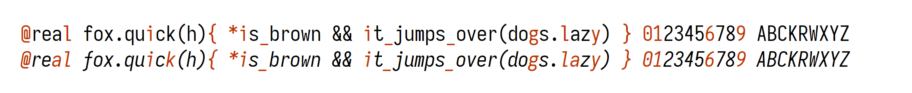</td>
</tr>
<tr>
<td><code>ss02</code></td>
<td>Anonymous Pro Style</td>
</tr>
<tr>
<td colspan="2">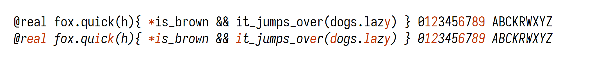</td>
</tr>
<tr>
<td><code>ss03</code></td>
<td>Consolas Style</td>
</tr>
<tr>
<td colspan="2">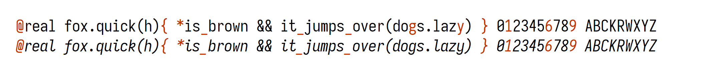</td>
</tr>
<tr>
<td><code>ss04</code></td>
<td>Menlo Style</td>
</tr>
<tr>
<td colspan="2">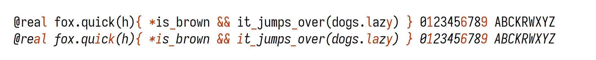</td>
</tr>
<tr>
<td><code>ss05</code></td>
<td>Fira Mono Style</td>
</tr>
<tr>
<td colspan="2">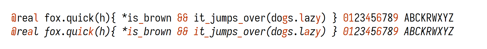</td>
</tr>
<tr>
<td><code>ss06</code></td>
<td>Liberation Mono Style</td>
</tr>
<tr>
<td colspan="2">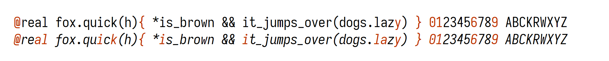</td>
</tr>
<tr>
<td><code>ss07</code></td>
<td>Monaco Style</td>
</tr>
<tr>
<td colspan="2">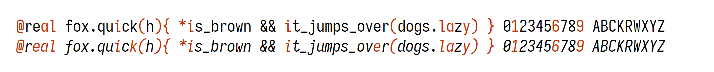</td>
</tr>
<tr>
<td><code>ss08</code></td>
<td>Pragmata Pro Style</td>
</tr>
<tr>
<td colspan="2">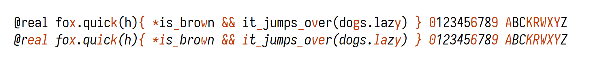</td>
</tr>
<tr>
<td><code>ss09</code></td>
<td>Source Code Pro Style</td>
</tr>
<tr>
<td colspan="2"></td>
</tr>
<tr>
<td><code>ss10</code></td>
<td>Envy Code R Style</td>
</tr>
<tr>
<td colspan="2">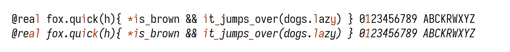</td>
</tr>
<tr>
<td><code>ss11</code></td>
<td>X Window Style</td>
</tr>
<tr>
<td colspan="2">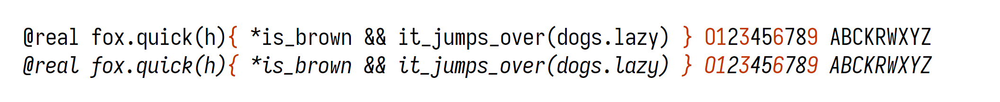</td>
</tr>
<tr>
<td><code>ss12</code></td>
<td>Ubuntu Mono Style</td>
</tr>
<tr>
<td colspan="2">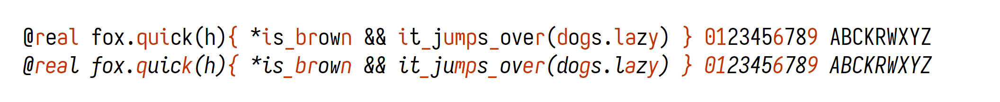</td>
</tr>
<tr>
<td><code>ss13</code></td>
<td>Lucida Style</td>
</tr>
<tr>
<td colspan="2">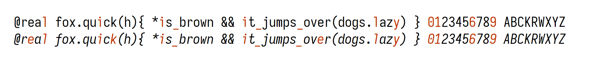</td>
</tr>
<tr>
<td><code>ss14</code></td>
<td>JetBrains Mono Style</td>
</tr>
<tr>
<td colspan="2">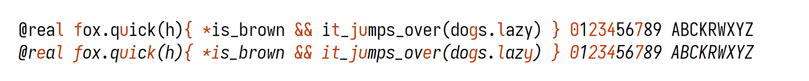</td>
</tr>
<tr>
<td><code>ss15</code></td>
<td>IBM Plex Mono Style</td>
</tr>
<tr>
<td colspan="2">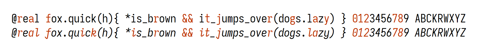</td>
</tr>
<tr>
<td><code>ss20</code></td>
<td>Curly Style</td>
</tr>
<tr>
<td colspan="2">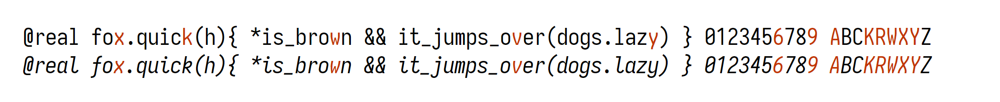</td>
</tr>
</table>

<!-- END Section-OT-Stylistic-Sets -->

### Character Variants

Alongside stylistic sets, Monospace Iosevka can also be configured to cherry-pick variants for each character using OpenType. The variants are shown below. To enable, assign the feature tag to the variant index. For example, setting `cv11` to `2` will enable single-storey `a`.

**Caution :**  Certain software may limit the quantity of OpenType features and drop some of them if the feature list is too long. Please validate your feature configuration to ensure that it worked in your software.


### Ligations

Monospace subfamilies support ligations. Iosevka’s default ligation set is assigned to `calt` feature, though not all of them are enabled by default.

<!-- BEGIN Section-OT-Ligation-Tags-1 -->
<!-- THIS SECTION IS AUTOMATICALLY GENERATED. DO NOT EDIT. -->

<table>
<tr>
<td><code>calt off</td>
<td>Ligation Off</td>
</tr>
<tr>
<td colspan="2"></td>
</tr>
<tr>
<td><code>calt</code></td>
<td>Default setting in text editors</td>
</tr>
<tr>
<td colspan="2"></td>
</tr>
</table>

<!-- END Section-OT-Ligation-Tags-1 -->

Iosevka supports Language-Specific Ligations, which is the ligation set enabled only under certain languages. These ligation sets are assigned to custom feature tags. To use them, you need to turn **off** `calt` and enable the corresponded feature. The feature list is:

<!-- BEGIN Section-OT-Ligation-Tags-2 -->
<!-- THIS SECTION IS AUTOMATICALLY GENERATED. DO NOT EDIT. -->

<table>
<tr>
<td><code>dlig</code></td>
<td>Discretionary ligatures</td>
</tr>
<tr>
<td colspan="2"></td>
</tr>
<tr>
<td><code>CLIK</code>; <code>JSPT</code>; <code>PHPX</code></td>
<td>C-Like, JavaScript, PHP</td>
</tr>
<tr>
<td colspan="2"></td>
</tr>
<tr>
<td><code>MLXX</code>; <code>FSHP</code></td>
<td>ML, F#</td>
</tr>
<tr>
<td colspan="2"></td>
</tr>
<tr>
<td><code>FSTA</code></td>
<td>F*</td>
</tr>
<tr>
<td colspan="2"></td>
</tr>
<tr>
<td><code>HSKL</code>; <code>IDRS</code>; <code>ELMX</code>; <code>PURS</code></td>
<td>Haskell, Idris, Elm, PureScript</td>
</tr>
<tr>
<td colspan="2"></td>
</tr>
<tr>
<td><code>SWFT</code></td>
<td>Swift</td>
</tr>
<tr>
<td colspan="2"></td>
</tr>
<tr>
<td><code>COQX</code></td>
<td>Coq</td>
</tr>
<tr>
<td colspan="2"></td>
</tr>
<tr>
<td><code>MTLB</code></td>
<td>Matlab</td>
</tr>
<tr>
<td colspan="2"></td>
</tr>
<tr>
<td><code>VRLG</code></td>
<td>Verilog</td>
</tr>
<tr>
<td colspan="2"></td>
</tr>
<tr>
<td><code>WFLM</code></td>
<td>Wolfram Language (Mathematica)</td>
</tr>
<tr>
<td colspan="2"></td>
</tr>
</table>

<!-- END Section-OT-Ligation-Tags-2 -->

Please note that, due to the complex interactions when forming ligations, cherry-picking ligation groups will require a custom Iosevka build. The instructions could be seen below.

## Building from Source

To build Iosevka you should:

1. Ensure that [`nodejs`](http://nodejs.org) (≥ 12.16.0) and [`ttfautohint`](http://www.freetype.org/ttfautohint/) are present, and accessible from `PATH`.
2. Run `npm install`. This command will install **all** the NPM dependencies, and will also validate whether external dependencies are present.
3. `npm run build -- contents::iosevka`.

You will find TTFs, as well as WOFF(2) web fonts and one Webfont CSS in the `dist/` directory.

### Using a Docker container

A Docker container handling the build environment for you can be found [here](https://github.com/avivace/fonts-iosevka).

To pull it from Docker Hub and start a standard build of the latest released version, run

```
docker run -it -v $(pwd):/build avivace/iosevka-build
```

Fonts files will be placed in the `dist` folder.

You can provide `private-build.plans.toml` for a customized build and/or specify the desired release appending `-e FONT_VERSION=X.X.X`. to the Docker command.

## Customized Build

To create a custom build, you need:

1. Create `private-build-plans.toml` file if absent.

2. Add a build plan into `private-build-plans.toml`. The configurable properties are described in the following sections.
   
3. Run `npm run build -- contents::<your plan name>` and the built fonts would be available in `dist/`. Aside from `contents::<plan>`, other options are:

   1. `contents::<plan>` : TTF (Hinted and Unhinted), WOFF(2) and Web font CSS;
   2. `ttf::<plan>` : TTF;
   3. `ttf-unhinted::<plan>` : Unhinted TTF only;
   4. `webfont::<plan>` : Web fonts only (CSS + WOFF2);
   5. `woff2::<plan>` : WOFF2 only.

### Configuring Custom Build

Configuration of build plans are organized under `[buildPlans.<plan name>]` sections in the `private-build-plans.toml`. You can use [the Customizer](https://be5invis.github.io/Iosevka/customizer) to create the build plan, and/or manulally edit them, following the instructions below.

Inside the plan, top-level properties include:

* `family`: String, defines the family name of your custom variant.
* `spacing`: Optional, String, denotes the spacing of the custom variant. Valid values include:
  - `quasi-proportional`: The font will become quasi-proportional.
  - `term`: Make the symbols' width suitable for terminal emulators. Arrows and geometric symbols will become narrower.
  - `fontconfig-mono`: Apply `term` spacing changes and further apply changes to be compatible with FontConfig's Mono spacing, which recognizes a font as monospace if and only if its every non-combining characters having the same width. The changes include:
    - Completely remove wide glyphs. All non-combining glyphs will be exactly the same width.
      - As a consequence, the following characters will be **removed**:
        - `U+27F5` LONG LEFTWARDS ARROW
        - `U+27F6` LONG RIGHTWARDS ARROW
    - Remove `NWID` and `WWID` OpenType feature.
  - `fixed`: Apply `fontconfig-mono` changes and further remove ligations.
* `serifs`: Optional, String, configures style of serifs.
  - When set to `slab`, the font will be converted into slab-serif.
  - Otherwise the font will be sans-serif.
* `no-cv-ss`: Optional, Boolean, disables `cv##` and `ss##` OpenType features.
* `no-ligation`: Optional, Boolean, disables ligations.

Build plan could have 5 optional subsections: `ligations`, `variants`, `weights`, `widths` and `slopes`.

#### Configuring Ligations

Subsection `ligations` is used to customize the ligation set assigned to `calt` OpenType feature. Properties include:

<!-- BEGIN Section-Predefined-Ligation-Sets -->
<!-- THIS SECTION IS AUTOMATICALLY GENERATED. DO NOT EDIT. -->

* `inherits`: Optional, String, defines the inherited ligation set. When absent, the ligation set will not inherit any other sets. Valid values are:

  - `default-calt`: Inherit default ligation set.
  - `dlig`: Default ligation set would be assigned to Discretionary ligatures.
  - `clike`: Default ligation set would be assigned to C-Like.
  - `javascript`: Default ligation set would be assigned to JavaScript.
  - `php`: Default ligation set would be assigned to PHP.
  - `ml`: Default ligation set would be assigned to ML.
  - `fsharp`: Default ligation set would be assigned to F#.
  - `fstar`: Default ligation set would be assigned to F*.
  - `haskell`: Default ligation set would be assigned to Haskell.
  - `idris`: Default ligation set would be assigned to Idris.
  - `elm`: Default ligation set would be assigned to Elm.
  - `purescript`: Default ligation set would be assigned to PureScript.
  - `swift`: Default ligation set would be assigned to Swift.
  - `coq`: Default ligation set would be assigned to Coq.
  - `matlab`: Default ligation set would be assigned to Matlab.
  - `verilog`: Default ligation set would be assigned to Verilog.
  - `wolfram`: Default ligation set would be assigned to Wolfram Language (Mathematica).

<!-- END Section-Predefined-Ligation-Sets -->

<!-- BEGIN Section-Cherry-Picking-Ligation-Sets -->
<!-- THIS SECTION IS AUTOMATICALLY GENERATED. DO NOT EDIT. -->

* `disables` and `enables`: Optional, String Array, Cherry-picking ligation groups to be disabled or enabled. Valid values include:

  - `center-ops`: Vertically align some of the operators (like `*`) to the center position it is before or after a "center" operator (like `+`).
  - `arrow`: Enable ligation set that forms arrows.
  - `arrow2`: Enable ligation for more arrows, like `>>=`.
  - `trig`: Enable ligation for `<|`, `|>` , `<||`, and other bar-and-angle-bracket symbols.
  - `eqeqeq`: Enable special ligation for `===` with triple lines.
  - `eqeq`: Enable ligation for `==` and `===`.
  - `ineq`: Enable ligation for `<=` and `>=`.
  - `exeqeq`: Enable special ligation for `!==` with triple lines.
  - `exeqeq-dotted`: Enable special ligation for `!==` with triple lines, and a dot at below for distinction.
  - `eqexeq`: Enable special ligation for `=!=` with triple lines.
  - `eqexeq-dotted`: Enable special ligation for `=!=` with triple lines and a dot at below for distinction.
  - `eqexeq-dl`: Enable special ligation for `=!=` with double lines.
  - `eqexeq-dl-dotted`: Enable special ligation for `=!=` with double lines, and a dot at below for distinction.
  - `exeq`: Enable ligation for `!=` and `!==`.
  - `exeq-dotted`: Enable ligation for `!=` and `!==` with a dot at below for distinction.
  - `tildeeq`: Enable ligation for `~=` as inequality.
  - `eqslasheq`: Enable special triple-line ligation for `=/=` as inequality.
  - `slasheq`: Enable ligation for `/=` and `=/=` as inequality.
  - `ltgt-ne`: Enable ligation for `<>` as inequality.
  - `ltgt-diamond`: Enable ligation for `<>` as diamond.
  - `brst`: Center asterisk in `(*` and `*)`.
  - `plusplus`: Enable ligation for `++` and further plus-chaining.
  - `kern-dotty`: Move connecting dotty punctuations closer, like for `::`, `:::` and `...`.
  - `logic`: Enable ligation for `/\` and `\/`.
  - `llgg`: Enable ligation for `<<`, `>>` and other angle-bracket chaining.
  - `llggeq`: Enable ligation for `<<=`, `>>=` as shift operator.
  - `dot-as-operator`: Treat dot (`.`) as operator and perform chained centering.
  - `lteq-as-arrow`: Treat `<=` as arrow.
  - `gteq-as-co-arrow`: Treat `>=` as co-arrow.
  - `html-comment`: Enable ligation for `<!--` and `<!---`.
  - `colon-greater-as-colon-arrow`: Transform `:>` into `:` and a narrow arrow..
  - `brace-bar`: Enable ligation for `{|` and `|}`.
  - `brack-bar`: Enable ligation for `[|` and `|]`.

<!-- END Section-Cherry-Picking-Ligation-Sets -->

#### Configuring Character Variants

Subsection `variants` is used to configure character variants in the font. Properties include:

<!-- BEGIN Section-Stylistic-Sets -->
<!-- THIS SECTION IS AUTOMATICALLY GENERATED. DO NOT EDIT. -->

* `inherits`: Optional, String, defines the inherited stylistic set. Valid options include:

  - `ss01`: Set character variant to “Andale Mono Style”.
  - `ss02`: Set character variant to “Anonymous Pro Style”.
  - `ss03`: Set character variant to “Consolas Style”.
  - `ss04`: Set character variant to “Menlo Style”.
  - `ss05`: Set character variant to “Fira Mono Style”.
  - `ss06`: Set character variant to “Liberation Mono Style”.
  - `ss07`: Set character variant to “Monaco Style”.
  - `ss08`: Set character variant to “Pragmata Pro Style”.
  - `ss09`: Set character variant to “Source Code Pro Style”.
  - `ss10`: Set character variant to “Envy Code R Style”.
  - `ss11`: Set character variant to “X Window Style”.
  - `ss12`: Set character variant to “Ubuntu Mono Style”.
  - `ss13`: Set character variant to “Lucida Style”.
  - `ss14`: Set character variant to “JetBrains Mono Style”.
  - `ss15`: Set character variant to “IBM Plex Mono Style”.
  - `ss20`: Set character variant to “Curly Style”.

<!-- END Section-Stylistic-Sets -->

<!-- BEGIN Section-Cherry-Picking-Styles -->
<!-- THIS SECTION IS AUTOMATICALLY GENERATED. DO NOT EDIT. -->

* `design`, `upright`, `italic`, and `oblique`: Optional, Dictionary, defines styles for individual characters. The choices are organized in key-value pairs, assigning a variant to a character group. Alternatively, you could assign numbers to `cv##` tags, like what you did when using OpenType in CSS. Assignments under `design` will be applied to all the slopes, and `upright`, `italic`, and `oblique` will apply to corresponded slopes. 

  In addition, style selector for default digit form also uses these dictionaries.
  
  The valid combinations include:

  - Default digit form:
    - `digit-form = 'lining'`: Lining (default).
    - `digit-form = 'old-style'`: Old-style.
  - Styles for `A`, `Λ`, `Δ`:
    + `capital-a = 'straight'`, `cv01 = 1`: Standard, straight `A` (default).
    + `capital-a = 'curly'`, `cv01 = 2`: Slightly curly `A`, like Iosevka 2.x.
    + `capital-a = 'straight-motion-serifed'`, `cv01 = 3`: Standard, straight `A`.
    + `capital-a = 'curly-motion-serifed'`, `cv01 = 4`: Slightly curly `A`, like Iosevka 2.x.
  - Styles for `B`:
    + `capital-b = 'standard'`, `cv02 = 1`: Standard `B` (default).
    + `capital-b = 'more-asymmetric'`, `cv02 = 2`: More asymmetric `B` to differentiate with `8`.
    + `capital-b = 'standard-unilateral-motion-serifed'`, `cv02 = 3`: Standard `B` with motion serifs at both top and bottom.
    + `capital-b = 'more-asymmetric-unilateral-motion-serifed'`, `cv02 = 4`: More asymmetric `B` to differentiate with `8` with motion serifs at top.
    + `capital-b = 'standard-bilateral-motion-serifed'`, `cv02 = 5`: Standard `B` with motion serifs at both top and bottom.
    + `capital-b = 'more-asymmetric-bilateral-motion-serifed'`, `cv02 = 6`: More asymmetric `B` to differentiate with `8` with motion serifs at top.
  - Styles for `D`:
    + `capital-d = 'standard'`, `cv03 = 1`: Standard `D` (default).
    + `capital-d = 'more-rounded'`, `cv03 = 2`: More rounded `D` to differentiate with `O`.
    + `capital-d = 'standard-unilateral-motion-serifed'`, `cv03 = 3`: Standard `B` with motion serifs at both top and bottom.
    + `capital-d = 'more-rounded-unilateral-motion-serifed'`, `cv03 = 4`: More rounded `B` to differentiate with `O` with motion serifs at top.
    + `capital-d = 'standard-bilateral-motion-serifed'`, `cv03 = 5`: Standard `B` with motion serifs at both top and bottom.
    + `capital-d = 'more-rounded-bilateral-motion-serifed'`, `cv03 = 6`: More rounded `B` to differentiate with `O` with motion serifs at top.
  - Styles for `E`:
    + `capital-e = 'standard'`, `cv04 = 1`: Standard E (default).
    + `capital-e = 'motion-serifed'`, `cv04 = 2`: Motion-Serifed E.
  - Styles for `F`:
    + `capital-f = 'standard'`, `cv05 = 1`: Standard F (default).
    + `capital-f = 'motion-serifed'`, `cv05 = 2`: Motion-Serifed F.
  - Styles for `G`:
    + `capital-g = 'toothed-hookless'`, `cv06 = 1`: Toothed G.
    + `capital-g = 'toothless-corner-hookless'`, `cv06 = 2`: Corner toothless G.
    + `capital-g = 'toothless-rounded-hookless'`, `cv06 = 3`: Round toothless G.
    + `capital-g = 'toothed-hooked'`, `cv06 = 4`: Toothed G with invard hook at terminal (default).
    + `capital-g = 'toothless-corner-hooked'`, `cv06 = 5`: Corner toothless G with invard hook at terminal.
    + `capital-g = 'toothless-rounded-hooked'`, `cv06 = 6`: Round toothless G with invard hook at terminal.
    + `capital-g = 'toothed-capped'`, `cv06 = 7`: Toothed G with a cap terminal.
    + `capital-g = 'toothless-corner-capped'`, `cv06 = 8`: Corner toothless G with a cap terminal.
    + `capital-g = 'toothless-rounded-capped'`, `cv06 = 9`: Round toothless G with a cap terminal.
  - Styles for `H`:
    + `capital-h = 'standard'`, `cv07 = 1`: Standard H (default).
    + `capital-h = 'motion-serifed'`, `cv07 = 2`: Motion-Serifed H.
  - Styles for `I`:
    + `capital-i = 'serifed'`, `cv08 = 1`: I with standard (long) serifs (default).
    + `capital-i = 'serifless'`, `cv08 = 2`: I without serifs, like a straight bar.
    + `capital-i = 'short-serifed'`, `cv08 = 3`: I with short serifs.
  - Styles for `J`:
    + `capital-j = 'serifless'`, `cv09 = 1`: J without top serif.
    + `capital-j = 'serifed'`, `cv09 = 2`: J with top serif at left side (default).
    + `capital-j = 'serifed-both-sides'`, `cv09 = 3`: J with symmetric at both sides.
    + `capital-j = 'serifed-symmetric'`, `cv09 = 4`: J with symmetric at both sides and is symmetric.
  - Styles for `K`:
    + `capital-k = 'straight'`, `cv10 = 1`: `K` with standard shape (default).
    + `capital-k = 'curly'`, `cv10 = 2`: Slightly curly `K`, like Iosevka 2.x.
    + `capital-k = 'symmetric-disconnected'`, `cv10 = 3`: `K` with symmetric legs disconnected to the vertical bar.
    + `capital-k = 'symmetric-connected'`, `cv10 = 4`: `K` with symmetric legs connected to the vertical bar.
    + `capital-k = 'straight-motion-serifed'`, `cv10 = 5`: `K` with standard shape and motion serifs.
    + `capital-k = 'curly-motion-serifed'`, `cv10 = 6`: Slightly curly `K`, like Iosevka 2.x, with motion serifs.
    + `capital-k = 'symmetric-disconnected-motion-serifed'`, `cv10 = 7`: `K` with symmetric legs disconnected to the vertical bar, and motion serifs.
    + `capital-k = 'symmetric-connected-motion-serifed'`, `cv10 = 8`: `K` with symmetric legs connected to the vertical bar, and motion serifs.
  - Styles for `L`:
    + `capital-l = 'standard'`, `cv11 = 1`: Standard `L` (default).
    + `capital-l = 'motion-serifed'`, `cv11 = 2`: Standard `L` with motion serifs.
  - Styles for `M`:
    + `capital-m = 'hanging'`, `cv12 = 1`: `M` with middle being hanging off baseline (default).
    + `capital-m = 'flat-bottom'`, `cv12 = 2`: `M` with middle aligned to baseline.
    + `capital-m = 'hanging-motion-serifed'`, `cv12 = 3`: `M` with middle being hanging off baseline and motion serifs.
    + `capital-m = 'flat-bottom-motion-serifed'`, `cv12 = 4`: `M` with middle aligned to baseline and motion serifs.
  - Styles for `N`:
    + `capital-n = 'standard'`, `cv13 = 1`: Standard N (default).
    + `capital-n = 'motion-serifed'`, `cv13 = 2`: Motion-Serifed N.
  - Styles for `P`:
    + `capital-p = 'closed'`, `cv14 = 1`: Closed `P` (default).
    + `capital-p = 'open'`, `cv14 = 2`: P with open contour at bottom.
    + `capital-p = 'closed-motion-serifed'`, `cv14 = 3`: Closed `P` with motion serifs.
    + `capital-p = 'open-motion-serifed'`, `cv14 = 4`: P with open contour at bottom and motion serifs.
  - Styles for `Q`:
    + `capital-q = 'curly-tailed'`, `cv15 = 1`: `Q` with a curly tail (default).
    + `capital-q = 'straight'`, `cv15 = 2`: `Q` with a straight tail like in the old versions.
    + `capital-q = 'crossing'`, `cv15 = 3`: `Q` with a tail crossing the ring.
    + `capital-q = 'vertical-crossing'`, `cv15 = 4`: `Q` with a vertical tail crossing the ring.
    + `capital-q = 'horizontal-tailed'`, `cv15 = 5`: `Q` with a horizontal tail, like Univers.
    + `capital-q = 'detached-horizontal-tailed'`, `cv15 = 6`: `Q` with a horizontal tail detached.
    + `capital-q = 'detached-oblique-tailed'`, `cv15 = 7`: `Q` with a oblique tail detached.
  - Styles for `R`:
    + `capital-r = 'straight'`, `cv16 = 1`: Standard, straight-leg `R` (default).
    + `capital-r = 'curly'`, `cv16 = 2`:  Slightly curly-legged `R`, like Iosevka 2.x.
    + `capital-r = 'standing'`, `cv16 = 3`: `R` with near-vertical standing leg.
    + `capital-r = 'straight-open'`, `cv16 = 4`: Standard, straight-leg `R`, with open contour at bottom.
    + `capital-r = 'curly-open'`, `cv16 = 5`:  Slightly curly-legged `R`, like Iosevka 2.x, with open contour at bottom.
    + `capital-r = 'standing-open'`, `cv16 = 6`: `R` with near-vertical standing leg, with open contour at bottom.
    + `capital-r = 'straight-motion-serifed'`, `cv16 = 7`: Standard, straight-leg `R`, with motion serifs.
    + `capital-r = 'curly-motion-serifed'`, `cv16 = 8`:  Slightly curly-legged `R`, like Iosevka 2.x, with motion serifs.
    + `capital-r = 'standing-motino-serifed'`, `cv16 = 9`: `R` with near-vertical standing leg.
    + `capital-r = 'straight-open-motion-serifed'`, `cv16 = 10`: Standard, straight-leg `R`, with open contour at bottom and motion serifs.
    + `capital-r = 'curly-open-motion-serifed'`, `cv16 = 11`:  Slightly curly-legged `R`, like Iosevka 2.x, with open contour at bottom and motion serifs.
    + `capital-r = 'standing-open-motion-serifed'`, `cv16 = 12`: `R` with near-vertical standing leg, with open contour at bottom.
  - Styles for `T`:
    + `capital-t = 'standard'`, `cv17 = 1`: Standard T (default).
    + `capital-t = 'motion-serifed'`, `cv17 = 2`: Motion-Serifed T.
  - Styles for `S`:
    + `capital-s = 'serifless'`, `cv18 = 1`: Serifless `S` (default for Sans).
    + `capital-s = 'serifed'`, `cv18 = 2`: `S` with serifs at both end (default for Slab).
    + `capital-s = 'top-serifed'`, `cv18 = 3`: `S` with single serif at top.
  - Styles for `U`:
    + `capital-u = 'toothed'`, `cv19 = 1`: `U` with bottom-right tooth.
    + `capital-u = 'toothless-corner'`, `cv19 = 2`: Toothless (corner bottom-right) `U`.
    + `capital-u = 'toothless-rounded'`, `cv19 = 3`: Toothless (rounded) `U` (default).
    + `capital-u = 'tailed'`, `cv19 = 4`: `U` with right bar and a slightly curly tail.
    + `capital-u = 'motion-serifed'`, `cv19 = 5`: Normal `U` with right bar and motion serifs.
    + `capital-u = 'motion-serifed-tailed'`, `cv19 = 6`: `U` with right bar, motion serifs and a slightly curly tail.
    + `capital-u = 'toothless-corner-unilateral-motion-serifed'`, `cv19 = 7`: Toothless (corner bottom-right) `U` with motion serifs, like Museo.
    + `capital-u = 'toothless-rounded-unilateral-motion-serifed'`, `cv19 = 8`: Toothless (rounded) `U` with motion serifs, like Museo.
    + `capital-u = 'toothless-corner-bilateral-motion-serifed'`, `cv19 = 9`: Toothless (corner bottom-right) `U` with motion serifs, like Museo.
    + `capital-u = 'toothless-rounded-bilateral-motion-serifed'`, `cv19 = 10`: Toothless (rounded) `U` with motion serifs, like Museo.
  - Styles for `V`:
    + `capital-v = 'straight'`, `cv20 = 1`: Standard, straight `V` (default).
    + `capital-v = 'curly'`, `cv20 = 2`:  Slightly curly `V`, like Iosevka 2.x.
    + `capital-v = 'straight-motion-serifed'`, `cv20 = 3`: Standard, straight `V`, and motion serifs.
    + `capital-v = 'curly-motion-serifed'`, `cv20 = 4`:  Slightly curly `V`, like Iosevka 2.x, and motion serifs.
  - Styles for `W`:
    + `capital-w = 'straight'`, `cv21 = 1`: Standard, straight `W` (default).
    + `capital-w = 'curly'`, `cv21 = 2`: Slightly curly `W`, like Iosevka 2.x.
    + `capital-w = 'straight-flat-top'`, `cv21 = 3`: Standard, straight `W`, and the middle is forced to be aligned the top.
    + `capital-w = 'straight-double-v'`, `cv21 = 4`: Straight `W` looks like double V.
    + `capital-w = 'straight-asymmetric'`, `cv21 = 5`: Straight `W` looks asymmetric.
    + `capital-w = 'straight-motion-serifed'`, `cv21 = 6`: Standard, straight `W`, with motion serifs.
    + `capital-w = 'curly-motion-serifed'`, `cv21 = 7`: Slightly curly `W`, like Iosevka 2.x, with motion serifs.
    + `capital-w = 'straight-flat-top-motion-serifed'`, `cv21 = 8`: Standard, straight `W`, and the middle is forced to be aligned the top, with motion serifs.
    + `capital-w = 'straight-double-v-motion-serifed'`, `cv21 = 9`: Straight `W` looks like double V, with motion serifs.
    + `capital-w = 'straight-asymmetric-motion-serifed'`, `cv21 = 10`: Straight `W` looks asymmetric, with motion serifs.
  - Styles for `X`:
    + `capital-x = 'straight'`, `cv22 = 1`: Standard, straight `X` (default).
    + `capital-x = 'curly'`, `cv22 = 2`: Slightly curly `X`, like Iosevka 2.x.
    + `capital-x = 'straight-motion-serifed'`, `cv22 = 3`: Standard, straight `X` with motion serifs.
    + `capital-x = 'curly-motion-serifed'`, `cv22 = 4`: Slightly curly `X`, like Iosevka 2.x, with motion serifs.
  - Styles for `Y`:
    + `capital-y = 'straight'`, `cv23 = 1`: Standard, straight `Y` (default).
    + `capital-y = 'curly'`, `cv23 = 2`: Slightly curly `Y`, like Iosevka 2.x.
    + `capital-y = 'straight-motion-serifed'`, `cv23 = 3`: Standard, straight `Y`, with motion serifs.
    + `capital-y = 'curly-motion-serifed'`, `cv23 = 4`: Slightly curly `Y`, like Iosevka 2.x, with motion serifs.
  - Styles for `Z`:
    + `capital-z = 'standard'`, `cv24 = 1`: Standard `Z` (default).
    + `capital-z = 'with-crossbar'`, `cv24 = 2`: Standard `Z` with a diagonal cross bar for better dsitinction with `2`.
    + `capital-z = 'with-horizontal-crossbar'`, `cv24 = 3`: Standard `Z` with a horizontal cross bar for better dsitinction with `2`.
    + `capital-z = 'curly'`, `cv24 = 4`: Curly `Z`.
    + `capital-z = 'curly-with-crossbar'`, `cv24 = 5`: Curly `Z` with a diagonal cross bar for better dsitinction with `2`.
    + `capital-z = 'curly-with-horizontal-crossbar'`, `cv24 = 6`: Curly `Z` with a horizontal cross bar for better dsitinction with `2`.
    + `capital-z = 'motion-serifed'`, `cv24 = 7`: Standard `Z` with motion serifs at bottom.
    + `capital-z = 'curly-motion-serifed'`, `cv24 = 8`: Curly `Z` with motion serifs at bottom.
    + `capital-z = 'top-motion-serifed'`, `cv24 = 9`: Standard `Z` with motion serifs at top.
    + `capital-z = 'curly-top-motion-serifed'`, `cv24 = 10`: Curly `Z` with motion serifs at top.
  - Styles for `a`:
    + `a = 'double-storey'`, `cv25 = 1`: Double-storey `a` (default for Upright).
    + `a = 'double-storey-tailed'`, `cv25 = 2`: Double-storey `a` with curly tail.
    + `a = 'double-storey-toothless-corner'`, `cv25 = 3`: Toothless (cornered bottom-right) double-storey `a`.
    + `a = 'double-storey-toothless-rounded'`, `cv25 = 4`: Toothless (rounded bottom-right) double-storey `a`.
    + `a = 'double-storey-motion-serifed'`, `cv25 = 5`: Double-storey `a` with motion serifs.
    + `a = 'single-storey'`, `cv25 = 6`: Single-storey `a`.
    + `a = 'single-storey-earless-corner'`, `cv25 = 7`: Earless (cornered top-right) single-storey `a`.
    + `a = 'single-storey-earless-rounded'`, `cv25 = 8`: Earless (rounded top-right) single-storey `a`.
    + `a = 'single-storey-tailed'`, `cv25 = 9`: Single-storey `a` with curly tail (default for Italic).
    + `a = 'single-storey-earless-corner-tailed'`, `cv25 = 10`: Earless (cornered top-right) single-storey `a` with curly tail.
    + `a = 'single-storey-earless-rounded-tailed'`, `cv25 = 11`: Earless (rounded top-right) single-storey `a` with curly tail.
    + `a = 'single-storey-motion-serifed'`, `cv25 = 12`: Single-storey `a` with motion serifs.
    + `a = 'single-storey-earless-corner-motion-serifed'`, `cv25 = 13`: Earless (cornered top-right) single-storey `a` with motion serifs.
    + `a = 'single-storey-earless-rounded-motion-serifed'`, `cv25 = 14`: Earless (rounded top-right) single-storey `a` with motion serifs.
  - Styles for `b`:
    + `b = 'toothed'`, `cv26 = 1`: `b` with bottom-left tooth (default).
    + `b = 'toothless-corner'`, `cv26 = 2`: `b` without bottom-left tooth, with a corner transition.
    + `b = 'toothless-rounded'`, `cv26 = 3`: `b` without bottom-left tooth, with a rounded transition.
    + `b = 'toothed-motion-serifed'`, `cv26 = 4`: `b` with motion serif, and with bottom-left tooth.
    + `b = 'toothless-corner-motion-serifed'`, `cv26 = 5`: `b` with motion serif, and without bottom-left tooth, with a corner transition.
    + `b = 'toothless-rounded-motion-serifed'`, `cv26 = 6`: `b` with motion serif, and without bottom-left tooth, with a rounded transition.
  - Styles for `d`:
    + `d = 'toothed'`, `cv27 = 1`: `d` with bottom-right tooth (default for Upright).
    + `d = 'toothless-corner'`, `cv27 = 2`: `d` without bottom-right tooth, with a corner transition.
    + `d = 'toothless-rounded'`, `cv27 = 3`: `d` without bottom-right tooth, with a rounded transition.
    + `d = 'tailed'`, `cv27 = 4`: `d` with a slightly tail bottom-right tail (default for Italic).
    + `d = 'toothed-motion-serifed'`, `cv27 = 5`: `d` motion serif, and with bottom-right tooth.
    + `d = 'toothless-corner-motion-serifed'`, `cv27 = 6`: `d` motion serif, and without bottom-right tooth, with a corner transition.
    + `d = 'toothless-rounded-motion-serifed'`, `cv27 = 7`: `d` motion serif, and without bottom-right tooth, with a rounded transition.
    + `d = 'motion-serifed-tailed'`, `cv27 = 8`: `d` motion serif, and with a slightly tail bottom-right tail.
  - Styles for `e`:
    + `e = 'flat-crossbar'`, `cv28 = 1`: `e` with flat crossbar (default for Upright).
    + `e = 'rounded'`, `cv28 = 2`: `e` with more rounded shape (default for Italic).
  - Styles for `f`:
    + `f = 'serifless'`, `cv29 = 1`: `f` without bottom serif, hook or exension (default for Sans Upright).
    + `f = 'serifed'`, `cv29 = 2`: `f` with bottom serif (default for Slab Upright).
    + `f = 'tailed'`, `cv29 = 3`: `f` with bottom hook.
    + `f = 'extended'`, `cv29 = 4`: `f` with bar extended to descender.
    + `f = 'diagonal-tailed'`, `cv29 = 5`: `f` with bottom diagonal tail.
    + `f = 'serifless-crossbar-at-x-height'`, `cv29 = 6`: `f` without bottom serif, hook or exension; crossbar is placed right at X-height.
    + `f = 'serifed-crossbar-at-x-height'`, `cv29 = 7`: `f` with bottom serif; crossbar is placed right at X-height.
    + `f = 'tailed-crossbar-at-x-height'`, `cv29 = 8`: `f` with bottom hook; crossbar is placed right at X-height.
    + `f = 'extended-crossbar-at-x-height'`, `cv29 = 9`: `f` with bar extended to descender; crossbar is placed right at X-height.
    + `f = 'diagonal-tailed-crossbar-at-x-height'`, `cv29 = 10`: `f` with bottom diagonal tail; crossbar is placed right at X-height.
    + `f = 'flat-hook'`, `cv29 = 11`: `f` with flat top hook, without bottom serif, hook or exension.
    + `f = 'flat-hook-serifed'`, `cv29 = 12`: `f` with flat top hook and bottom serif.
    + `f = 'flat-hook-tailed'`, `cv29 = 13`: `f` with flat top hook and bottom hook (default for Italic).
    + `f = 'flat-hook-extended'`, `cv29 = 14`: `f` with flat top hook and bar extended to descender.
    + `f = 'flat-hook-diagonal-tailed'`, `cv29 = 15`: `f` with falt hook and bottom diagonal tail.
    + `f = 'flat-hook-crossbar-at-x-height'`, `cv29 = 16`: `f` with flat top hook, without bottom serif, hook or exension; crossbar is placed right at X-height.
    + `f = 'flat-hook-serifed-crossbar-at-x-height'`, `cv29 = 17`: `f` with flat top hook, bottom serif; crossbar is placed right at X-height.
    + `f = 'flat-hook-tailed-crossbar-at-x-height'`, `cv29 = 18`: `f` with flat top hook, bottom hook; crossbar is placed right at X-height.
    + `f = 'flat-hook-extended-crossbar-at-x-height'`, `cv29 = 19`: `f` with flat top hook, bar extended to descender; crossbar is placed right at X-height.
    + `f = 'flat-hook-diagonal-tailed-crossbar-at-x-height'`, `cv29 = 20`: `f` with falt hook and bottom diagonal tail; crossbar is placed right at X-height.
  - Styles for `g`:
    + `g = 'double-storey'`, `cv30 = 1`: Double-storey `g`.
    + `g = 'double-storey-open'`, `cv30 = 2`: Open Double-storey `g`, like Trebuchet MS or Fira Code.
    + `g = 'single-storey'`, `cv30 = 3`: Single-storey `g` (default).
    + `g = 'earless-corner'`, `cv30 = 4`: Earless (cornered top-right) single-storey `g`.
    + `g = 'earless-rounded'`, `cv30 = 5`: Earless (rounded top-right) single-storey `g`.
    + `g = 'single-storey-motion-serifed'`, `cv30 = 6`: Single-storey `g` with motion serifs.
    + `g = 'single-storey-flat-hook'`, `cv30 = 7`: Single-storey `g` with flat terminal hook.
    + `g = 'single-storey-earless-corner-flat-hook'`, `cv30 = 8`: Earless (cornered top-right) single-storey `g` with flat terminal hook.
    + `g = 'single-storey-earless-rounded-flat-hook'`, `cv30 = 9`: Earless (rounded top-right) single-storey `g` with flat terminal hook.
    + `g = 'single-storey-motion-serifed-flat-hook'`, `cv30 = 10`: Single-storey `g` with motion serifs and flat terminal hook.
  - Styles for `h`:
    + `h = 'straight'`, `cv31 = 1`: `h` with straight ending (default).
    + `h = 'tailed'`, `cv31 = 2`: `h` with curly tailed ending.
    + `h = 'straight-motion-serifed'`, `cv31 = 3`: `h` with straight ending.
    + `h = 'motion-serifed-tailed'`, `cv31 = 4`: `h` with curly tailed ending.
  - Styles for `i`:
    + `i = 'serifed'`, `cv32 = 1`: Serifed `i` (default for Upright).
    + `i = 'serifless'`, `cv32 = 2`: `i` like a straight line.
    + `i = 'hooky'`, `cv32 = 3`: Hooky `i`.
    + `i = 'zshaped'`, `cv32 = 4`: Z-shaped `i`.
    + `i = 'hooky-bottom'`, `cv32 = 5`: `i` with a straight tail.
    + `i = 'serifed-asymmetric'`, `cv32 = 6`: `i` with shorter top serif and full bottom serif.
    + `i = 'tailed'`, `cv32 = 7`: `i` with curly tail.
    + `i = 'serifed-tailed'`, `cv32 = 8`: `i` with curly tail and top serif (default for Italic).
    + `i = 'flat-tailed'`, `cv32 = 9`: `i` with top serif and a curly-then-flat tail.
    + `i = 'serifed-flat-tailed'`, `cv32 = 10`: `i` with top serif and a curly-then-flat tail.
    + `i = 'diagonal-tailed'`, `cv32 = 11`: `i` with top serif and a diagonal tail.
    + `i = 'serifed-diagonal-tailed'`, `cv32 = 12`: `i` with top serif and a diagonal tail.
  - Styles for `j`:
    + `j = 'serifed'`, `cv33 = 1`: `j` with top serif (default).
    + `j = 'serifless'`, `cv33 = 2`: `j` without serif.
    + `j = 'straight-line'`, `cv33 = 3`: `j` like a straight line.
    + `j = 'flat-hook-serifed'`, `cv33 = 4`: `j` with flat terminal hook.
    + `j = 'flat-hook-serifless'`, `cv33 = 5`: `j` with flat terminal hook and top serif.
    + `j = 'diagonal-tailed-serifless'`, `cv33 = 6`: `j` with diagonal tail.
    + `j = 'diagonal-tailed-serifed'`, `cv33 = 7`: `j` with top serif and diagonal tail.
  - Styles for `k`:
    + `k = 'straight'`, `cv34 = 1`: `k` with standard shape (default for Upright).
    + `k = 'curly'`, `cv34 = 2`: Slightly curly `k`, like Iosevka 2.x.
    + `k = 'cursive'`, `cv34 = 3`: `k` with a cursive loop (default for Italic).
    + `k = 'diagonal-tailed-cursive'`, `cv34 = 4`: `k` with a cursive loop and diagonal tail.
    + `k = 'symmetric-disconnected'`, `cv34 = 5`: `k` with symmetric legs disconnected to the vertical bar.
    + `k = 'symmetric-connected'`, `cv34 = 6`: `k` with symmetric legs connected to the vertical bar.
    + `k = 'straight-motion-serifed'`, `cv34 = 7`: `k` with motion serifs.
    + `k = 'curly-motion-serifed'`, `cv34 = 8`: Slightly curly `k`, like Iosevka 2.x, with motion serifs.
    + `k = 'cursive-motion-serifed'`, `cv34 = 9`: `k` with a cursive loop and motion serifs.
    + `k = 'diagonal-tailed-cursive-motion-serifed'`, `cv34 = 10`: `k` with a cursive loop, motion serifs and diagonal tail.
    + `k = 'symmetric-disconnected-motion-serifed'`, `cv34 = 11`: `k` with symmetric legs disconnected to the vertical bar and motion serifs.
    + `k = 'symmetric-connected-motion-serifed'`, `cv34 = 12`: `k` with symmetric legs connected to the vertical bar and motion serifs.
  - Styles for `l`:
    + `l = 'serifed'`, `cv35 = 1`: Serifed `l` (default for Upright).
    + `l = 'serifless'`, `cv35 = 2`: `l` like a straight line.
    + `l = 'hooky'`, `cv35 = 3`: Hooky `l`.
    + `l = 'zshaped'`, `cv35 = 4`: Z-shaped `l`.
    + `l = 'hooky-bottom'`, `cv35 = 5`: `l` with a straight tail.
    + `l = 'serifed-asymmetric'`, `cv35 = 6`: `l` with shorter top serif and full bottom serif.
    + `l = 'tailed'`, `cv35 = 7`: `l` with curly tail.
    + `l = 'serifed-tailed'`, `cv35 = 8`: `l` with top serif and curly tail (default for Italic).
    + `l = 'flat-tailed'`, `cv35 = 9`: `l` with top serif and a curly-then-flat tail.
    + `l = 'serifed-flat-tailed'`, `cv35 = 10`: `l` with top serif and a curly-then-flat tail.
    + `l = 'diagonal-tailed'`, `cv35 = 11`: `l` with top serif and a diagonal tail.
    + `l = 'serifed-diagonal-tailed'`, `cv35 = 12`: `l` with top serif and a diagonal tail.
  - Styles for `m`:
    + `m = 'normal'`, `cv36 = 1`: `m` with normal middle leg, touching the baseline (default).
    + `m = 'short-leg'`, `cv36 = 2`: `m` with shorter middle leg, like Ubuntu Mono.
    + `m = 'tailed'`, `cv36 = 3`: `m` with normal middle leg, touching the baseline, and a curly tail.
    + `m = 'short-leg-tailed'`, `cv36 = 4`: `m` with shorter middle leg, like Ubuntu Mono, and a curly tail.
    + `m = 'earless-corner-double-arch'`, `cv36 = 5`: Earless (corner top-left) `m` with normal middle leg touching baseline.
    + `m = 'earless-corner-double-arch-short-leg'`, `cv36 = 6`: Earless (corner top-left) `m` with a shorter middle leg like Ubuntu Mono.
    + `m = 'earless-corner-double-arch-tailed'`, `cv36 = 7`: Earless (corner top-left) `m` with normal middle leg touching baseline, and a curly tail.
    + `m = 'earless-corner-double-arch-short-leg-tailed'`, `cv36 = 8`: Earless (corner top-left) `m` with a shorter middle leg like Ubuntu Mono, and a curly tail.
    + `m = 'earless-rounded-double-arch'`, `cv36 = 9`: Earless (rounded top-left) `m` with normal middle leg touching baseline.
    + `m = 'earless-rounded-double-arch-short-leg'`, `cv36 = 10`: Earless (rounded top-left) `m` with a shorter middle leg like Ubuntu Mono.
    + `m = 'earless-rounded-double-arch-tailed'`, `cv36 = 11`: Earless (rounded top-left) `m` with normal middle leg touching baseline, and a curly tail.
    + `m = 'earless-rounded-double-arch-short-leg-tailed'`, `cv36 = 12`: Earless (rounded top-left) `m` with a shorter middle leg like Ubuntu Mono, and a curly tail.
    + `m = 'earless-single-arch'`, `cv36 = 13`: Earless (single-arch) `m` with normal middle leg touching baseline.
    + `m = 'earless-single-arch-short-leg'`, `cv36 = 14`: Earless (single-arch) `m` with a shorter middle leg like Ubuntu Mono.
    + `m = 'earless-single-arch-tailed'`, `cv36 = 15`: Earless (single-arch) `m` with normal middle leg touching baseline, and a curly tail.
    + `m = 'earless-single-arch-short-leg-tailed'`, `cv36 = 16`: Earless (single-arch) `m` with a shorter middle leg like Ubuntu Mono, and a curly tail.
    + `m = 'motion-serifed'`, `cv36 = 17`: `m` with motion serifs, normal middle leg touching baseline.
    + `m = 'short-leg-motion-serifed'`, `cv36 = 18`: `m` with motion serifs, a shorter middle leg like Ubuntu Mono.
    + `m = 'motion-serifed-tailed'`, `cv36 = 19`: `m` with motion serifs, normal middle leg touching baseline, and a curly tail.
    + `m = 'short-leg-motion-serifed-tailed'`, `cv36 = 20`: `m` with motion serifs, a shorter middle leg like Ubuntu Mono, and a curly tail.
  - Styles for `n`:
    + `n = 'straight'`, `cv37 = 1`: `n` with straight ending (default).
    + `n = 'tailed'`, `cv37 = 2`: `n` with a curly tail.
    + `n = 'earless-corner-straight'`, `cv37 = 3`: Earless (corner top-left) `n` with straight ending.
    + `n = 'earless-corner-tailed'`, `cv37 = 4`: Earless (corner top-left) `n` with a curly tail.
    + `n = 'earless-rounded-straight'`, `cv37 = 5`: Earless (rounded top-left) `n` with straight ending.
    + `n = 'earless-rounded-tailed'`, `cv37 = 6`: Earless (rounded top-left) `n` with a curly tail.
    + `n = 'straight-motion-serifed'`, `cv37 = 7`: `n` with motion serifs and straight ending.
    + `n = 'motion-serifed-tailed'`, `cv37 = 8`: `n` with motion serifs and a curly tail.
  - Styles for `p`:
    + `p = 'eared'`, `cv38 = 1`: `p` with top-left ear (default).
    + `p = 'earless-corner'`, `cv38 = 2`: `p` without top-left ear (corner).
    + `p = 'earless-rounded'`, `cv38 = 3`: `p` without top-left ear (rounded).
    + `p = 'motion-serifed'`, `cv38 = 4`: `p` with motion serifs.
  - Styles for `q`:
    + `q = 'straight'`, `cv39 = 1`: `q` with straight bar (default).
    + `q = 'tailed'`, `cv39 = 2`: `q` with tail.
    + `q = 'earless-corner'`, `cv39 = 3`: Earless (cornered top-left) single-storey `q`.
    + `q = 'earless-corner-tailed'`, `cv39 = 4`: Earless (cornered top-left) single-storey `q` with curly tail.
    + `q = 'earless-rounded'`, `cv39 = 5`: Earless (rounded top-left) single-storey `q`.
    + `q = 'earless-rounded-tailed'`, `cv39 = 6`: Earless (rounded top-left) single-storey `q` with curly tail.
    + `q = 'straight-motion-serifed'`, `cv39 = 7`: `q` with straight bar and motion serifs.
    + `q = 'motion-serifed-tailed'`, `cv39 = 8`: `q` with tail and motion serifs.
    + `q = 'diagonal-tailed'`, `cv39 = 9`: `q` with diagonal tail.
    + `q = 'earless-corner-diagonal-tailed'`, `cv39 = 10`: Earless (cornered top-left) single-storey `q` with curly diagonal tail.
    + `q = 'earless-rounded-diagonal-tailed'`, `cv39 = 11`: Earless (rounded top-left) single-storey `q` with curly diagonal tail.
    + `q = 'motion-serifed-diagonal-tailed'`, `cv39 = 12`: `q` with diagonal tail and motion serifs.
  - Styles for `r`:
    + `r = 'serifless'`, `cv40 = 1`: Straight, serif-less `r` (default for Sans).
    + `r = 'serifed'`, `cv40 = 2`: `r` with serif at both top and bottom (default for Slab Upright).
    + `r = 'top-serifed'`, `cv40 = 3`: `r` with serifs at top-left only (default for Slab Italic).
    + `r = 'earless-corner'`, `cv40 = 4`: Earless (corner top-left), serif-less `r`.
    + `r = 'earless-corner-serifed'`, `cv40 = 5`: Earless (corner top-left), serifed `r`.
    + `r = 'earless-rounded'`, `cv40 = 6`: Earless (rounded top-left), serif-less `r`.
    + `r = 'earless-rounded-serifed'`, `cv40 = 7`: Earless (rounded top-left), serifed `r`.
    + `r = 'compact'`, `cv40 = 8`: Compact, serifless `r`.
    + `r = 'compact-serifed'`, `cv40 = 9`: Compact, serifless `r`.
    + `r = 'compact-top-serifed'`, `cv40 = 10`: Compact, serifless `r`.
  - Styles for `s`:
    + `s = 'serifless'`, `cv41 = 1`: Serifless `s` (default for Sans).
    + `s = 'serifed'`, `cv41 = 2`: `s` with serifs at both end (default for Slab).
    + `s = 'top-serifed'`, `cv41 = 3`: `s` with single serif at top.
  - Styles for `t`:
    + `t = 'standard'`, `cv42 = 1`: Standard `t` shape (default).
    + `t = 'cross'`, `cv42 = 2`: Futura-like `t` shape.
    + `t = 'flat-hook'`, `cv42 = 3`: `t` with flat hook.
    + `t = 'hookless-asymmetric'`, `cv42 = 4`: `t` without hook and ony half the cross bar.
    + `t = 'flat-hook-short-neck'`, `cv42 = 5`: `t` with flat hook and a slightly shorter neck.
    + `t = 'flat-hook-short-neck2'`, `cv42 = 6`: `t` with flat hook and a more shorter neck.
    + `t = 'diagonal-tailed'`, `cv42 = 7`: `t` with diagonal tail.
  - Styles for `u`:
    + `u = 'toothed'`, `cv43 = 1`: Normal `u` with bottom-right tooth (default for Upright).
    + `u = 'toothless-corner'`, `cv43 = 2`: Toothless (corner bottom-right) `u`.
    + `u = 'toothless-rounded'`, `cv43 = 3`: Toothless (rounded) `u`, like a smaller uppercase `U`.
    + `u = 'tailed'`, `cv43 = 4`: `u` with right bar and a slightly curly tail (default for Italic).
    + `u = 'motion-serifed'`, `cv43 = 5`: Normal `u` with right bar and motion serifs.
    + `u = 'motion-serifed-tailed'`, `cv43 = 6`: `u` with right bar, motion serifs and a slightly curly tail.
    + `u = 'toothless-corner-motion-serifed'`, `cv43 = 7`: Toothless (corner bottom-right) `u` with motion serifs.
    + `u = 'toothless-rounded-motion-serifed'`, `cv43 = 8`: Toothless (rounded) `u` with motion serifs.
  - Styles for `v`:
    + `v = 'straight'`, `cv44 = 1`: Standard, straight `v` (default).
    + `v = 'curly'`, `cv44 = 2`:  Slightly curly `v`, like Iosevka 2.x.
    + `v = 'straight-motion-serifed'`, `cv44 = 3`: Standard, straight `v`, and motion serifs.
    + `v = 'curly-motion-serifed'`, `cv44 = 4`:  Slightly curly `v`, like Iosevka 2.x, and motion serifs.
  - Styles for `w`:
    + `w = 'straight'`, `cv45 = 1`: Standard, straight `w` (default).
    + `w = 'curly'`, `cv45 = 2`: Slightly curly `w`, like Iosevka 2.x.
    + `w = 'straight-flat-top'`, `cv45 = 3`: Standard, straight `w`, and the middle is forced to be aligned the top.
    + `w = 'straight-double-v'`, `cv45 = 4`: Straight `w` looks like double V.
    + `w = 'straight-asymmetric'`, `cv45 = 5`: Straight `w` looks asymmetric.
    + `w = 'straight-motion-serifed'`, `cv45 = 6`: Standard, straight `w`, with motion serifs.
    + `w = 'curly-motion-serifed'`, `cv45 = 7`: Slightly curly `w`, like Iosevka 2.x, with motion serifs.
    + `w = 'straight-flat-top-motion-serifed'`, `cv45 = 8`: Standard, straight `w`, and the middle is forced to be aligned the top, with motion serifs.
    + `w = 'straight-double-v-motion-serifed'`, `cv45 = 9`: Straight `w` looks like double V, with motion serifs.
    + `w = 'straight-asymmetric-motion-serifed'`, `cv45 = 10`: Straight `w` looks asymmetric, with motion serifs.
  - Styles for `x`:
    + `x = 'straight'`, `cv46 = 1`: Standard, straight `X` (default).
    + `x = 'curly'`, `cv46 = 2`: Slightly curly `X`, like Iosevka 2.x.
    + `x = 'straight-motion-serifed'`, `cv46 = 3`: Standard, straight `X` with motion serifs.
    + `x = 'curly-motion-serifed'`, `cv46 = 4`: Slightly curly `X`, like Iosevka 2.x, with motion serifs.
  - Styles for `y`:
    + `y = 'straight'`, `cv47 = 1`: Letter `y` that is fully straight (default for Sans Upright).
    + `y = 'straight-turn'`, `cv47 = 2`: Letter `y` with straight upper and a tail turns leftward (default for Slab Upright).
    + `y = 'curly'`, `cv47 = 3`: More curly letter `y`, like Iosevka 2.x.
    + `y = 'curly-turn'`, `cv47 = 4`: More curly letter `y`, like Iosevka 2.x, with a tail turns leftward.
    + `y = 'cursive'`, `cv47 = 5`: Cursive-like `y` (default for Italic).
    + `y = 'cursive-flat-hook'`, `cv47 = 6`: Cursive-like `y` with flat terminal hook.
    + `y = 'straight-motion-serifed'`, `cv47 = 7`: Letter `y` that is fully straight, with motion serifs.
    + `y = 'straight-turn-motion-serifed'`, `cv47 = 8`: Letter `y` with straight upper and a tail turns leftward, and motion serifs.
    + `y = 'curly-motion-serifed'`, `cv47 = 9`: More curly letter `y`, like Iosevka 2.x, with motion serifs.
    + `y = 'curly-turn-motion-serifed'`, `cv47 = 10`: More curly letter `y`, like Iosevka 2.x, with a tail turns leftward and motion serifs.
    + `y = 'cursive-motion-serifed'`, `cv47 = 11`: Cursive-like `y`, with motion serifs.
    + `y = 'cursive-flat-hook-motion-serifed'`, `cv47 = 12`: Cursive-like `y` with flat terminal hook, and motion serifs.
  - Styles for `z`:
    + `z = 'standard'`, `cv48 = 1`: Standard `z` (default).
    + `z = 'with-crossbar'`, `cv48 = 2`: Standard `z` with a diagonal cross bar for better dsitinction with `2`.
    + `z = 'with-horizontal-crossbar'`, `cv48 = 3`: Standard `z` with a horizontal cross bar for better dsitinction with `2`.
    + `z = 'curly'`, `cv48 = 4`: Curly `z`.
    + `z = 'curly-with-crossbar'`, `cv48 = 5`: Curly `z` with a diagonal cross bar for better dsitinction with `2`.
    + `z = 'curly-with-horizontal-crossbar'`, `cv48 = 6`: Curly `z` with a horizontal cross bar for better dsitinction with `2`.
    + `z = 'motion-serifed'`, `cv48 = 7`: Standard `z` with motion serifs at bottom.
    + `z = 'curly-motion-serifed'`, `cv48 = 8`: Curly `z` with motion serifs at bottom.
    + `z = 'top-motion-serifed'`, `cv48 = 9`: Standard `z` with motion serifs at top.
    + `z = 'curly-top-motion-serifed'`, `cv48 = 10`: Curly `z` with motion serifs at top.
  - Styles for `ß` (Eszet):
    + `eszet = 'traditional'`, `cv49 = 1`: Traditional, Fraktur-like Eszet (`ß`).
    + `eszet = 'sulzbacher'`, `cv49 = 2`: More modern, beta-like Eszet (`ß`) (default).
    + `eszet = 'longs-s-lig'`, `cv49 = 3`: Eszet (`ß`) shown as a ligature of long-S (`ſ`) and `s`.
  - Styles for `Λ`, `Δ`:
    + `turn-v = 'straight'`, `cv50 = 1`: Standard, straight `Λ`, `Δ` (default).
    + `turn-v = 'curly'`, `cv50 = 2`: Slightly curly `Λ`, `Δ`, like Iosevka 2.x.
  - Styles for `λ` (Greek small Lambda):
    + `lambda = 'straight'`, `cv51 = 1`: More-straight Greek small Lambda (`λ`) (default).
    + `lambda = 'curly'`, `cv51 = 2`: More curly Greek small Lambda (`λ`), like Iosevka 2.x.
  - Styles for `У` (Cyrillic Capital U):
    + `cyrl-capital-u = 'straight'`, `cv52 = 1`: Cyrillic capital U (`У`) that is fully straight (default for Sans).
    + `cyrl-capital-u = 'straight-turn'`, `cv52 = 2`: Cyrillic capital U (`У`) with straight upper and a tail turns leftward (default for Slab).
    + `cyrl-capital-u = 'curly'`, `cv52 = 3`: More curly cyrillic capital U (`У`), like Iosevka 2.x.
    + `cyrl-capital-u = 'curly-turn'`, `cv52 = 4`: More curly cyrillic capital U (`У`), like Iosevka 2.x, with a tail turns leftward.
    + `cyrl-capital-u = 'cursive'`, `cv52 = 5`: Cursive-like Cyrillic capital U (`У`).
    + `cyrl-capital-u = 'cursive-flat-hook'`, `cv52 = 6`: Cursive-like Cyrillic capital U (`У`) with flat terminal hook.
  - Styles for `0`:
    + `zero = 'slashed'`, `cv53 = 1`: Slashed Zero `0` (default).
    + `zero = 'dotted'`, `cv53 = 2`: Dotted Zero `0`.
    + `zero = 'unslashed'`, `cv53 = 3`: O-like `0`.
    + `zero = 'reverse-slashed'`, `cv53 = 4`: Reverse-slashed `0`.
    + `zero = 'long-dotted'`, `cv53 = 5`: Long-dotted Zero `0` like Hack.
    + `zero = 'unslashed-oval'`, `cv53 = 6`: O-like `0` but more round.
  - Styles for `1`:
    + `one = 'nobase'`, `cv54 = 1`: `1` without bottom serif (default for Sans).
    + `one = 'base'`, `cv54 = 2`: `1` with bottom serif (default for Slab).
    + `one = 'line'`, `cv54 = 3`: `1` drawn just like a straight line.
    + `one = 'nobase-long-top-serif'`, `cv54 = 4`: `1` without bottom serif and with a long top serif.
    + `one = 'base-long-top-serif'`, `cv54 = 5`: `1` with bottom serif and a long top serif.
    + `one = 'nobase-flat-top-serif'`, `cv54 = 6`: `1` without bottom serif and with a flat top serif.
    + `one = 'base-flat-top-serif'`, `cv54 = 7`: `1` with bottom serif and a flat top serif.
  - Styles for `2`:
    + `two = 'straight-neck'`, `cv55 = 1`: `2` with straight neck.
    + `two = 'curly-neck'`, `cv55 = 2`: `2` with curly neck (default).
  - Styles for `3`:
    + `three = 'flattop'`, `cv56 = 1`: Flat top `3` (Like Museo Sans / Montserrat).
    + `three = 'twoarcs'`, `cv56 = 2`: Arched top `3` (default).
  - Styles for `4`:
    + `four = 'closed'`, `cv57 = 1`: `4` with closed contour (default).
    + `four = 'closed-non-crossing'`, `cv57 = 2`: `4` with closed contour but the horizontal bar does not overflow the vertical bar.
    + `four = 'semi-open'`, `cv57 = 3`: `4` with semi-open contour.
    + `four = 'semi-open-non-crossing'`, `cv57 = 4`: `4` with semi-open contour but the horizontal bar does not overflow the vertical bar.
    + `four = 'open'`, `cv57 = 5`: `4` with open contour.
    + `four = 'open-non-crossing'`, `cv57 = 6`: `4` with open contour but the horizontal bar does not overflow the vertical bar.
  - Styles for `5`:
    + `five = 'vertical-upper-left-bar'`, `cv58 = 1`: `5` with a vertical upper-left bar (default).
    + `five = 'oblique-upper-left-bar'`, `cv58 = 2`: `5` with a more open contour.
  - Styles for `6`:
    + `six = 'closed-contour'`, `cv59 = 1`: `6` with a more closed contour.
    + `six = 'open-contour'`, `cv59 = 2`: `6` with a more open contour.
    + `six = 'straight-bar'`, `cv59 = 3`: `6` with a straight bar (default).
  - Styles for `7`:
    + `seven = 'noserif'`, `cv60 = 1`: `7` without serif (default for Sans).
    + `seven = 'serifed'`, `cv60 = 2`: `7` with initial serif (default for Slab).
    + `seven = 'crossbar'`, `cv60 = 3`: `7` with crossbar.
    + `seven = 'crossbar-serifed'`, `cv60 = 4`: `7` with crossbar and initial serif.
  - Styles for `8`:
    + `eight = 'crossing'`, `cv61 = 1`: `8` with crossing middle part (default).
    + `eight = 'two-circles'`, `cv61 = 2`: `8` looks like two circles joined together.
  - Styles for `9`:
    + `nine = 'closed-contour'`, `cv62 = 1`: `9` with a more closed contour.
    + `nine = 'open-contour'`, `cv62 = 2`: `9` with a more open contour.
    + `nine = 'straight-bar'`, `cv62 = 3`: `9` with a straight bar (default).
  - Styles for `~`:
    + `tilde = 'high'`, `cv63 = 1`: Higher tilde `~`.
    + `tilde = 'low'`, `cv63 = 2`: Lower tilde `~` (default).
  - Styles for `*`:
    + `asterisk = 'high'`, `cv64 = 1`: Higher five-pointed asterisk `*` (default).
    + `asterisk = 'low'`, `cv64 = 2`: Lower five-pointed asterisk `*`.
    + `asterisk = 'hexhigh'`, `cv64 = 3`: Higher six-pointed asterisk `*`.
    + `asterisk = 'hexlow'`, `cv64 = 4`: Lower six-pointed asterisk `*`.
    + `asterisk = 'flip-penta-high'`, `cv64 = 5`: Higher five-pointed and turned asterisk `*`.
    + `asterisk = 'flip-penta-low'`, `cv64 = 6`: Lower five-pointed and turned asterisk `*`.
  - Styles for `_`:
    + `underscore = 'high'`, `cv65 = 1`: Higher underscore `_`, placed right below baseline (default).
    + `underscore = 'low'`, `cv65 = 2`: Lower underscore `_`, placed right above descender line.
    + `underscore = 'above-baseline'`, `cv65 = 3`: Extra-high `_`, placed right below baseline.
  - Styles for `¶`:
    + `paragraph-sign = 'high'`, `cv66 = 1`: Higher paragraph sign `¶` (default).
    + `paragraph-sign = 'low'`, `cv66 = 2`: Lower paragraph sign `¶`.
  - Styles for `^`:
    + `caret = 'high'`, `cv67 = 1`: Higher circumflex `^` (default).
    + `caret = 'low'`, `cv67 = 2`: Lower circumflex `^`.
  - Styles for `(`, `)`:
    + `paren = 'normal'`, `cv68 = 1`: Parenthesis with normal contour (default).
    + `paren = 'large-contour'`, `cv68 = 2`: Parenthesis with larger contour, like that in Monaco.
  - Styles for `{`, `}`:
    + `brace = 'straight'`, `cv69 = 1`: More straight braces.
    + `brace = 'curly'`, `cv69 = 2`: More curly braces (default).
  - Styles for `#`:
    + `number-sign = 'upright'`, `cv70 = 1`: Number sign with vertical bars (default).
    + `number-sign = 'slanted'`, `cv70 = 2`: Number sign with slanted bars.
    + `number-sign = 'upright-open'`, `cv70 = 3`: Number sign with vertical bars and open inner.
    + `number-sign = 'slanted-open'`, `cv70 = 4`: Number sign with slanted bars and open inner.
  - Styles for `&`:
    + `ampersand = 'closed'`, `cv71 = 1`: Ampersand (`&`) with a closed contour (default).
    + `ampersand = 'upper-open'`, `cv71 = 2`: Ampersand (`&`) with an open contour at upper half.
    + `ampersand = 'lower-open'`, `cv71 = 3`: Ampersand (`&`) with an open contour at lower half.
    + `ampersand = 'et-toothed'`, `cv71 = 4`: Ampersand (`&`) drawn like a ligature of Ɛ and t with tooth.
    + `ampersand = 'et-toothless-corner'`, `cv71 = 5`: Ampersand (`&`) drawn like a ligature of Ɛ and t without tooth (corner).
    + `ampersand = 'et-toothless-rounded'`, `cv71 = 6`: Ampersand (`&`) drawn like a ligature of Ɛ and t without tooth (rounded).
    + `ampersand = 'flat-top'`, `cv71 = 7`: Ampersand (`&`) drawn with a flat top.
  - Styles for `@`:
    + `at = 'threefold'`, `cv72 = 1`: The long, three-fold At symbol (`@`) (default).
    + `at = 'fourfold'`, `cv72 = 2`: The traditional, four-fold At symbol (`@`).
    + `at = 'short'`, `cv72 = 3`: The shorter, Fira-like At symbol (`@`).
  - Styles for `$`:
    + `dollar = 'open'`, `cv73 = 1`: Dollar symbol with open contour.
    + `dollar = 'through'`, `cv73 = 2`: Dollar symbol with strike-through vertical bar (default).
    + `dollar = 'opencap'`, `cv73 = 3`: Dollar symbol with open contour, not exceeding baseline and ascender.
    + `dollar = 'throughcap'`, `cv73 = 4`: Dollar symbol with strike-through vertical bar, not exceeding baseline and ascender.
  - Styles for `%`:
    + `percent = 'dots'`, `cv74 = 1`: Percent `%`, Per-mille `‰` and basis point `‱` using rectangular dots.
    + `percent = 'rings'`, `cv74 = 2`: Percent `%` with rings and broken bar; Per-mille `‰` and basis point `‱` with rings (default).
    + `percent = 'rings-connected'`, `cv74 = 3`: Percent `%`, Per-mille `‰` and basis point `‱` using rings and continuous bar.
  - Styles for `|`:
    + `bar = 'natural-slope'`, `cv75 = 1`: Bar punctuations (`|`) has a natural slope under italics and oblique (default).
    + `bar = 'force-upright'`, `cv75 = 2`: Bar punctuations (`|`) is forced upright under italics and oblique.
  - Styles for `<=`, `>=`:
    + `lig-ltgteq = 'flat'`, `cv76 = 1`: The lower bar of `<=` and `>=` ligation is flat (default).
    + `lig-ltgteq = 'slanted'`, `cv76 = 2`: The lower bar of `<=` and `>=` ligation is slanted.
  - Styles for `'`:
    + `ascii-single-quote = 'straight'`, `cv77 = 1`: Show ASCII quote (`'`) as short vertical straight bar. (default).
    + `ascii-single-quote = 'raised-comma'`, `cv77 = 2`: Show ASCII quote (`'`) as raised comma..
  - Styles for `` ` ``:
    + `ascii-grave = 'straight'`, `cv78 = 1`: Show ASCII grave (`` ` ``) as short diagonal straight bar. (default).
    + `ascii-grave = 'raised-inverse-comma'`, `cv78 = 2`: Show ASCII grave (`` ` ``) as raised comma..
    + `ascii-grave = 'raised-turn-comma'`, `cv78 = 3`: Show ASCII grave (`` ` ``) as raised turned comma, identical to curly open single quote symbols (U+2018)..
  - Styles for `?`:
    + `question = 'smooth'`, `cv79 = 1`: Smooth question mark (`?`) (default).
    + `question = 'corner'`, `cv79 = 2`: Question mark (`?`) with a corner at middle.
    + `question = 'corner-flat-hooked'`, `cv79 = 3`: Question mark (`?`) with a corner at middle and flat hook.

<!-- END Section-Cherry-Picking-Styles -->

#### Configuring Weights, Widths and Slopes

Subsection `weights` is used to change the weight grades that the custom family needs. It is a dictionary of sub-objects with properties:

* `shape`: Integer, configures the weight grade of the glyphs' shapes.
* `menu`: Integer, configures the weight grade used when naming fonts.
* `css`: Integer, configures the weight grade used in web font CSS.

Subsection `widths` is used to change the weight grades that the custom family needs. It is a dictionary of sub-objects with properties:

* `shape`: Integer, configures the width of the glyphs' shapes, measured in 1/1000 em.
* `menu`: Integer, configures the width grade used when naming fonts. The valid values are `1` to `9`, inclusive.
* `css`: String, configures the [font-stretch](https://developer.mozilla.org/en-US/docs/Web/CSS/font-stretch) value used in web font CSS.

Subsection `slopes` is a simple string-to-string dictionary maps slopes (`upright`, `italic` or `oblique`) to [CSS font-style](https://developer.mozilla.org/zh-CN/docs/Web/CSS/font-style) values, represented in string.

#### Compatibility Ligatures

Certain software, notably Emacs, relies on pre-encoded ligatures instead of OpenType to provide ligations. Iosevka could be configured with additional subsection `compatibility-ligatures`, being an array of records with following fields:

* `unicode`: The PUA code point being assigned to.
* `featureTag`: The feature tag to compute ligations.
* `sequence`: The source character sequence.

A sample of compatibility ligature config is:

```toml
[[buildPlans.iosevka-custom.compatibility-ligatures]]
unicode = 57600 # 0xE100
featureTag = 'calt'
sequence = '<*>'
```

#### Metric Override

Subsection `metric-override` provides ability to override certain metric values, if you *reallly* want to. Adding this section is **strongly discouraged** as it may introduce broken geometry or broken shapes.

| Property | Unit | Default Value | Meaning |
|----------|------|---------|----------|
| `cap` | emu | 735 | Height of `H`. |
| `xheight` | emu | 530 | Height of `x`. |
| `sb` | emu | (*varies, 60 for Regular*) | Width of common side-bearings. |
| `leading` | emu | 1250 | Built-in line height. |
| `symbolMid` | emu | 340 | Height of the center of hyphen (`-`). |
| `parenSize` | emu | 966 | Height of Parentheses. |
| `winMetricAscenderPad` | emu | 0 | Additional pad for Win metrics’ ascender to avoid clipping in legacy Windows applications. |
| `winMetricDescenderPad` | emu | 0 | Additional pad for Win metrics’ descender to avoid clipping in legacy Windows applications. |
| `powerlineScaleX`, `powerlineScaleY` | (*ratio*) | 1 | X and Y scale of Powerline glyphs. |
| `powerlineShiftX`, `powerlineShiftY` | emu | 0 | X and Y shift of Powerline glyphs. |
| `onumZeroHeightRatio` | (*ratio*) | 1.145 | Ratio of height of `0` under `onum` feature, to the height of `x`. |

Sub-subsection `metric-override.multiplies` and `metric-override.adds` could be used to override the value by multiplying a scale to the default value, then add a shift to it further. The following configuration

```toml
[buildPlans.iosevka-custom.metric-override]
leading = 1500

[buildPlans.iosevka-custom.metric-override.multiplies]
sb = 1.0625

[buildPlans.iosevka-custom.metric-override.adds]
sb = 15
```

will:

* Override line height to `1500` em-unit;
* Override the sidebearing value by its value multiplied by `1.0625` then added with `15`.

#### Sample Configuration

A sample configuration could be found at [private-build-plans.sample.toml](private-build-plans.sample.toml).

## For Chinese and Japanese users...

→ [Sarasa Gothic](https://github.com/be5invis/Sarasa-Gothic).

---


