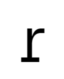
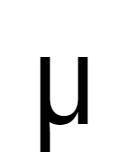
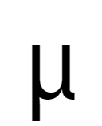
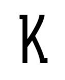
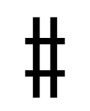

# List of Character Variants of Iosevka

<!-- BEGIN Section-OT-Character-Variants -->
<!-- THIS SECTION IS AUTOMATICALLY GENERATED. DO NOT EDIT. -->

<table>
<tr>
<td rowspan="2"><code>cv01</code></td>
<td></td>
<td></td>
<td></td>
<td></td>
<td></td>
<td></td>
<td></td>
<td></td>
<td colspan="4"> </td>
</tr>
<tr>
<td>1</td>
<td>2</td>
<td>3</td>
<td>4</td>
<td>5</td>
<td>6</td>
<td>7</td>
<td>8</td>
<td colspan="4"> </td>
</tr>
<tr>
<td rowspan="2"><code>cv02</code></td>
<td></td>
<td></td>
<td></td>
<td></td>
<td></td>
<td></td>
<td></td>
<td></td>
<td></td>
<td></td>
<td></td>
<td></td>
</tr>
<tr>
<td>1</td>
<td>2</td>
<td>3</td>
<td>4</td>
<td>5</td>
<td>6</td>
<td>7</td>
<td>8</td>
<td>9</td>
<td>10</td>
<td>11</td>
<td>12</td>
</tr>
<tr>
<td rowspan="2"><code>cv03</code></td>
<td></td>
<td></td>
<td></td>
<td></td>
<td></td>
<td colspan="7"> </td>
</tr>
<tr>
<td>1</td>
<td>2</td>
<td>3</td>
<td>4</td>
<td>5</td>
<td colspan="7"> </td>
</tr>
<tr>
<td rowspan="2"><code>cv04</code></td>
<td></td>
<td></td>
<td></td>
<td></td>
<td></td>
<td></td>
<td colspan="6"> </td>
</tr>
<tr>
<td>1</td>
<td>2</td>
<td>3</td>
<td>4</td>
<td>5</td>
<td>6</td>
<td colspan="6"> </td>
</tr>
<tr>
<td rowspan="2"><code>cv05</code></td>
<td></td>
<td></td>
<td></td>
<td colspan="9"> </td>
</tr>
<tr>
<td>1</td>
<td>2</td>
<td>3</td>
<td colspan="9"> </td>
</tr>
<tr>
<td rowspan="2"><code>cv06</code></td>
<td></td>
<td></td>
<td></td>
<td colspan="9"> </td>
</tr>
<tr>
<td>1</td>
<td>2</td>
<td>3</td>
<td colspan="9"> </td>
</tr>
<tr>
<td rowspan="6"><code>cv07</code></td>
<td></td>
<td></td>
<td></td>
<td></td>
<td></td>
<td></td>
<td></td>
<td></td>
<td></td>
<td></td>
<td></td>
<td></td>
</tr>
<tr>
<td>1</td>
<td>2</td>
<td>3</td>
<td>4</td>
<td>5</td>
<td>6</td>
<td>7</td>
<td>8</td>
<td>9</td>
<td>10</td>
<td>11</td>
<td>12</td>
</tr>
<tr>
<td></td>
<td></td>
<td></td>
<td></td>
<td></td>
<td></td>
<td></td>
<td></td>
<td></td>
<td></td>
<td></td>
<td></td>
</tr>
<tr>
<td>13</td>
<td>14</td>
<td>15</td>
<td>16</td>
<td>17</td>
<td>18</td>
<td>19</td>
<td>20</td>
<td>21</td>
<td>22</td>
<td>23</td>
<td>24</td>
</tr>
<tr>
<td></td>
<td></td>
<td></td>
<td colspan="9"> </td>
</tr>
<tr>
<td>25</td>
<td>26</td>
<td>27</td>
<td colspan="9"> </td>
</tr>
<tr>
<td rowspan="2"><code>cv08</code></td>
<td></td>
<td></td>
<td></td>
<td></td>
<td colspan="8"> </td>
</tr>
<tr>
<td>1</td>
<td>2</td>
<td>3</td>
<td>4</td>
<td colspan="8"> </td>
</tr>
<tr>
<td rowspan="2"><code>cv09</code></td>
<td></td>
<td></td>
<td></td>
<td colspan="9"> </td>
</tr>
<tr>
<td>1</td>
<td>2</td>
<td>3</td>
<td colspan="9"> </td>
</tr>
<tr>
<td rowspan="4"><code>cv10</code></td>
<td></td>
<td></td>
<td></td>
<td></td>
<td></td>
<td></td>
<td></td>
<td></td>
<td></td>
<td></td>
<td></td>
<td></td>
</tr>
<tr>
<td>1</td>
<td>2</td>
<td>3</td>
<td>4</td>
<td>5</td>
<td>6</td>
<td>7</td>
<td>8</td>
<td>9</td>
<td>10</td>
<td>11</td>
<td>12</td>
</tr>
<tr>
<td></td>
<td></td>
<td colspan="10"> </td>
</tr>
<tr>
<td>13</td>
<td>14</td>
<td colspan="10"> </td>
</tr>
<tr>
<td rowspan="4"><code>cv11</code></td>
<td></td>
<td></td>
<td></td>
<td></td>
<td></td>
<td></td>
<td></td>
<td></td>
<td></td>
<td></td>
<td></td>
<td></td>
</tr>
<tr>
<td>1</td>
<td>2</td>
<td>3</td>
<td>4</td>
<td>5</td>
<td>6</td>
<td>7</td>
<td>8</td>
<td>9</td>
<td>10</td>
<td>11</td>
<td>12</td>
</tr>
<tr>
<td></td>
<td></td>
<td></td>
<td></td>
<td></td>
<td></td>
<td></td>
<td></td>
<td colspan="4"> </td>
</tr>
<tr>
<td>13</td>
<td>14</td>
<td>15</td>
<td>16</td>
<td>17</td>
<td>18</td>
<td>19</td>
<td>20</td>
<td colspan="4"> </td>
</tr>
<tr>
<td rowspan="2"><code>cv12</code></td>
<td></td>
<td></td>
<td></td>
<td colspan="9"> </td>
</tr>
<tr>
<td>1</td>
<td>2</td>
<td>3</td>
<td colspan="9"> </td>
</tr>
<tr>
<td rowspan="2"><code>cv13</code></td>
<td></td>
<td></td>
<td></td>
<td></td>
<td></td>
<td></td>
<td></td>
<td></td>
<td colspan="4"> </td>
</tr>
<tr>
<td>1</td>
<td>2</td>
<td>3</td>
<td>4</td>
<td>5</td>
<td>6</td>
<td>7</td>
<td>8</td>
<td colspan="4"> </td>
</tr>
<tr>
<td rowspan="2"><code>cv14</code></td>
<td></td>
<td></td>
<td></td>
<td></td>
<td colspan="8"> </td>
</tr>
<tr>
<td>1</td>
<td>2</td>
<td>3</td>
<td>4</td>
<td colspan="8"> </td>
</tr>
<tr>
<td rowspan="2"><code>cv15</code></td>
<td></td>
<td></td>
<td></td>
<td></td>
<td colspan="8"> </td>
</tr>
<tr>
<td>1</td>
<td>2</td>
<td>3</td>
<td>4</td>
<td colspan="8"> </td>
</tr>
<tr>
<td rowspan="2"><code>cv16</code></td>
<td></td>
<td></td>
<td></td>
<td></td>
<td></td>
<td></td>
<td></td>
<td></td>
<td></td>
<td colspan="3"> </td>
</tr>
<tr>
<td>1</td>
<td>2</td>
<td>3</td>
<td>4</td>
<td>5</td>
<td>6</td>
<td>7</td>
<td>8</td>
<td>9</td>
<td colspan="3"> </td>
</tr>
<tr>
<td rowspan="2"><code>cv17</code></td>
<td></td>
<td></td>
<td></td>
<td></td>
<td></td>
<td></td>
<td></td>
<td></td>
<td></td>
<td></td>
<td></td>
<td></td>
</tr>
<tr>
<td>1</td>
<td>2</td>
<td>3</td>
<td>4</td>
<td>5</td>
<td>6</td>
<td>7</td>
<td>8</td>
<td>9</td>
<td>10</td>
<td>11</td>
<td>12</td>
</tr>
<tr>
<td rowspan="2"><code>cv18</code></td>
<td></td>
<td></td>
<td></td>
<td></td>
<td></td>
<td colspan="7"> </td>
</tr>
<tr>
<td>1</td>
<td>2</td>
<td>3</td>
<td>4</td>
<td>5</td>
<td colspan="7"> </td>
</tr>
<tr>
<td rowspan="2"><code>cv19</code></td>
<td></td>
<td></td>
<td></td>
<td colspan="9"> </td>
</tr>
<tr>
<td>1</td>
<td>2</td>
<td>3</td>
<td colspan="9"> </td>
</tr>
<tr>
<td rowspan="2"><code>cv20</code></td>
<td></td>
<td></td>
<td></td>
<td></td>
<td></td>
<td></td>
<td></td>
<td></td>
<td></td>
<td></td>
<td colspan="2"> </td>
</tr>
<tr>
<td>1</td>
<td>2</td>
<td>3</td>
<td>4</td>
<td>5</td>
<td>6</td>
<td>7</td>
<td>8</td>
<td>9</td>
<td>10</td>
<td colspan="2"> </td>
</tr>
<tr>
<td rowspan="2"><code>cv21</code></td>
<td></td>
<td></td>
<td></td>
<td></td>
<td colspan="8"> </td>
</tr>
<tr>
<td>1</td>
<td>2</td>
<td>3</td>
<td>4</td>
<td colspan="8"> </td>
</tr>
<tr>
<td rowspan="2"><code>cv22</code></td>
<td></td>
<td></td>
<td></td>
<td></td>
<td></td>
<td></td>
<td></td>
<td></td>
<td></td>
<td></td>
<td></td>
<td></td>
</tr>
<tr>
<td>1</td>
<td>2</td>
<td>3</td>
<td>4</td>
<td>5</td>
<td>6</td>
<td>7</td>
<td>8</td>
<td>9</td>
<td>10</td>
<td>11</td>
<td>12</td>
</tr>
<tr>
<td rowspan="2"><code>cv23</code></td>
<td></td>
<td></td>
<td></td>
<td></td>
<td></td>
<td></td>
<td colspan="6"> </td>
</tr>
<tr>
<td>1</td>
<td>2</td>
<td>3</td>
<td>4</td>
<td>5</td>
<td>6</td>
<td colspan="6"> </td>
</tr>
<tr>
<td rowspan="2"><code>cv24</code></td>
<td></td>
<td></td>
<td></td>
<td></td>
<td></td>
<td></td>
<td></td>
<td></td>
<td colspan="4"> </td>
</tr>
<tr>
<td>1</td>
<td>2</td>
<td>3</td>
<td>4</td>
<td>5</td>
<td>6</td>
<td>7</td>
<td>8</td>
<td colspan="4"> </td>
</tr>
<tr>
<td rowspan="6"><code>cv25</code></td>
<td></td>
<td></td>
<td></td>
<td></td>
<td></td>
<td></td>
<td></td>
<td></td>
<td></td>
<td></td>
<td></td>
<td></td>
</tr>
<tr>
<td>1</td>
<td>2</td>
<td>3</td>
<td>4</td>
<td>5</td>
<td>6</td>
<td>7</td>
<td>8</td>
<td>9</td>
<td>10</td>
<td>11</td>
<td>12</td>
</tr>
<tr>
<td></td>
<td></td>
<td></td>
<td></td>
<td></td>
<td></td>
<td></td>
<td></td>
<td></td>
<td></td>
<td></td>
<td></td>
</tr>
<tr>
<td>13</td>
<td>14</td>
<td>15</td>
<td>16</td>
<td>17</td>
<td>18</td>
<td>19</td>
<td>20</td>
<td>21</td>
<td>22</td>
<td>23</td>
<td>24</td>
</tr>
<tr>
<td></td>
<td></td>
<td></td>
<td colspan="9"> </td>
</tr>
<tr>
<td>25</td>
<td>26</td>
<td>27</td>
<td colspan="9"> </td>
</tr>
<tr>
<td rowspan="4"><code>cv26</code></td>
<td></td>
<td></td>
<td></td>
<td></td>
<td></td>
<td></td>
<td></td>
<td></td>
<td></td>
<td></td>
<td></td>
<td></td>
</tr>
<tr>
<td>1</td>
<td>2</td>
<td>3</td>
<td>4</td>
<td>5</td>
<td>6</td>
<td>7</td>
<td>8</td>
<td>9</td>
<td>10</td>
<td>11</td>
<td>12</td>
</tr>
<tr>
<td></td>
<td></td>
<td colspan="10"> </td>
</tr>
<tr>
<td>13</td>
<td>14</td>
<td colspan="10"> </td>
</tr>
<tr>
<td rowspan="2"><code>cv27</code></td>
<td></td>
<td></td>
<td></td>
<td></td>
<td></td>
<td></td>
<td colspan="6"> </td>
</tr>
<tr>
<td>1</td>
<td>2</td>
<td>3</td>
<td>4</td>
<td>5</td>
<td>6</td>
<td colspan="6"> </td>
</tr>
<tr>
<td rowspan="2"><code>cv28</code></td>
<td></td>
<td></td>
<td></td>
<td></td>
<td></td>
<td colspan="7"> </td>
</tr>
<tr>
<td>1</td>
<td>2</td>
<td>3</td>
<td>4</td>
<td>5</td>
<td colspan="7"> </td>
</tr>
<tr>
<td rowspan="2"><code>cv29</code></td>
<td></td>
<td></td>
<td></td>
<td></td>
<td></td>
<td></td>
<td></td>
<td></td>
<td></td>
<td colspan="3"> </td>
</tr>
<tr>
<td>1</td>
<td>2</td>
<td>3</td>
<td>4</td>
<td>5</td>
<td>6</td>
<td>7</td>
<td>8</td>
<td>9</td>
<td colspan="3"> </td>
</tr>
<tr>
<td rowspan="2"><code>cv30</code></td>
<td></td>
<td></td>
<td colspan="10"> </td>
</tr>
<tr>
<td>1</td>
<td>2</td>
<td colspan="10"> </td>
</tr>
<tr>
<td rowspan="4"><code>cv31</code></td>
<td></td>
<td></td>
<td></td>
<td></td>
<td></td>
<td></td>
<td></td>
<td></td>
<td></td>
<td></td>
<td></td>
<td></td>
</tr>
<tr>
<td>1</td>
<td>2</td>
<td>3</td>
<td>4</td>
<td>5</td>
<td>6</td>
<td>7</td>
<td>8</td>
<td>9</td>
<td>10</td>
<td>11</td>
<td>12</td>
</tr>
<tr>
<td></td>
<td></td>
<td></td>
<td></td>
<td></td>
<td></td>
<td></td>
<td></td>
<td colspan="4"> </td>
</tr>
<tr>
<td>13</td>
<td>14</td>
<td>15</td>
<td>16</td>
<td>17</td>
<td>18</td>
<td>19</td>
<td>20</td>
<td colspan="4"> </td>
</tr>
<tr>
<td rowspan="2"><code>cv32</code></td>
<td></td>
<td></td>
<td></td>
<td></td>
<td></td>
<td></td>
<td></td>
<td></td>
<td></td>
<td></td>
<td colspan="2"> </td>
</tr>
<tr>
<td>1</td>
<td>2</td>
<td>3</td>
<td>4</td>
<td>5</td>
<td>6</td>
<td>7</td>
<td>8</td>
<td>9</td>
<td>10</td>
<td colspan="2"> </td>
</tr>
<tr>
<td rowspan="2"><code>cv33</code></td>
<td></td>
<td></td>
<td></td>
<td></td>
<td></td>
<td colspan="7"> </td>
</tr>
<tr>
<td>1</td>
<td>2</td>
<td>3</td>
<td>4</td>
<td>5</td>
<td colspan="7"> </td>
</tr>
<tr>
<td rowspan="2"><code>cv34</code></td>
<td></td>
<td></td>
<td></td>
<td></td>
<td></td>
<td></td>
<td></td>
<td></td>
<td></td>
<td></td>
<td></td>
<td></td>
</tr>
<tr>
<td>1</td>
<td>2</td>
<td>3</td>
<td>4</td>
<td>5</td>
<td>6</td>
<td>7</td>
<td>8</td>
<td>9</td>
<td>10</td>
<td>11</td>
<td>12</td>
</tr>
<tr>
<td rowspan="2"><code>cv35</code></td>
<td></td>
<td></td>
<td></td>
<td></td>
<td></td>
<td></td>
<td></td>
<td></td>
<td colspan="4"> </td>
</tr>
<tr>
<td>1</td>
<td>2</td>
<td>3</td>
<td>4</td>
<td>5</td>
<td>6</td>
<td>7</td>
<td>8</td>
<td colspan="4"> </td>
</tr>
<tr>
<td rowspan="6"><code>cv36</code></td>
<td></td>
<td></td>
<td></td>
<td></td>
<td></td>
<td></td>
<td></td>
<td></td>
<td></td>
<td></td>
<td></td>
<td></td>
</tr>
<tr>
<td>1</td>
<td>2</td>
<td>3</td>
<td>4</td>
<td>5</td>
<td>6</td>
<td>7</td>
<td>8</td>
<td>9</td>
<td>10</td>
<td>11</td>
<td>12</td>
</tr>
<tr>
<td></td>
<td></td>
<td></td>
<td></td>
<td></td>
<td></td>
<td></td>
<td></td>
<td></td>
<td></td>
<td></td>
<td></td>
</tr>
<tr>
<td>13</td>
<td>14</td>
<td>15</td>
<td>16</td>
<td>17</td>
<td>18</td>
<td>19</td>
<td>20</td>
<td>21</td>
<td>22</td>
<td>23</td>
<td>24</td>
</tr>
<tr>
<td></td>
<td></td>
<td></td>
<td colspan="9"> </td>
</tr>
<tr>
<td>25</td>
<td>26</td>
<td>27</td>
<td colspan="9"> </td>
</tr>
<tr>
<td rowspan="2"><code>cv37</code></td>
<td></td>
<td></td>
<td></td>
<td></td>
<td></td>
<td></td>
<td></td>
<td></td>
<td></td>
<td></td>
<td></td>
<td></td>
</tr>
<tr>
<td>1</td>
<td>2</td>
<td>3</td>
<td>4</td>
<td>5</td>
<td>6</td>
<td>7</td>
<td>8</td>
<td>9</td>
<td>10</td>
<td>11</td>
<td>12</td>
</tr>
<tr>
<td rowspan="4"><code>cv38</code></td>
<td></td>
<td></td>
<td></td>
<td></td>
<td></td>
<td></td>
<td></td>
<td></td>
<td></td>
<td></td>
<td></td>
<td></td>
</tr>
<tr>
<td>1</td>
<td>2</td>
<td>3</td>
<td>4</td>
<td>5</td>
<td>6</td>
<td>7</td>
<td>8</td>
<td>9</td>
<td>10</td>
<td>11</td>
<td>12</td>
</tr>
<tr>
<td></td>
<td></td>
<td></td>
<td></td>
<td></td>
<td></td>
<td></td>
<td></td>
<td></td>
<td></td>
<td colspan="2"> </td>
</tr>
<tr>
<td>13</td>
<td>14</td>
<td>15</td>
<td>16</td>
<td>17</td>
<td>18</td>
<td>19</td>
<td>20</td>
<td>21</td>
<td>22</td>
<td colspan="2"> </td>
</tr>
<tr>
<td rowspan="2"><code>cv39</code></td>
<td></td>
<td></td>
<td></td>
<td></td>
<td></td>
<td></td>
<td></td>
<td></td>
<td></td>
<td colspan="3"> </td>
</tr>
<tr>
<td>1</td>
<td>2</td>
<td>3</td>
<td>4</td>
<td>5</td>
<td>6</td>
<td>7</td>
<td>8</td>
<td>9</td>
<td colspan="3"> </td>
</tr>
<tr>
<td rowspan="2"><code>cv40</code></td>
<td></td>
<td></td>
<td></td>
<td></td>
<td colspan="8"> </td>
</tr>
<tr>
<td>1</td>
<td>2</td>
<td>3</td>
<td>4</td>
<td colspan="8"> </td>
</tr>
<tr>
<td rowspan="2"><code>cv41</code></td>
<td></td>
<td></td>
<td></td>
<td></td>
<td></td>
<td></td>
<td></td>
<td></td>
<td></td>
<td></td>
<td></td>
<td></td>
</tr>
<tr>
<td>1</td>
<td>2</td>
<td>3</td>
<td>4</td>
<td>5</td>
<td>6</td>
<td>7</td>
<td>8</td>
<td>9</td>
<td>10</td>
<td>11</td>
<td>12</td>
</tr>
<tr>
<td rowspan="4"><code>cv42</code></td>
<td></td>
<td></td>
<td></td>
<td></td>
<td></td>
<td></td>
<td></td>
<td></td>
<td></td>
<td></td>
<td></td>
<td></td>
</tr>
<tr>
<td>1</td>
<td>2</td>
<td>3</td>
<td>4</td>
<td>5</td>
<td>6</td>
<td>7</td>
<td>8</td>
<td>9</td>
<td>10</td>
<td>11</td>
<td>12</td>
</tr>
<tr>
<td></td>
<td></td>
<td></td>
<td></td>
<td></td>
<td></td>
<td></td>
<td></td>
<td colspan="4"> </td>
</tr>
<tr>
<td>13</td>
<td>14</td>
<td>15</td>
<td>16</td>
<td>17</td>
<td>18</td>
<td>19</td>
<td>20</td>
<td colspan="4"> </td>
</tr>
<tr>
<td rowspan="2"><code>cv43</code></td>
<td></td>
<td></td>
<td></td>
<td></td>
<td></td>
<td colspan="7"> </td>
</tr>
<tr>
<td>1</td>
<td>2</td>
<td>3</td>
<td>4</td>
<td>5</td>
<td colspan="7"> </td>
</tr>
<tr>
<td rowspan="4"><code>cv44</code></td>
<td></td>
<td></td>
<td></td>
<td></td>
<td></td>
<td></td>
<td></td>
<td></td>
<td></td>
<td></td>
<td></td>
<td></td>
</tr>
<tr>
<td>1</td>
<td>2</td>
<td>3</td>
<td>4</td>
<td>5</td>
<td>6</td>
<td>7</td>
<td>8</td>
<td>9</td>
<td>10</td>
<td>11</td>
<td>12</td>
</tr>
<tr>
<td></td>
<td></td>
<td></td>
<td colspan="9"> </td>
</tr>
<tr>
<td>13</td>
<td>14</td>
<td>15</td>
<td colspan="9"> </td>
</tr>
<tr>
<td rowspan="2"><code>cv45</code></td>
<td></td>
<td></td>
<td></td>
<td></td>
<td></td>
<td></td>
<td></td>
<td></td>
<td></td>
<td colspan="3"> </td>
</tr>
<tr>
<td>1</td>
<td>2</td>
<td>3</td>
<td>4</td>
<td>5</td>
<td>6</td>
<td>7</td>
<td>8</td>
<td>9</td>
<td colspan="3"> </td>
</tr>
<tr>
<td rowspan="2"><code>cv46</code></td>
<td></td>
<td></td>
<td></td>
<td></td>
<td></td>
<td></td>
<td colspan="6"> </td>
</tr>
<tr>
<td>1</td>
<td>2</td>
<td>3</td>
<td>4</td>
<td>5</td>
<td>6</td>
<td colspan="6"> </td>
</tr>
<tr>
<td rowspan="4"><code>cv47</code></td>
<td></td>
<td></td>
<td></td>
<td></td>
<td></td>
<td></td>
<td></td>
<td></td>
<td></td>
<td></td>
<td></td>
<td></td>
</tr>
<tr>
<td>1</td>
<td>2</td>
<td>3</td>
<td>4</td>
<td>5</td>
<td>6</td>
<td>7</td>
<td>8</td>
<td>9</td>
<td>10</td>
<td>11</td>
<td>12</td>
</tr>
<tr>
<td></td>
<td></td>
<td colspan="10"> </td>
</tr>
<tr>
<td>13</td>
<td>14</td>
<td colspan="10"> </td>
</tr>
<tr>
<td rowspan="2"><code>cv48</code></td>
<td></td>
<td></td>
<td></td>
<td></td>
<td></td>
<td></td>
<td></td>
<td colspan="5"> </td>
</tr>
<tr>
<td>1</td>
<td>2</td>
<td>3</td>
<td>4</td>
<td>5</td>
<td>6</td>
<td>7</td>
<td colspan="5"> </td>
</tr>
<tr>
<td rowspan="2"><code>cv49</code></td>
<td></td>
<td></td>
<td></td>
<td></td>
<td></td>
<td></td>
<td></td>
<td></td>
<td></td>
<td></td>
<td></td>
<td></td>
</tr>
<tr>
<td>1</td>
<td>2</td>
<td>3</td>
<td>4</td>
<td>5</td>
<td>6</td>
<td>7</td>
<td>8</td>
<td>9</td>
<td>10</td>
<td>11</td>
<td>12</td>
</tr>
<tr>
<td rowspan="6"><code>cv50</code></td>
<td></td>
<td></td>
<td></td>
<td></td>
<td></td>
<td></td>
<td></td>
<td></td>
<td></td>
<td></td>
<td></td>
<td></td>
</tr>
<tr>
<td>1</td>
<td>2</td>
<td>3</td>
<td>4</td>
<td>5</td>
<td>6</td>
<td>7</td>
<td>8</td>
<td>9</td>
<td>10</td>
<td>11</td>
<td>12</td>
</tr>
<tr>
<td></td>
<td></td>
<td></td>
<td></td>
<td></td>
<td></td>
<td></td>
<td></td>
<td></td>
<td></td>
<td></td>
<td></td>
</tr>
<tr>
<td>13</td>
<td>14</td>
<td>15</td>
<td>16</td>
<td>17</td>
<td>18</td>
<td>19</td>
<td>20</td>
<td>21</td>
<td>22</td>
<td>23</td>
<td>24</td>
</tr>
<tr>
<td></td>
<td></td>
<td></td>
<td colspan="9"> </td>
</tr>
<tr>
<td>25</td>
<td>26</td>
<td>27</td>
<td colspan="9"> </td>
</tr>
<tr>
<td rowspan="2"><code>cv51</code></td>
<td></td>
<td></td>
<td></td>
<td></td>
<td></td>
<td></td>
<td colspan="6"> </td>
</tr>
<tr>
<td>1</td>
<td>2</td>
<td>3</td>
<td>4</td>
<td>5</td>
<td>6</td>
<td colspan="6"> </td>
</tr>
<tr>
<td rowspan="2"><code>cv52</code></td>
<td></td>
<td></td>
<td></td>
<td></td>
<td></td>
<td></td>
<td></td>
<td></td>
<td></td>
<td></td>
<td></td>
<td></td>
</tr>
<tr>
<td>1</td>
<td>2</td>
<td>3</td>
<td>4</td>
<td>5</td>
<td>6</td>
<td>7</td>
<td>8</td>
<td>9</td>
<td>10</td>
<td>11</td>
<td>12</td>
</tr>
<tr>
<td rowspan="2"><code>cv53</code></td>
<td colspan="2"></td>
<td colspan="2"></td>
<td colspan="8"> </td>
</tr>
<tr>
<td colspan="2">1</td>
<td colspan="2">2</td>
<td colspan="8"> </td>
</tr>
<tr>
<td rowspan="2"><code>cv54</code></td>
<td></td>
<td></td>
<td colspan="10"> </td>
</tr>
<tr>
<td>1</td>
<td>2</td>
<td colspan="10"> </td>
</tr>
<tr>
<td rowspan="2"><code>VXAA</code></td>
<td></td>
<td></td>
<td colspan="10"> </td>
</tr>
<tr>
<td>1</td>
<td>2</td>
<td colspan="10"> </td>
</tr>
<tr>
<td rowspan="2"><code>cv55</code></td>
<td></td>
<td></td>
<td></td>
<td colspan="9"> </td>
</tr>
<tr>
<td>1</td>
<td>2</td>
<td>3</td>
<td colspan="9"> </td>
</tr>
<tr>
<td rowspan="2"><code>cv56</code></td>
<td></td>
<td></td>
<td></td>
<td></td>
<td></td>
<td></td>
<td colspan="6"> </td>
</tr>
<tr>
<td>1</td>
<td>2</td>
<td>3</td>
<td>4</td>
<td>5</td>
<td>6</td>
<td colspan="6"> </td>
</tr>
<tr>
<td rowspan="2"><code>cv57</code></td>
<td></td>
<td></td>
<td></td>
<td></td>
<td colspan="8"> </td>
</tr>
<tr>
<td>1</td>
<td>2</td>
<td>3</td>
<td>4</td>
<td colspan="8"> </td>
</tr>
<tr>
<td rowspan="2"><code>VXAC</code></td>
<td></td>
<td></td>
<td colspan="10"> </td>
</tr>
<tr>
<td>1</td>
<td>2</td>
<td colspan="10"> </td>
</tr>
<tr>
<td rowspan="2"><code>VXAB</code></td>
<td></td>
<td></td>
<td colspan="10"> </td>
</tr>
<tr>
<td>1</td>
<td>2</td>
<td colspan="10"> </td>
</tr>
<tr>
<td rowspan="2"><code>cv58</code></td>
<td></td>
<td></td>
<td></td>
<td></td>
<td></td>
<td colspan="7"> </td>
</tr>
<tr>
<td>1</td>
<td>2</td>
<td>3</td>
<td>4</td>
<td>5</td>
<td colspan="7"> </td>
</tr>
<tr>
<td rowspan="2"><code>cv59</code></td>
<td></td>
<td></td>
<td></td>
<td></td>
<td></td>
<td colspan="7"> </td>
</tr>
<tr>
<td>1</td>
<td>2</td>
<td>3</td>
<td>4</td>
<td>5</td>
<td colspan="7"> </td>
</tr>
<tr>
<td rowspan="4"><code>cv60</code></td>
<td></td>
<td></td>
<td></td>
<td></td>
<td></td>
<td></td>
<td></td>
<td></td>
<td></td>
<td></td>
<td></td>
<td></td>
</tr>
<tr>
<td>1</td>
<td>2</td>
<td>3</td>
<td>4</td>
<td>5</td>
<td>6</td>
<td>7</td>
<td>8</td>
<td>9</td>
<td>10</td>
<td>11</td>
<td>12</td>
</tr>
<tr>
<td></td>
<td></td>
<td></td>
<td></td>
<td></td>
<td></td>
<td></td>
<td></td>
<td colspan="4"> </td>
</tr>
<tr>
<td>13</td>
<td>14</td>
<td>15</td>
<td>16</td>
<td>17</td>
<td>18</td>
<td>19</td>
<td>20</td>
<td colspan="4"> </td>
</tr>
<tr>
<td rowspan="4"><code>cv61</code></td>
<td></td>
<td></td>
<td></td>
<td></td>
<td></td>
<td></td>
<td></td>
<td></td>
<td></td>
<td></td>
<td></td>
<td></td>
</tr>
<tr>
<td>1</td>
<td>2</td>
<td>3</td>
<td>4</td>
<td>5</td>
<td>6</td>
<td>7</td>
<td>8</td>
<td>9</td>
<td>10</td>
<td>11</td>
<td>12</td>
</tr>
<tr>
<td></td>
<td></td>
<td></td>
<td></td>
<td></td>
<td></td>
<td></td>
<td></td>
<td colspan="4"> </td>
</tr>
<tr>
<td>13</td>
<td>14</td>
<td>15</td>
<td>16</td>
<td>17</td>
<td>18</td>
<td>19</td>
<td>20</td>
<td colspan="4"> </td>
</tr>
<tr>
<td rowspan="2"><code>cv62</code></td>
<td></td>
<td></td>
<td colspan="10"> </td>
</tr>
<tr>
<td>1</td>
<td>2</td>
<td colspan="10"> </td>
</tr>
<tr>
<td rowspan="2"><code>cv63</code></td>
<td></td>
<td></td>
<td></td>
<td></td>
<td></td>
<td></td>
<td></td>
<td colspan="5"> </td>
</tr>
<tr>
<td>1</td>
<td>2</td>
<td>3</td>
<td>4</td>
<td>5</td>
<td>6</td>
<td>7</td>
<td colspan="5"> </td>
</tr>
<tr>
<td rowspan="2"><code>cv64</code></td>
<td></td>
<td></td>
<td></td>
<td></td>
<td colspan="8"> </td>
</tr>
<tr>
<td>1</td>
<td>2</td>
<td>3</td>
<td>4</td>
<td colspan="8"> </td>
</tr>
<tr>
<td rowspan="2"><code>cv65</code></td>
<td></td>
<td></td>
<td colspan="10"> </td>
</tr>
<tr>
<td>1</td>
<td>2</td>
<td colspan="10"> </td>
</tr>
<tr>
<td rowspan="2"><code>cv66</code></td>
<td></td>
<td></td>
<td></td>
<td></td>
<td></td>
<td></td>
<td colspan="6"> </td>
</tr>
<tr>
<td>1</td>
<td>2</td>
<td>3</td>
<td>4</td>
<td>5</td>
<td>6</td>
<td colspan="6"> </td>
</tr>
<tr>
<td rowspan="2"><code>cv67</code></td>
<td></td>
<td></td>
<td></td>
<td></td>
<td></td>
<td></td>
<td colspan="6"> </td>
</tr>
<tr>
<td>1</td>
<td>2</td>
<td>3</td>
<td>4</td>
<td>5</td>
<td>6</td>
<td colspan="6"> </td>
</tr>
<tr>
<td rowspan="2"><code>cv68</code></td>
<td></td>
<td></td>
<td></td>
<td></td>
<td></td>
<td></td>
<td></td>
<td></td>
<td></td>
<td></td>
<td></td>
<td></td>
</tr>
<tr>
<td>1</td>
<td>2</td>
<td>3</td>
<td>4</td>
<td>5</td>
<td>6</td>
<td>7</td>
<td>8</td>
<td>9</td>
<td>10</td>
<td>11</td>
<td>12</td>
</tr>
<tr>
<td rowspan="2"><code>cv69</code></td>
<td></td>
<td></td>
<td></td>
<td colspan="9"> </td>
</tr>
<tr>
<td>1</td>
<td>2</td>
<td>3</td>
<td colspan="9"> </td>
</tr>
<tr>
<td rowspan="2"><code>cv70</code></td>
<td></td>
<td></td>
<td></td>
<td></td>
<td></td>
<td></td>
<td colspan="6"> </td>
</tr>
<tr>
<td>1</td>
<td>2</td>
<td>3</td>
<td>4</td>
<td>5</td>
<td>6</td>
<td colspan="6"> </td>
</tr>
<tr>
<td rowspan="2"><code>cv71</code></td>
<td></td>
<td></td>
<td></td>
<td></td>
<td></td>
<td></td>
<td></td>
<td></td>
<td></td>
<td></td>
<td colspan="2"> </td>
</tr>
<tr>
<td>1</td>
<td>2</td>
<td>3</td>
<td>4</td>
<td>5</td>
<td>6</td>
<td>7</td>
<td>8</td>
<td>9</td>
<td>10</td>
<td colspan="2"> </td>
</tr>
<tr>
<td rowspan="2"><code>cv72</code></td>
<td></td>
<td></td>
<td></td>
<td></td>
<td></td>
<td></td>
<td></td>
<td colspan="5"> </td>
</tr>
<tr>
<td>1</td>
<td>2</td>
<td>3</td>
<td>4</td>
<td>5</td>
<td>6</td>
<td>7</td>
<td colspan="5"> </td>
</tr>
<tr>
<td rowspan="2"><code>cv73</code></td>
<td></td>
<td></td>
<td colspan="10"> </td>
</tr>
<tr>
<td>1</td>
<td>2</td>
<td colspan="10"> </td>
</tr>
<tr>
<td rowspan="2"><code>cv74</code></td>
<td></td>
<td></td>
<td colspan="10"> </td>
</tr>
<tr>
<td>1</td>
<td>2</td>
<td colspan="10"> </td>
</tr>
<tr>
<td rowspan="2"><code>cv75</code></td>
<td></td>
<td></td>
<td></td>
<td></td>
<td></td>
<td></td>
<td colspan="6"> </td>
</tr>
<tr>
<td>1</td>
<td>2</td>
<td>3</td>
<td>4</td>
<td>5</td>
<td>6</td>
<td colspan="6"> </td>
</tr>
<tr>
<td rowspan="2"><code>cv76</code></td>
<td></td>
<td></td>
<td colspan="10"> </td>
</tr>
<tr>
<td>1</td>
<td>2</td>
<td colspan="10"> </td>
</tr>
<tr>
<td rowspan="2"><code>cv77</code></td>
<td></td>
<td></td>
<td></td>
<td colspan="9"> </td>
</tr>
<tr>
<td>1</td>
<td>2</td>
<td>3</td>
<td colspan="9"> </td>
</tr>
<tr>
<td rowspan="2"><code>cv78</code></td>
<td></td>
<td></td>
<td></td>
<td></td>
<td></td>
<td></td>
<td></td>
<td></td>
<td></td>
<td></td>
<td></td>
<td></td>
</tr>
<tr>
<td>1</td>
<td>2</td>
<td>3</td>
<td>4</td>
<td>5</td>
<td>6</td>
<td>7</td>
<td>8</td>
<td>9</td>
<td>10</td>
<td>11</td>
<td>12</td>
</tr>
<tr>
<td rowspan="2"><code>cv79</code></td>
<td></td>
<td></td>
<td></td>
<td colspan="9"> </td>
</tr>
<tr>
<td>1</td>
<td>2</td>
<td>3</td>
<td colspan="9"> </td>
</tr>
<tr>
<td rowspan="2"><code>cv80</code></td>
<td></td>
<td></td>
<td></td>
<td colspan="9"> </td>
</tr>
<tr>
<td>1</td>
<td>2</td>
<td>3</td>
<td colspan="9"> </td>
</tr>
<tr>
<td rowspan="2"><code>cv81</code></td>
<td></td>
<td></td>
<td colspan="10"> </td>
</tr>
<tr>
<td>1</td>
<td>2</td>
<td colspan="10"> </td>
</tr>
<tr>
<td rowspan="2"><code>cv82</code></td>
<td></td>
<td></td>
<td></td>
<td></td>
<td></td>
<td></td>
<td></td>
<td></td>
<td colspan="4"> </td>
</tr>
<tr>
<td>1</td>
<td>2</td>
<td>3</td>
<td>4</td>
<td>5</td>
<td>6</td>
<td>7</td>
<td>8</td>
<td colspan="4"> </td>
</tr>
<tr>
<td rowspan="2"><code>cv83</code></td>
<td></td>
<td></td>
<td></td>
<td colspan="9"> </td>
</tr>
<tr>
<td>1</td>
<td>2</td>
<td>3</td>
<td colspan="9"> </td>
</tr>
<tr>
<td rowspan="2"><code>cv84</code></td>
<td></td>
<td></td>
<td colspan="10"> </td>
</tr>
<tr>
<td>1</td>
<td>2</td>
<td colspan="10"> </td>
</tr>
<tr>
<td rowspan="2"><code>cv85</code></td>
<td></td>
<td></td>
<td></td>
<td colspan="9"> </td>
</tr>
<tr>
<td>1</td>
<td>2</td>
<td>3</td>
<td colspan="9"> </td>
</tr>
<tr>
<td rowspan="2"><code>cv86</code></td>
<td colspan="2"></td>
<td colspan="2"></td>
<td colspan="2"></td>
<td colspan="6"> </td>
</tr>
<tr>
<td colspan="2">1</td>
<td colspan="2">2</td>
<td colspan="2">3</td>
<td colspan="6"> </td>
</tr>
<tr>
<td rowspan="2"><code>cv87</code></td>
<td colspan="2"></td>
<td colspan="2"></td>
<td colspan="2"></td>
<td colspan="6"> </td>
</tr>
<tr>
<td colspan="2">1</td>
<td colspan="2">2</td>
<td colspan="2">3</td>
<td colspan="6"> </td>
</tr>
<tr>
<td rowspan="2"><code>cv88</code></td>
<td></td>
<td></td>
<td></td>
<td></td>
<td></td>
<td></td>
<td></td>
<td></td>
<td colspan="4"> </td>
</tr>
<tr>
<td>1</td>
<td>2</td>
<td>3</td>
<td>4</td>
<td>5</td>
<td>6</td>
<td>7</td>
<td>8</td>
<td colspan="4"> </td>
</tr>
<tr>
<td rowspan="2"><code>cv89</code></td>
<td></td>
<td></td>
<td></td>
<td></td>
<td></td>
<td></td>
<td></td>
<td colspan="5"> </td>
</tr>
<tr>
<td>1</td>
<td>2</td>
<td>3</td>
<td>4</td>
<td>5</td>
<td>6</td>
<td>7</td>
<td colspan="5"> </td>
</tr>
<tr>
<td rowspan="2"><code>cv90</code></td>
<td></td>
<td></td>
<td></td>
<td></td>
<td></td>
<td colspan="7"> </td>
</tr>
<tr>
<td>1</td>
<td>2</td>
<td>3</td>
<td>4</td>
<td>5</td>
<td colspan="7"> </td>
</tr>
<tr>
<td rowspan="2"><code>cv91</code></td>
<td></td>
<td></td>
<td></td>
<td></td>
<td></td>
<td></td>
<td colspan="6"> </td>
</tr>
<tr>
<td>1</td>
<td>2</td>
<td>3</td>
<td>4</td>
<td>5</td>
<td>6</td>
<td colspan="6"> </td>
</tr>
<tr>
<td rowspan="2"><code>cv92</code></td>
<td></td>
<td></td>
<td></td>
<td colspan="9"> </td>
</tr>
<tr>
<td>1</td>
<td>2</td>
<td>3</td>
<td colspan="9"> </td>
</tr>
<tr>
<td rowspan="2"><code>cv93</code></td>
<td></td>
<td></td>
<td></td>
<td></td>
<td colspan="8"> </td>
</tr>
<tr>
<td>1</td>
<td>2</td>
<td>3</td>
<td>4</td>
<td colspan="8"> </td>
</tr>
<tr>
<td rowspan="2"><code>cv94</code></td>
<td colspan="2"></td>
<td colspan="2"></td>
<td colspan="8"> </td>
</tr>
<tr>
<td colspan="2">1</td>
<td colspan="2">2</td>
<td colspan="8"> </td>
</tr>
<tr>
<td rowspan="2"><code>cv95</code></td>
<td colspan="2"></td>
<td colspan="2"></td>
<td colspan="8"> </td>
</tr>
<tr>
<td colspan="2">1</td>
<td colspan="2">2</td>
<td colspan="8"> </td>
</tr>
<tr>
<td rowspan="2"><code>cv96</code></td>
<td></td>
<td></td>
<td colspan="10"> </td>
</tr>
<tr>
<td>1</td>
<td>2</td>
<td colspan="10"> </td>
</tr>
<tr>
<td rowspan="2"><code>cv97</code></td>
<td></td>
<td></td>
<td></td>
<td colspan="9"> </td>
</tr>
<tr>
<td>1</td>
<td>2</td>
<td>3</td>
<td colspan="9"> </td>
</tr>
<tr>
<td rowspan="2"><code>cv98</code></td>
<td></td>
<td></td>
<td></td>
<td colspan="9"> </td>
</tr>
<tr>
<td>1</td>
<td>2</td>
<td>3</td>
<td colspan="9"> </td>
</tr>
<tr>
<td rowspan="2"><code>cv99</code></td>
<td colspan="6"></td>
<td colspan="6"></td>
</tr>
<tr>
<td colspan="6">1</td>
<td colspan="6">2</td>
</tr>
</table>

<!-- END Section-OT-Character-Variants -->
